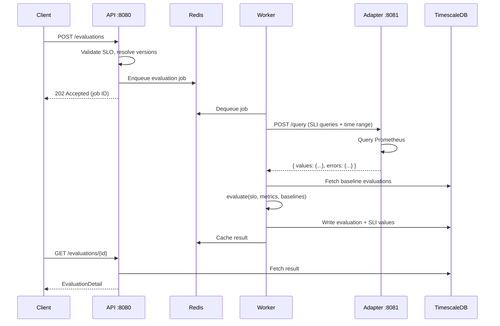
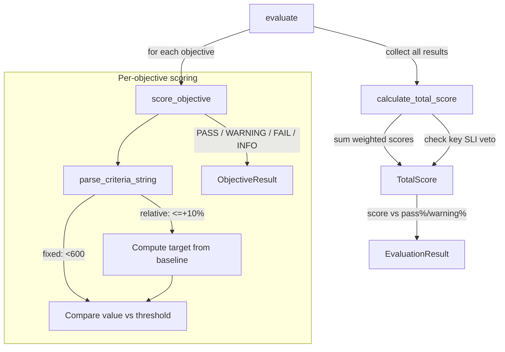

# TROPEK

**Trend Reporting and Objective Evaluation toolkit**

A standalone quality gate and performance test evaluation platform. Evaluates SLI/SLO metrics from Prometheus, CSV files, JMeter results, or any source that can POST JSON — and decides pass / warning / fail.

Extracted and rewritten from [Keptn's](https://keptn.sh) lighthouse-service. Runs in Docker Compose. No Kubernetes required.

---

## What it does

- Evaluates metrics against **SLO criteria** (fixed thresholds and relative % change)
- Supports **key SLI veto** — one critical metric failure fails the whole evaluation regardless of score
- Tracks **trend history** with TimescaleDB for relative comparisons (`<=+10%`)
- Three **ingestion modes**: pull from Prometheus, push metrics inline, or upload a file (CSV / JMeter)
- **Versioned SLO & SLI registries** — every change is stored; evaluations record which version they used
- **Asset & group registry** — register VMs/services, organise into groups, bind SLOs to assets
- **Annotations** — attach contextual notes to evaluations ("kernel updated before this test")
- **Invalidation** — mark evaluations as invalid without deleting them
- **Data source registry** — register adapter instances (Prometheus, future: InfluxDB, etc.)

---

## Architecture

### Service topology

```
Docker Compose
├── api                  :8080   FastAPI — evaluation engine, registries, REST API
├── worker               ×2      arq job workers (same image, different entrypoint)
├── adapter-prometheus   :8081   Prometheus query adapter
├── timescaledb          :5432   PostgreSQL + TimescaleDB (evaluations + time-series SLI values)
├── redis                :6379   Job queue (arq db 1) + response cache (db 0)
├── ui                   :3000   React SPA
└── timescaledb-test     :5433   Test database (profile: test — not started by default)
```

The evaluation engine is a **pure Python function** — zero I/O, fully unit-tested, ported from Keptn's Go implementation.

### Evaluation flow



### Evaluation engine (pure logic)



### Database schema

```mermaid
erDiagram
    AssetType ||--o{ Asset : "has type"
    Asset ||--o{ AssetGroupMember : "belongs to"
    AssetGroup ||--o{ AssetGroupMember : "contains"
    AssetGroup ||--o{ AssetGroupLink : "parent"
    AssetGroup ||--o{ AssetGroupLink : "child"
    Asset ||--o{ AssetSLOLink : "bound to"
    AssetGroup ||--o{ AssetGroupSLOLink : "bound to"
    SLODefinition ||--o{ SLOObjective : "has"
    Evaluation ||--o{ EvaluationAnnotation : "annotated"
    Evaluation }o--|| SLIValue : "produces"
    EvaluationBatch ||--o{ Evaluation : "groups"

    AssetType { uuid id PK; string name UK; bool is_default }
    Asset { uuid id PK; string name UK; uuid type_id FK; jsonb labels }
    AssetGroup { uuid id PK; string name UK; string display_name }
    SLODefinition { uuid id PK; string name; int version; float pass_pct; float warning_pct; bool active }
    SLOObjective { uuid id PK; uuid slo_id FK; string sli; int weight; bool key_sli; text[] pass_criteria; text[] warning_criteria }
    SLIDefinition { uuid id PK; string name; int version; jsonb indicators; string adapter_type; bool active }
    DataSource { uuid id PK; string name UK; string adapter_type; string adapter_url; jsonb labels }
    Evaluation { uuid id PK; string status; string result; float score; jsonb indicator_results; string ingestion_mode }
    EvaluationAnnotation { uuid id PK; uuid eval_id FK; text content; string author; string category }
    SLIValue { uuid eval_id PK; timestamp eval_start PK; string metric_name PK; float value; string asset_name }
```

---

## Quick start

```bash
# 1. Clone
git clone https://github.com/domik82/tropek.git
cd tropek

# 2. Configure
cp .env.example .env
# Edit .env — set passwords

# 3. Start infrastructure
docker compose up timescaledb redis -d

# 4. Run migrations
uv run --directory api alembic upgrade head

# 5. Start all services
docker compose up --build

# 6. Check health
curl http://localhost:8080/health
```

---

## Development setup

Requires: [uv](https://docs.astral.sh/uv/), Python 3.13, Docker, Node.js 18+

### Backend (API + worker)

```bash
# Install all workspace dependencies
uv sync

# Run all unit tests (no infrastructure needed)
uv run pytest api/tests/ -m "not integration" -q

# Run integration tests (requires test DB — see below)
uv run pytest api/tests/ -m integration -v

# Lint and format
uv run ruff check api/ adapters/
uv run ruff format api/ adapters/

# Type check
uv run mypy api/app adapters/prometheus/app
```

### Integration tests

Integration tests use a **dedicated test database** on port 5433 — completely separate from the dev database (port 5432).

```bash
# First-time setup
cp .env.test.example .env.test

# Start test infrastructure (idempotent)
./start_test_infra.sh

# Run integration tests
uv run pytest api/tests/ -m integration -v

# Tear down
./stop_test_infra.sh
```

### Database migrations

```bash
# Dev database
uv run --directory api alembic upgrade head

# Test database
ENV_FILE=.env.test uv run --directory api alembic upgrade head

# Autogenerate a new migration (against test DB)
ENV_FILE=.env.test uv run --directory api alembic revision --autogenerate -m "description"
```

### UI

```bash
cd ui
npm install
```

#### With mocks (no backend needed)

```bash
npm run dev
```

Starts on `http://localhost:5173` with MSW intercepting all API calls. Mock data is deterministic (seeded PRNG) — 30 days of history, 40 asset/lab scenarios, 30 metrics. No backend services required.

#### Against the real API

```bash
# Option 1: dev server with HMR (disable mocks, proxy to running backend)
VITE_USE_MOCKS=false npm run dev

# Option 2: production build
VITE_API_BASE=http://localhost:8080 npm run build
npm run preview
```

Requires the API service running on `:8080` (see Quick Start above).

#### UI tests

```bash
npm run test     # Vitest unit tests
npm run lint     # ESLint
```

---

## API reference

All endpoints are prefixed with `/` (no `/api` prefix in the backend — the UI proxy or reverse proxy adds it).

### Evaluations

| Method | Path | Purpose |
|---|---|---|
| GET | `/evaluations` | List evaluations (filters: `asset_name`, `slo_name`, `result`, `group_name`, `date`, `from`/`to`, pagination) |
| GET | `/evaluations/{id}` | Full detail with indicator breakdown and annotations |
| PATCH | `/evaluations/{id}/invalidate` | Mark evaluation as invalid |
| PATCH | `/evaluations/{id}/restore` | Clear invalidation |
| GET | `/evaluations/{id}/annotations` | List annotations |
| POST | `/evaluations/{id}/annotations` | Add annotation |
| PATCH | `/evaluations/{id}/annotations/{ann_id}` | Update annotation |
| DELETE | `/evaluations/{id}/annotations/{ann_id}` | Delete annotation |
| GET | `/trend` | Time-series metric data (by `eval_id` or `asset_name`+`slo_name`) |

### SLO registry

| Method | Path | Purpose |
|---|---|---|
| GET | `/slo-definitions` | List all SLO definitions |
| POST | `/slo-definitions` | Create new SLO (auto-versions) |
| POST | `/slo-definitions/validate` | Dry-run validation without saving |
| POST | `/slo-definitions/test` | Dry-run evaluation: fetch metrics from adapter, evaluate, return result |
| GET | `/slo-definitions/{name}` | Get latest active version |
| GET | `/slo-definitions/{name}/versions` | Get all versions |
| DELETE | `/slo-definitions/{name}` | Deactivate |

### SLI registry

| Method | Path | Purpose |
|---|---|---|
| GET | `/sli-definitions` | List all (filter: `adapter_type`) |
| POST | `/sli-definitions` | Create new SLI (auto-versions) |
| GET | `/sli-definitions/{name}` | Get latest active version |
| GET | `/sli-definitions/{name}/versions` | Get all versions |
| DELETE | `/sli-definitions/{name}` | Deactivate |

### Assets

| Method | Path | Purpose |
|---|---|---|
| GET | `/assets` | List assets (filters: `type_name`, `label_key`/`label_value`) |
| POST | `/assets` | Create asset |
| GET | `/assets/{name}` | Get by name |
| PATCH | `/assets/{name}` | Update asset |
| GET | `/assets/{name}/slo-links` | List SLO bindings |
| POST | `/assets/{name}/slo-links` | Bind SLO+SLI+DataSource to asset |
| DELETE | `/assets/{name}/slo-links/{link}` | Remove binding |

### Asset groups

| Method | Path | Purpose |
|---|---|---|
| GET | `/asset-groups` | List groups |
| GET | `/asset-groups/tree` | Full hierarchy tree |
| POST | `/asset-groups` | Create group |
| GET | `/asset-groups/{name}` | Get by name |
| PATCH | `/asset-groups/{name}` | Update group |
| DELETE | `/asset-groups/{name}` | Delete group |
| POST | `/asset-groups/{name}/members` | Add asset to group |
| DELETE | `/asset-groups/{name}/members/{id}` | Remove asset from group |
| POST | `/asset-groups/{name}/subgroups` | Add child group |
| DELETE | `/asset-groups/{name}/subgroups/{id}` | Remove child group |
| GET | `/asset-groups/{name}/slo-links` | List SLO bindings |
| POST | `/asset-groups/{name}/slo-links` | Bind SLO to group |
| DELETE | `/asset-groups/{name}/slo-links/{link}` | Remove binding |

### Asset types

| Method | Path | Purpose |
|---|---|---|
| GET | `/asset-types` | List types |
| POST | `/asset-types` | Create type |
| PATCH | `/asset-types/{name}/set-default` | Set as default type |
| DELETE | `/asset-types/{name}` | Delete type |

### Data sources

| Method | Path | Purpose |
|---|---|---|
| GET | `/datasources` | List (filter: `adapter_type`) |
| POST | `/datasources` | Register adapter instance |
| GET | `/datasources/{name}` | Get by name |
| PATCH | `/datasources/{name}` | Update |

### Health

| Method | Path | Purpose |
|---|---|---|
| GET | `/health` | `{"status": "ok"}` |

---

## SLO format

TROPEK uses a superset of the [Keptn 1.0 SLO spec](https://github.com/keptn/spec/blob/master/service_level_objective.md). Existing Keptn SLOs work without modification.

The key difference: **SLI queries are embedded in the SLO file** under an `indicators` block — no separate SLI file needed.

```yaml
spec_version: '1.0'

# Optional — comparison strategy for relative criteria (<=+10%)
comparison:
  compare_with: several_results        # single_result | several_results
  number_of_comparison_results: 3
  include_result_with_score: pass_or_warn  # pass | pass_or_warn | all
  aggregate_function: avg              # avg | p50 | p90 | p95 | p99
  scope_tags: [os, arch]              # TROPEK extension: scope baseline to matching asset tags

# SLI queries — one entry per metric (PromQL, SQL, or ignored for push/file mode)
indicators:
  response_time_p99: 'histogram_quantile(0.99, rate(http_request_duration_seconds_bucket{instance="$vm_ip"}[5m]))'
  error_rate: 'rate(http_requests_total{status=~"5..",instance="$vm_ip"}[5m])'

objectives:
  - sli: response_time_p99
    displayName: "Response Time P99 (ms)"
    pass:
      - criteria: ["<600", "<=+10%"]   # AND within a block
      - criteria: ["<400"]             # OR across blocks — any block passing = pass
    warning:
      - criteria: ["<800"]
    weight: 2
    key_sli: false                     # true = failure here fails the entire evaluation

  - sli: error_rate
    displayName: "Error Rate"
    pass:
      - criteria: ["=0"]
    weight: 3
    key_sli: true

total_score:
  pass: "90%"      # weighted score >= 90% → pass
  warning: "75%"   # weighted score >= 75% → warning
```

### Criteria syntax

| Pattern | Type | Meaning |
|---|---|---|
| `<600` | Fixed | value must be less than 600 |
| `<=600` | Fixed | value must be ≤ 600 |
| `=0` | Fixed | value must equal 0 |
| `>=10` | Fixed | value must be ≥ 10 |
| `<=+10%` | Relative | value ≤ baseline × 1.10 |
| `>=-5%` | Relative | value ≥ baseline × 0.95 |
| `<=+50` | Relative | value ≤ baseline + 50 (absolute delta) |
| `  <=+10   %` | Relative | whitespace is normalised |

Relative criteria with no comparison history **always pass** — no history means no penalty.

---

## Triggering an evaluation

### Push mode (metrics provided inline)

```bash
curl -X POST http://localhost:8080/evaluations \
  -H "Content-Type: application/json" \
  -d '{
    "name": "checkout-api-load-test",
    "start": "2026-03-12T10:00:00Z",
    "end": "2026-03-12T10:30:00Z",
    "slo_name": "http-api-slo",
    "metrics": {
      "response_time_p99": 450.3,
      "error_rate": 0.0
    },
    "metadata": {"os": "linux", "branch": "main"}
  }'
```

### Pull mode (Prometheus adapter)

```bash
curl -X POST http://localhost:8080/evaluations \
  -H "Content-Type: application/json" \
  -d '{
    "name": "compilation-test",
    "start": "2026-03-12T10:00:00Z",
    "end": "2026-03-12T10:45:00Z",
    "slo_name": "compilation-test-slo",
    "datasource": {"adapter": "prometheus"},
    "metadata": {"vm_ip": "10.0.1.15", "os": "windows-11", "arch": "x64"}
  }'
```

### File mode (CSV)

```bash
curl -X POST http://localhost:8080/evaluations/file \
  -F 'meta={"name":"network-test","start":"2026-03-12T09:00:00Z","end":"2026-03-12T09:20:00Z","slo_name":"network-slo","results_format":"csv","metadata":{}}' \
  -F "results_file=@results.csv"
```

CSV format:
```csv
metric_name,value,aggregation
response_time_p99,450.3,p99
error_rate,0.02,avg
```

---

## Project structure

```
tropek/
├── api/                          Python FastAPI service
│   ├── app/
│   │   ├── main.py               FastAPI app, router includes, /health
│   │   ├── config.py             Pydantic Settings — config.yaml + env vars
│   │   ├── db/
│   │   │   ├── models.py         18 SQLAlchemy ORM models
│   │   │   └── session.py        Async engine + session factory
│   │   └── modules/
│   │       ├── quality_gate/
│   │       │   ├── engine/       Pure evaluation logic (zero I/O)
│   │       │   │   ├── evaluator.py     evaluate() entry point
│   │       │   │   ├── slo_parser.py    Build SLO from dicts
│   │       │   │   ├── criteria.py      Parse + evaluate criteria strings
│   │       │   │   ├── scoring.py       Per-objective + total score
│   │       │   │   ├── variables.py     $variable substitution
│   │       │   │   ├── slo_models.py    SLO domain models
│   │       │   │   ├── result_models.py Evaluation result models
│   │       │   │   └── constants.py     StrEnums (status, outcome, etc.)
│   │       │   ├── router.py     /evaluations, /trend, /annotations endpoints
│   │       │   ├── repository.py DB queries for evaluations + SLI values
│   │       │   └── schemas.py    Pydantic request/response models
│   │       ├── slo_registry/     Versioned SLO CRUD + validate + test
│   │       ├── sli_registry/     Versioned SLI CRUD
│   │       ├── assets/           Assets, groups, types, SLO bindings
│   │       ├── datasource/       Data source registration
│   │       └── common/           Shared error helpers, PagedResponse[T]
│   ├── alembic/                  Async migrations (autogenerated)
│   ├── tests/
│   │   ├── engine/               Unit tests for pure evaluation logic
│   │   ├── db/                   Integration tests (mark: integration)
│   │   └── data/                 YAML + CSV test fixtures
│   └── pyproject.toml
├── ui/                           React SPA (Vite + TypeScript)
│   ├── src/
│   │   ├── features/             evaluations, assets, navigator, SLOs, SLIs
│   │   ├── components/           shadcn/ui primitives + ECharts
│   │   ├── pages/                Navigator, SLO Registry, Evaluation Detail
│   │   ├── mocks/                MSW handlers + deterministic data generator
│   │   └── lib/                  Theme, query keys, formatting
│   └── package.json
├── adapters/
│   └── prometheus/               Standalone Prometheus query adapter (FastAPI)
├── scripts/                      Migration + DB helper scripts
├── config.yaml                   Non-secret runtime config (safe to commit)
├── .env.example                  Secret config template
├── .env.test.example             Test DB secret config template
├── start_test_infra.sh           Start test DB on :5433
├── stop_test_infra.sh            Tear down test DB
├── docker-compose.yml            All services + test profile
└── pyproject.toml                UV workspace root + ruff/mypy/pytest config
```

---

## Configuration

### Non-secret settings (`config.yaml`)

```yaml
server:
  host: "0.0.0.0"
  port: 8080

database:
  host: "timescaledb"          # Docker hostname; override for local dev
  port: 5432
  name: "tropek"
  pool_size: 10
  max_overflow: 20

cache:
  host: "redis"
  port: 6379
  db: 0                        # Redis DB 0 for cache
  ttl_seconds:
    trend: 60
    evaluation_list: 30
    evaluation_detail: 300
    slo_definition: 600

queue:
  db_index: 1                  # Redis DB 1 for job queue (separate from cache)
  max_retries: 3
  retry_delay_seconds: 10
  job_timeout_seconds: 120
  keep_result_seconds: 3600

reliability:
  adapter_timeout_seconds: 30
  adapter_retry_attempts: 3
  adapter_retry_backoff_seconds: 2
  watchdog_interval_seconds: 60
  stuck_job_threshold_seconds: 180

adapters:
  prometheus:
    url: "http://adapter-prometheus:8081"
    timeout_seconds: 30
  max_concurrent_queries_per_adapter: 10

file_ingestion:
  allowed_path_prefix: "/data/results"
  max_file_size_mb: 50

logging:
  level: "INFO"
  format: "json"
```

### Secrets (environment variables)

| Variable | Purpose |
|---|---|
| `QG_DB_USER` | PostgreSQL username |
| `QG_DB_PASSWORD` | PostgreSQL password |
| `QG_REDIS_PASSWORD` | Redis password |
| `QG_SECRET_KEY` | API secret key |
| `QG_CONFIG_PATH` | Path to config.yaml (default: `config.yaml`) |
| `QG_ADAPTER_PROMETHEUS_USERNAME` | Optional Prometheus basic auth |
| `QG_ADAPTER_PROMETHEUS_PASSWORD` | Optional Prometheus basic auth |
| `PROMETHEUS_URL` | Prometheus server URL (default: `http://prometheus:9090`) |

Loading priority: Vault → Environment variables → `.env` file → `config.yaml` defaults.

---

## Tech stack

### Backend

| Component | Technology |
|---|---|
| Language | Python 3.13 |
| Framework | FastAPI |
| ORM | SQLAlchemy 2 (async, asyncpg driver) |
| Database | PostgreSQL 16 + TimescaleDB |
| Migrations | Alembic (async, autogenerated) |
| Job queue | arq (Redis-backed) |
| Cache | Redis 7 |
| HTTP client | httpx (async) |
| Config | Pydantic Settings + YAML |
| Logging | structlog |
| Retries | tenacity |
| Package manager | uv |

### Frontend

| Component | Technology |
|---|---|
| Framework | React 19 + TypeScript 5.9 |
| Build | Vite 8 |
| Styling | Tailwind CSS 4 + shadcn/ui (Base Nova) |
| Charts | Apache ECharts 6 |
| Data fetching | TanStack React Query 5 |
| Routing | React Router 7 |
| API mocking | MSW 2 |
| Testing | Vitest |

### Quality tools

| Tool | Scope |
|---|---|
| ruff | Lint + format (Python) |
| mypy | Type check (strict, Python 3.13) |
| pytest | Unit + integration tests |
| ESLint | Lint (TypeScript) |
| pre-commit | ruff + mypy on commit |

---

## Roadmap

- **Phase 1** (current): Evaluation engine, Prometheus adapter, REST API, basic UI
- **Phase 2**: Asset registry (VM / service registration, version snapshots), group evaluations with weighted multi-VM rollup
- **Phase 3**: Test catalog, cross-version comparison UI, Grafana SimpleJSON endpoint, InfluxDB adapter
- **Post Phase 3**: Change point detection via [Apache OTAVA](https://github.com/apache/otava)

---

## Contributing

This project is open source. PRs welcome.

```bash
# Before submitting a PR:
uv run ruff check api/ adapters/
uv run mypy api/app adapters/prometheus/app
uv run pytest api/tests/ -m "not integration" -q
cd ui && npm run lint && npm run test
```
