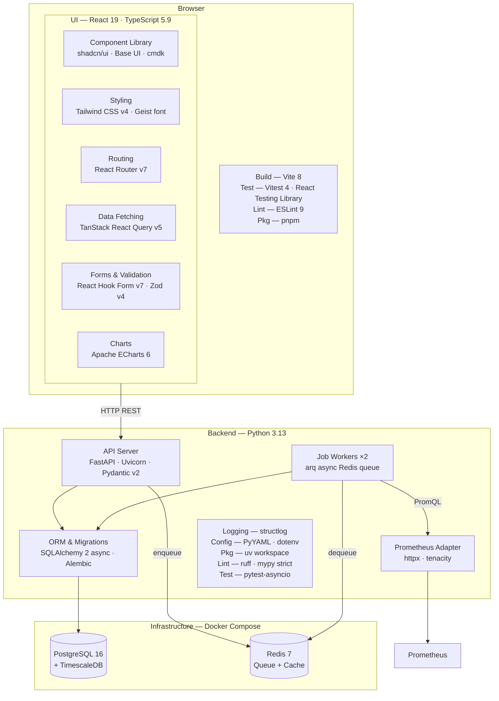

# TROPEK

**Trend Reporting and Objective Evaluation toolkit**

A standalone quality gate and performance test evaluation platform. Evaluates SLI/SLO metrics from Prometheus, CSV files, JMeter results, or any source that can POST JSON -- and decides pass / warning / fail.

Extracted and rewritten from [Keptn's](https://keptn.sh) lighthouse-service. Runs in Docker Compose. No Kubernetes required.

---

## What it does

- Evaluates metrics against **SLO criteria** (fixed thresholds and relative % change)
- Supports **key SLI veto** -- one critical metric failure fails the whole evaluation regardless of score
- Tracks **trend history** with TimescaleDB for relative comparisons (`<=+10%`)
- Three **ingestion modes**: pull from Prometheus, push metrics inline, or upload a file (CSV / JMeter)
- **Versioned SLO & SLI registries** -- every change is stored; evaluations record which version they used
- **Asset & group registry** -- register VMs/services, organise into groups, bind SLOs to assets
- **Annotations** -- attach contextual notes to evaluations ("kernel updated before this test")
- **Invalidation** -- mark evaluations as invalid without deleting them
- **Data source registry** -- register adapter instances (Prometheus, future: InfluxDB, etc.)

---

## Architecture

```
Docker Compose
├── api                  :8080   FastAPI — evaluation engine, registries, REST API
├── worker               ×2      arq job workers (same image, different entrypoint)
├── adapter-prometheus   :8081   Prometheus query adapter
├── timescaledb          :5432   PostgreSQL + TimescaleDB (evaluations + time-series SLI values)
├── redis                :6379   Job queue (arq db 1) + response cache (db 0)
├── ui                   :3000   React SPA
└── timescaledb-test     :5433   Test database (profile: test — not started by default)
```

The evaluation engine is a **pure Python function** -- zero I/O, fully unit-tested, ported from Keptn's Go implementation.

For detailed architecture documentation see:
- [docs/architecture/system-overview.md](docs/architecture/system-overview.md) -- Service topology and communication
- [docs/architecture/evaluation-flow.md](docs/architecture/evaluation-flow.md) -- Evaluation lifecycle and scoring
- [docs/architecture/data-model.md](docs/architecture/data-model.md) -- Database schema and design decisions
- [docs/architecture/configuration.md](docs/architecture/configuration.md) -- Configuration system
- [api/docs/](api/docs/) -- API layer, evaluation engine, database layer
- [ui/docs/](ui/docs/) -- Frontend architecture, features, mock system
- [adapters/prometheus/docs/](adapters/prometheus/docs/) -- Adapter architecture and contract

---

## Quick start

```bash
# 1. Clone
git clone https://github.com/domik82/tropek.git
cd tropek

# 2. Configure
cp .env.example .env
# Edit .env — set passwords

# 3. Start infrastructure
docker compose up timescaledb redis -d

# 4. Run migrations
uv run --directory api alembic upgrade head

# 5. Start all services
docker compose up --build

# 6. Check health
curl http://localhost:8080/health
```

---

## Development setup

Requires: [uv](https://docs.astral.sh/uv/), Python 3.13, Docker, Node.js 18+, [pnpm](https://pnpm.io/)

### Backend (API + worker)

```bash
# Install all workspace dependencies
uv sync

# Run all unit tests (no infrastructure needed)
uv run pytest api/tests/ -m "not integration" -q

# Run integration tests (requires test DB — see below)
uv run pytest api/tests/ -m integration -v

# Lint and format
uv run ruff check api/ adapters/
uv run ruff format api/ adapters/

# Type check
uv run mypy api/app adapters/prometheus/app
```

### Integration tests

Integration tests use a **dedicated test database** on port 5433 -- completely separate from the dev database (port 5432).

```bash
# First-time setup
cp .env.test.example .env.test

# Start test infrastructure (idempotent)
./start_test_infra.sh

# Run integration tests
uv run pytest api/tests/ -m integration -v

# Tear down
./stop_test_infra.sh
```

### Database migrations

```bash
# Dev database
uv run --directory api alembic upgrade head

# Test database
ENV_FILE=.env.test uv run --directory api alembic upgrade head

# Autogenerate a new migration (against test DB)
ENV_FILE=.env.test uv run --directory api alembic revision --autogenerate -m "description"
```

### UI

```bash
cd ui
pnpm install
```

#### With mocks (no backend needed)

```bash
pnpm dev
```

Starts on `http://localhost:5173` with MSW intercepting all API calls. Mock data is deterministic (seeded PRNG) -- 30 days of history, 40 asset/lab scenarios, 30 metrics. No backend services required.

#### Against the real API

```bash
# Option 1: dev server with HMR (disable mocks, proxy to running backend)
VITE_USE_MOCKS=false pnpm dev

# Option 2: production build
VITE_API_BASE=http://localhost:8080 pnpm build
pnpm preview
```

Requires the API service running on `:8080` (see Quick Start above).

#### UI tests

```bash
pnpm test        # Vitest unit tests
pnpm lint        # ESLint
```

---

## SLO format

TROPEK uses a superset of the [Keptn 1.0 SLO spec](https://github.com/keptn/spec/blob/master/service_level_objective.md). Existing Keptn SLOs work without modification.

The key difference: **SLI queries are embedded in the SLO file** under an `indicators` block -- no separate SLI file needed.

```yaml
spec_version: '1.0'

# Optional — comparison strategy for relative criteria (<=+10%)
comparison:
  compare_with: several_results        # single_result | several_results
  number_of_comparison_results: 3
  include_result_with_score: pass_or_warn  # pass | pass_or_warn | all
  aggregate_function: avg              # avg | p50 | p90 | p95 | p99
  scope_tags: [os, arch]              # TROPEK extension: scope baseline to matching asset tags

# SLI queries — one entry per metric (PromQL, SQL, or ignored for push/file mode)
indicators:
  response_time_p99: 'histogram_quantile(0.99, rate(http_request_duration_seconds_bucket{instance="$vm_ip"}[5m]))'
  error_rate: 'rate(http_requests_total{status=~"5..",instance="$vm_ip"}[5m])'

objectives:
  - sli: response_time_p99
    displayName: "Response Time P99 (ms)"
    pass:
      - criteria: ["<600", "<=+10%"]   # AND within a block
      - criteria: ["<400"]             # OR across blocks — any block passing = pass
    warning:
      - criteria: ["<800"]
    weight: 2
    key_sli: false                     # true = failure here fails the entire evaluation

  - sli: error_rate
    displayName: "Error Rate"
    pass:
      - criteria: ["=0"]
    weight: 3
    key_sli: true

total_score:
  pass: "90%"      # weighted score >= 90% → pass
  warning: "75%"   # weighted score >= 75% → warning
```

### Criteria syntax

| Pattern | Type | Meaning |
|---|---|---|
| `<600` | Fixed | value must be less than 600 |
| `<=600` | Fixed | value must be <= 600 |
| `=0` | Fixed | value must equal 0 |
| `>=10` | Fixed | value must be >= 10 |
| `<=+10%` | Relative | value <= baseline x 1.10 |
| `>=-5%` | Relative | value >= baseline x 0.95 |
| `<=+50` | Relative | value <= baseline + 50 (absolute delta) |

Relative criteria with no comparison history **always pass** -- no history means no penalty.

---

## Triggering an evaluation

### Push mode (metrics provided inline)

```bash
curl -X POST http://localhost:8080/evaluations \
  -H "Content-Type: application/json" \
  -d '{
    "name": "checkout-api-load-test",
    "start": "2026-03-12T10:00:00Z",
    "end": "2026-03-12T10:30:00Z",
    "slo_name": "http-api-slo",
    "metrics": {
      "response_time_p99": 450.3,
      "error_rate": 0.0
    },
    "metadata": {"os": "linux", "branch": "main"}
  }'
```

### Pull mode (Prometheus adapter)

```bash
curl -X POST http://localhost:8080/evaluations \
  -H "Content-Type: application/json" \
  -d '{
    "name": "compilation-test",
    "start": "2026-03-12T10:00:00Z",
    "end": "2026-03-12T10:45:00Z",
    "slo_name": "compilation-test-slo",
    "datasource": {"adapter": "prometheus"},
    "metadata": {"vm_ip": "10.0.1.15", "os": "windows-11", "arch": "x64"}
  }'
```

### File mode (CSV)

```bash
curl -X POST http://localhost:8080/evaluations/file \
  -F 'meta={"name":"network-test","start":"2026-03-12T09:00:00Z","end":"2026-03-12T09:20:00Z","slo_name":"network-slo","results_format":"csv","metadata":{}}' \
  -F "results_file=@results.csv"
```

CSV format:
```csv
metric_name,value,aggregation
response_time_p99,450.3,p99
error_rate,0.02,avg
```

---

## Project structure

```
tropek/
├── api/                          Python FastAPI service (see api/README.md)
│   ├── app/                      Application code
│   ├── alembic/                  Database migrations
│   ├── tests/                    Unit + integration tests
│   └── docs/                     API architecture docs
├── ui/                           React SPA (see ui/README.md)
│   ├── src/                      Application code
│   └── docs/                     UI architecture docs
├── adapters/
│   └── prometheus/               Prometheus query adapter (see adapters/prometheus/README.md)
├── docs/
│   └── architecture/             System-wide architecture docs
├── scripts/                      Migration + DB helper scripts
├── config.yaml                   Non-secret runtime config (safe to commit)
├── .env.example                  Secret config template
├── docker-compose.yml            All services + test profile
└── pyproject.toml                UV workspace root + ruff/mypy/pytest config
```

---

## Tech stack

### Backend

| Component | Technology |
|---|---|
| Language | Python 3.13 |
| Framework | FastAPI |
| ORM | SQLAlchemy 2 (async, asyncpg driver) |
| Database | PostgreSQL 16 + TimescaleDB |
| Migrations | Alembic (async, autogenerated) |
| Job queue | arq (Redis-backed) |
| Cache | Redis 7 |
| HTTP client | httpx (async) |
| Config | Pydantic Settings + YAML |
| Logging | structlog |
| Package manager | uv |

### Frontend

| Component | Technology |
|---|---|
| Framework | React 19 + TypeScript 5.9 |
| Build | Vite 8 |
| Styling | Tailwind CSS 4 + shadcn/ui (Base UI) |
| Charts | Apache ECharts 6 |
| Data fetching | TanStack React Query 5 |
| Routing | React Router 7 |
| Forms | React Hook Form 7 + Zod 4 |
| API mocking | MSW 2 |
| Testing | Vitest 4 + React Testing Library |
| Package manager | pnpm |

---

## Roadmap

- **Phase 1** (current): Evaluation engine, Prometheus adapter, REST API, basic UI
- **Phase 2**: Asset registry (VM / service registration, version snapshots), group evaluations with weighted multi-VM rollup
- **Phase 3**: Test catalog, cross-version comparison UI, Grafana SimpleJSON endpoint, InfluxDB adapter
- **Post Phase 3**: Change point detection via [Apache OTAVA](https://github.com/apache/otava)

---

## Contributing

This project is open source. PRs welcome.

```bash
# Before submitting a PR:
uv run ruff check api/ adapters/
uv run mypy api/app adapters/prometheus/app
uv run pytest api/tests/ -m "not integration" -q
cd ui && pnpm lint && pnpm test
```

---

## Stack


