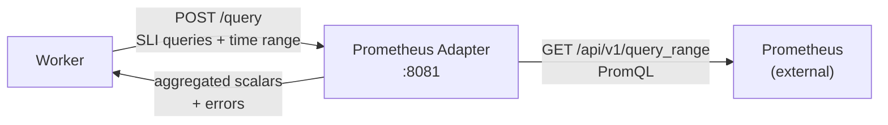

# Prometheus Adapter Architecture

Standalone microservice that translates TROPEK SLI queries into Prometheus PromQL queries
and returns aggregated scalar values.

## Role in the System



The adapter is a **plugin** in TROPEK's adapter system. The same `/query` interface
will be implemented by future adapters (InfluxDB, Datadog, etc.).

## Technology Stack

| Component | Technology |
|-----------|-----------|
| Framework | FastAPI |
| HTTP client | httpx (async) |
| Retry | tenacity |
| Config | Pydantic Settings |
| Logging | structlog |

## Current Status

**Phase 1 (current)**: Skeleton with health endpoint only.

```python
GET /health -> {"status": "ok", "datasource": "prometheus"}
```

## Planned Interface

### POST /query

**Request:**
```json
{
  "queries": {
    "response_time_p99": "histogram_quantile(0.99, rate(http_request_duration_seconds_bucket[5m]))",
    "error_rate": "rate(http_requests_total{status=~\"5..\"}[5m])"
  },
  "start": "2026-03-12T10:00:00Z",
  "end": "2026-03-12T10:30:00Z",
  "step": "60s",
  "variables": {
    "vm_ip": "10.0.1.15"
  }
}
```

**Response:**
```json
{
  "values": {
    "response_time_p99": 450.3,
    "error_rate": 0.001
  },
  "errors": {
    "failed_metric": "query timeout after 30s"
  }
}
```

### Query Flow

1. Receive SLI queries from worker
2. Substitute `$variables` into PromQL templates
3. Execute each query against Prometheus `/api/v1/query_range`
4. Aggregate time-series results into a single scalar per metric
5. Return values map + errors map

### Error Handling

- Per-metric errors (query timeout, invalid PromQL) reported individually
- Adapter-level errors (Prometheus down) cause the entire request to fail
- Worker retries adapter calls with exponential backoff (tenacity)

## Configuration

| Variable | Default | Purpose |
|----------|---------|---------|
| `PROMETHEUS_URL` | `http://prometheus:9090` | Prometheus server URL |
| `QG_ADAPTER_PROMETHEUS_USERNAME` | -- | Optional basic auth |
| `QG_ADAPTER_PROMETHEUS_PASSWORD` | -- | Optional basic auth |

## Adapter Contract

Any TROPEK adapter must implement:

1. `GET /health` -- Return adapter status and datasource type
2. `POST /query` -- Accept SLI query map + time range, return value map + error map

This allows the worker to be adapter-agnostic. The `data_sources` table stores
which adapter to call for each evaluation.
