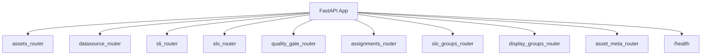
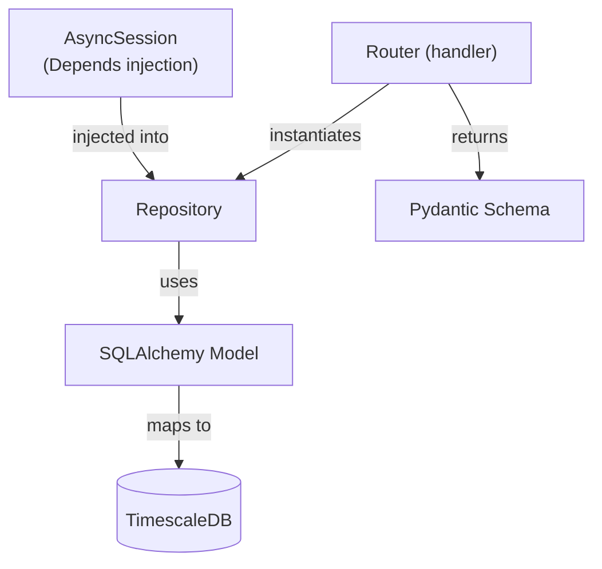

# API Architecture

The API is a FastAPI application serving the REST interface, evaluation trigger,
and all registry CRUD operations.

## Application Structure



Routers are mounted with no URL prefix -- each router defines absolute paths.
A single `/health` endpoint is defined at the app level.

## Module Layout

Every domain module follows the same three-file structure:

```
modules/{domain}/
  router.py       -- FastAPI endpoint handlers
  repository.py   -- Database access (async SQLAlchemy)
  schemas.py      -- Pydantic request/response models
```

| Module | URL Prefix | Responsibility |
|--------|------------|----------------|
| `assets` | `/asset-types`, `/assets`, `/asset-groups` | Asset inventory, groups, hierarchy |
| `assignments` | `/assets/{name}/slo-assignments`, `/asset-groups/{name}/slo-*-assignments` | SLO and SLO group binding to assets/groups |
| `datasource` | `/datasources` | Data source registration (adapter pointers) |
| `sli_registry` | `/sli-definitions` | Versioned SLI definition CRUD |
| `slo_registry` | `/slo-definitions` | Versioned SLO definition CRUD + validate + test |
| `slo_groups` | `/slo-groups` | SLO group CRUD + template generation |
| `display_groups` | `/slo-display-groups` | UI navigation grouping for SLO concepts |
| `quality_gate` | `/evaluations`, `/evaluation/{id}`, `/note-categories` | Evaluation lifecycle, annotations, heatmaps, trend |
| `asset_meta` | `/assets/{id}/meta/*` | Point-in-time metadata snapshots and timeline |
| `common` | -- | Shared error helpers, `PagedResponse[T]`, `StrictInput` |

## Dependency Injection

All routers share the same pattern:

```python
@router.get("/evaluations")
async def list_evaluations(
    session: AsyncSession = Depends(get_session),
) -> PagedResponse[EvaluationSummary]:
    repo = EvaluationRepository(session)
    ...
```

`get_session()` is an async context manager that yields a session, auto-commits on
success, and rolls back on exception. Repositories are instantiated per-request.

## Repository Pattern



### Repository Index

| Repository | Module | Tables |
|------------|--------|--------|
| `AssetTypeRepository` | assets | `asset_types` |
| `AssetRepository` | assets | `assets` |
| `AssetGroupRepository` | assets | `asset_groups`, `asset_group_members`, `asset_group_links` |
| `AssignmentRepository` | assignments | `slo_assignments`, `slo_group_assignments` |
| `DataSourceRepository` | datasource | `data_sources` |
| `SLORepository` | slo_registry | `slo_definitions`, `slo_objectives` |
| `SLIRepository` | sli_registry | `sli_definitions` |
| `SLOGroupRepository` | slo_groups | `slo_groups` |
| `DisplayGroupRepository` | display_groups | `slo_display_groups`, `slo_display_group_members` |
| `EvaluationRunRepository` | quality_gate | `evaluations` |
| `EvaluationRepository` | quality_gate | `slo_evaluations` |
| `IndicatorRepository` | quality_gate | `indicator_results` |
| `SLIValueRepository` | quality_gate | `sli_values` |
| `BaselineRepository` | quality_gate | `slo_evaluations` (baseline queries) |
| `TrendRepository` | quality_gate | `sli_values` (trend queries) |
| `AnnotationRepository` | quality_gate | `evaluation_annotations` |
| `AnnotationCategoryRepository` | quality_gate | `annotation_categories` |
| `AssetMetaRepository` | asset_meta | `asset_meta_snapshots`, `asset_meta_values`, `asset_meta_closures` |

## Common Patterns

- **Pagination**: list endpoints return `PagedResponse[T]` with `items` and `total`
- **Error handling**: domain exceptions (`NotFoundError` -> 404, `ConflictError` -> 409, `DomainValidationError` -> 422) with centralized handlers in `main.py`
- **Schema validation**: Pydantic v2 models with `model_validate()` for ORM -> response
- **Naming**: all lookups by human-readable `name`, not UUID (UUIDs are internal PKs)
- **Versioning**: SLO/SLI auto-increment via `SELECT ... FOR UPDATE`

## Endpoint Reference

### Assets

| Method | Endpoint | Description |
|--------|----------|-------------|
| GET | `/asset-types` | List all asset types |
| POST | `/asset-types` | Create asset type |
| PATCH | `/asset-types/{name}` | Update asset type |
| PATCH | `/asset-types/{name}/set-default` | Set default type |
| DELETE | `/asset-types/{name}` | Delete type (409 if in use) |
| GET | `/assets` | List assets (filter: type_name, tag_key, tag_value) |
| GET | `/assets/tag-keys` | Distinct tag keys across assets |
| GET | `/assets/tag-values` | Tag values for a given key |
| POST | `/assets` | Create asset |
| GET | `/assets/{name}` | Get by name |
| PATCH | `/assets/{name}` | Update asset |
| DELETE | `/assets/{name}` | Delete asset |
| GET | `/asset-groups` | List all groups |
| GET | `/asset-groups/tree` | Full hierarchy tree |
| POST | `/asset-groups` | Create group |
| GET | `/asset-groups/{name}` | Get group detail |
| PATCH | `/asset-groups/{name}` | Update group |
| DELETE | `/asset-groups/{name}` | Delete group |
| POST | `/asset-groups/{name}/members` | Add asset to group |
| DELETE | `/asset-groups/{name}/members/{id}` | Remove from group |
| POST | `/asset-groups/{name}/subgroups` | Add child group |
| DELETE | `/asset-groups/{name}/subgroups/{id}` | Remove child group |

### Assignments

| Method | Endpoint | Description |
|--------|----------|-------------|
| GET | `/assets/{name}/slo-assignments` | List SLO assignments for asset |
| PUT | `/assets/{name}/slo-assignments/{slo_id}` | Assign SLO to asset |
| DELETE | `/assets/{name}/slo-assignments/{id}` | Remove SLO assignment |
| PATCH | `/assets/{name}/slo-assignments/{id}` | Update assignment (e.g., pin version) |
| GET | `/asset-groups/{name}/slo-assignments` | List SLO assignments for group |
| PUT | `/asset-groups/{name}/slo-assignments/{slo_id}` | Assign SLO to group |
| DELETE | `/asset-groups/{name}/slo-assignments/{id}` | Remove SLO assignment from group |
| GET | `/assets/{name}/slo-group-assignments` | List SLO group assignments for asset |
| PUT | `/assets/{name}/slo-group-assignments/{group_id}` | Assign SLO group to asset |
| DELETE | `/assets/{name}/slo-group-assignments/{id}` | Remove SLO group assignment |
| GET | `/asset-groups/{name}/slo-group-assignments` | List SLO group assignments for group |
| PUT | `/asset-groups/{name}/slo-group-assignments/{group_id}` | Assign SLO group to group |
| DELETE | `/asset-groups/{name}/slo-group-assignments/{id}` | Remove SLO group assignment from group |

### DataSources

| Method | Endpoint | Description |
|--------|----------|-------------|
| GET | `/datasources` | List (filter: adapter_type) |
| GET | `/datasources/tag-keys` | Distinct tag keys |
| GET | `/datasources/tag-values` | Tag values for a given key |
| POST | `/datasources` | Register adapter instance |
| GET | `/datasources/{name}` | Get by name |
| PATCH | `/datasources/{name}` | Update URL/tags |
| DELETE | `/datasources/{name}` | Delete datasource |

### SLO Registry

| Method | Endpoint | Description |
|--------|----------|-------------|
| GET | `/slo-definitions` | List latest active versions |
| GET | `/slo-definitions/tag-keys` | Distinct tag keys |
| GET | `/slo-definitions/tag-values` | Tag values for a given key |
| POST | `/slo-definitions` | Create or bump version |
| POST | `/slo-definitions/validate` | Dry-run validation |
| POST | `/slo-definitions/test` | Dry-run evaluation with mock metrics |
| GET | `/slo-definitions/{name}` | Get latest active |
| GET | `/slo-definitions/{name}/versions` | All versions |
| DELETE | `/slo-definitions/{name}` | Deactivate all versions |

### SLI Registry

| Method | Endpoint | Description |
|--------|----------|-------------|
| GET | `/sli-definitions` | List latest active (filter: adapter_type) |
| GET | `/sli-definitions/tag-keys` | Distinct tag keys |
| GET | `/sli-definitions/tag-values` | Tag values for a given key |
| POST | `/sli-definitions` | Create or bump version |
| GET | `/sli-definitions/{name}` | Get latest active |
| GET | `/sli-definitions/{name}/versions` | All versions |
| DELETE | `/sli-definitions/{name}` | Deactivate all versions |

### SLO Groups

| Method | Endpoint | Description |
|--------|----------|-------------|
| GET | `/slo-groups` | List all SLO groups |
| POST | `/slo-groups` | Create group (requires template SLO) |
| GET | `/slo-groups/{name}` | Get group detail |
| PUT | `/slo-groups/{name}` | Update group |
| DELETE | `/slo-groups/{name}` | Delete group + generated SLOs |
| POST | `/slo-groups/{name}/generate` | Generate SLO instances from template |

### Display Groups

| Method | Endpoint | Description |
|--------|----------|-------------|
| GET | `/slo-display-groups` | List all display groups |
| POST | `/slo-display-groups` | Create display group |
| DELETE | `/slo-display-groups/{name}` | Delete display group |
| GET | `/slo-display-groups/{name}/members` | List member SLO names |
| POST | `/slo-display-groups/{name}/members` | Add SLO to display group |
| DELETE | `/slo-display-groups/{name}/members/{slo_name}` | Remove SLO from display group |

### Quality Gate — Evaluations

| Method | Endpoint | Description |
|--------|----------|-------------|
| POST | `/evaluations` | Trigger single evaluation |
| POST | `/evaluations/batch` | Trigger batch evaluation |
| GET | `/evaluations` | List (filters: asset_name, slo_name, result, date, group_name, from/to) |
| GET | `/evaluations/names` | Distinct evaluation names |
| GET | `/evaluations/heatmap` | Grouped metric heatmap for an asset |
| GET | `/evaluations/heatmap/by-metric` | Per-metric heatmap data |
| POST | `/evaluations/re-evaluate/from-date` | Re-evaluate from a date |
| POST | `/evaluations/re-evaluate/from-baseline` | Re-evaluate from baseline |
| POST | `/evaluations/re-evaluate/from-evaluation/{id}` | Re-evaluate from specific evaluation |

### Quality Gate — Single Evaluation

| Method | Endpoint | Description |
|--------|----------|-------------|
| GET | `/evaluation/{id}` | Full detail + indicator results |
| PATCH | `/evaluation/{id}/invalidate` | Mark as invalid |
| PATCH | `/evaluation/{id}/restore` | Clear invalidation |
| PATCH | `/evaluation/{id}/pin-baseline` | Pin baseline to this evaluation |
| PATCH | `/evaluation/{id}/unpin-baseline` | Unpin baseline |
| PATCH | `/evaluation/{id}/override-status` | Manually override result status |
| PATCH | `/evaluation/{id}/restore-override` | Remove manual override |
| GET | `/evaluation/{id}/annotations` | List annotations |
| POST | `/evaluation/{id}/annotations` | Add run-level annotation |
| PATCH | `/evaluation/{id}/annotations/{ann_id}` | Update annotation |
| POST | `/evaluation/{id}/annotations/slo/{slo_eval_id}` | Add SLO-level annotation |
| POST | `/evaluation/{id}/annotations/batch` | Add annotations in bulk |

### Quality Gate — Trend

| Method | Endpoint | Description |
|--------|----------|-------------|
| GET | `/assets/{name}/slos/{slo_name}/trend` | Trend for asset + SLO combination |
| GET | `/evaluation/{id}/trend` | Trend data for a specific evaluation |

### Note Categories

| Method | Endpoint | Description |
|--------|----------|-------------|
| GET | `/note-categories` | List all annotation categories |
| POST | `/note-categories` | Create category |
| PATCH | `/note-categories/{id}` | Update category |
| DELETE | `/note-categories/{id}` | Delete category (system categories immutable) |

### Asset Metadata

| Method | Endpoint | Description |
|--------|----------|-------------|
| POST | `/assets/{id}/meta/snapshots` | Ingest metadata snapshot |
| GET | `/assets/{id}/meta/timeline` | Full timeline for time window |
| GET | `/assets/{id}/meta/timeline/summary` | Summary stats for timeline strip |
