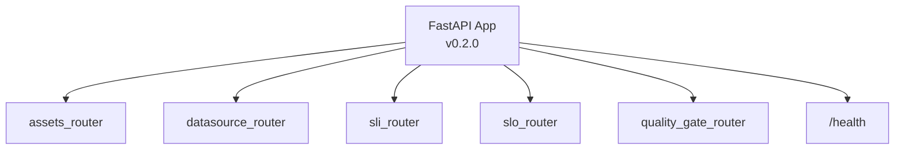
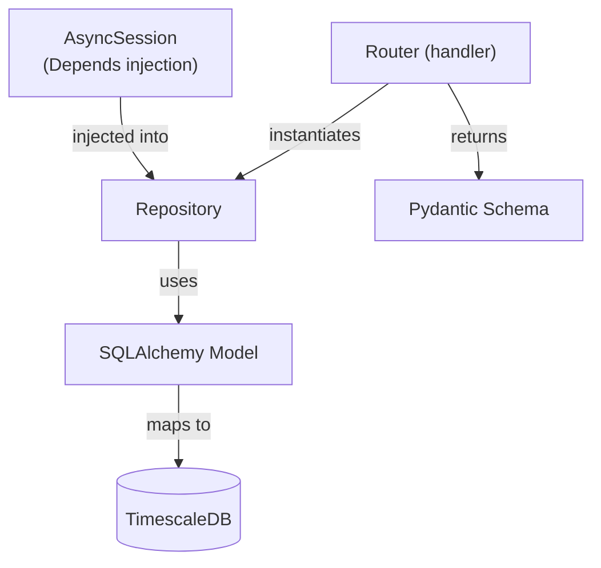

# API Architecture

The API is a FastAPI application serving the REST interface, evaluation trigger,
and all registry CRUD operations.

## Application Structure



Routers are mounted with no URL prefix -- each router defines absolute paths.
A single `/health` endpoint is defined at the app level.

## Module Layout

Every domain module follows the same three-file structure:

```
modules/{domain}/
  router.py       -- FastAPI endpoint handlers
  repository.py   -- Database access (async SQLAlchemy)
  schemas.py      -- Pydantic request/response models
```

| Module | URL Prefix | Responsibility |
|--------|------------|----------------|
| `assets` | `/asset-types`, `/assets`, `/asset-groups` | Asset inventory, groups, SLO bindings |
| `datasource` | `/datasources` | Data source registration (adapter pointers) |
| `sli_registry` | `/sli-definitions` | Versioned SLI definition CRUD |
| `slo_registry` | `/slo-definitions` | Versioned SLO definition CRUD + validate + test |
| `quality_gate` | `/evaluations`, `/trend` | Evaluation lifecycle, annotations, trend queries |
| `common` | -- | Shared error helpers, `PagedResponse[T]` |

## Dependency Injection

All routers share the same pattern:

```python
@router.get("/evaluations")
async def list_evaluations(
    session: AsyncSession = Depends(get_session),
) -> PagedResponse[EvaluationSummary]:
    repo = EvaluationRepository(session)
    ...
```

`get_session()` is an async context manager that yields a session, auto-commits on
success, and rolls back on exception. Repositories are instantiated per-request.

## Repository Pattern



### Repository Index

| Repository | Module | Tables |
|------------|--------|--------|
| `AssetTypeRepository` | assets | `asset_types` |
| `AssetRepository` | assets | `assets` |
| `AssetGroupRepository` | assets | `asset_groups`, `asset_group_members`, `asset_group_links` |
| `AssetSLOLinkRepository` | assets | `asset_slo_links` |
| `AssetGroupSLOLinkRepository` | assets | `asset_group_slo_links` |
| `DataSourceRepository` | datasource | `data_sources` |
| `SLORepository` | slo_registry | `slo_definitions`, `slo_objectives` |
| `SLIRepository` | sli_registry | `sli_definitions` |
| `EvaluationRepository` | quality_gate | `evaluations`, `evaluation_annotations`, `sli_values` |

## Common Patterns

- **Pagination**: list endpoints return `PagedResponse[T]` with `items` and `total`
- **Error handling**: `raise_not_found(entity, name)` -> 404, `raise_conflict(entity, name)` -> 409
- **Schema validation**: Pydantic v2 models with `model_validate()` for ORM -> response
- **Naming**: all lookups by human-readable `name`, not UUID (UUIDs are internal PKs)
- **Versioning**: SLO/SLI auto-increment via `SELECT ... FOR UPDATE`

## Endpoint Reference

### Assets Module

| Method | Endpoint | Description |
|--------|----------|-------------|
| GET | `/asset-types` | List all asset types |
| POST | `/asset-types` | Create asset type |
| PATCH | `/asset-types/{name}/set-default` | Set default type |
| DELETE | `/asset-types/{name}` | Delete type (409 if in use) |
| GET | `/assets` | List assets (filter: type_name, label_key, label_val) |
| POST | `/assets` | Create asset |
| GET | `/assets/{name}` | Get by name |
| PATCH | `/assets/{name}` | Update asset |
| GET | `/assets/{name}/slo-links` | List SLO bindings |
| POST | `/assets/{name}/slo-links` | Bind SLO+SLI+DataSource |
| DELETE | `/assets/{name}/slo-links/{link}` | Remove binding |
| GET | `/asset-groups` | List all groups |
| GET | `/asset-groups/tree` | Full hierarchy tree |
| POST | `/asset-groups` | Create group |
| GET | `/asset-groups/{name}` | Get group detail |
| PATCH | `/asset-groups/{name}` | Update group |
| DELETE | `/asset-groups/{name}` | Delete group |
| POST | `/asset-groups/{name}/members` | Add asset to group |
| DELETE | `/asset-groups/{name}/members/{id}` | Remove from group |
| POST | `/asset-groups/{name}/subgroups` | Add child group |
| DELETE | `/asset-groups/{name}/subgroups/{id}` | Remove child group |
| GET | `/asset-groups/{name}/slo-links` | List group SLO bindings |
| POST | `/asset-groups/{name}/slo-links` | Bind SLO to group |
| DELETE | `/asset-groups/{name}/slo-links/{link}` | Remove binding |

### DataSource Module

| Method | Endpoint | Description |
|--------|----------|-------------|
| GET | `/datasources` | List (filter: adapter_type) |
| POST | `/datasources` | Register adapter instance |
| GET | `/datasources/{name}` | Get by name |
| PATCH | `/datasources/{name}` | Update URL/labels |

### SLO Registry

| Method | Endpoint | Description |
|--------|----------|-------------|
| GET | `/slo-definitions` | List latest active versions |
| POST | `/slo-definitions` | Create or bump version |
| POST | `/slo-definitions/validate` | Dry-run validation |
| POST | `/slo-definitions/test` | Dry-run evaluation with mock metrics |
| GET | `/slo-definitions/{name}` | Get latest active |
| GET | `/slo-definitions/{name}/versions` | All versions |
| DELETE | `/slo-definitions/{name}` | Deactivate all versions |

### SLI Registry

| Method | Endpoint | Description |
|--------|----------|-------------|
| GET | `/sli-definitions` | List latest active (filter: adapter_type) |
| POST | `/sli-definitions` | Create or bump version |
| GET | `/sli-definitions/{name}` | Get latest active |
| GET | `/sli-definitions/{name}/versions` | All versions |
| DELETE | `/sli-definitions/{name}` | Deactivate all versions |

### Quality Gate

| Method | Endpoint | Description |
|--------|----------|-------------|
| GET | `/evaluations` | List (filters: asset_name, slo_name, result, date, group_name, from/to) |
| GET | `/evaluations/{id}` | Full detail + annotations + indicator results |
| PATCH | `/evaluations/{id}/invalidate` | Mark as invalid |
| PATCH | `/evaluations/{id}/restore` | Clear invalidation |
| GET | `/evaluations/{id}/annotations` | List annotations |
| POST | `/evaluations/{id}/annotations` | Add annotation |
| PATCH | `/evaluations/{id}/annotations/{ann_id}` | Update annotation |
| DELETE | `/evaluations/{id}/annotations/{ann_id}` | Delete annotation |
| GET | `/trend` | Time-series data (eval_id or asset_name+slo_name) |
