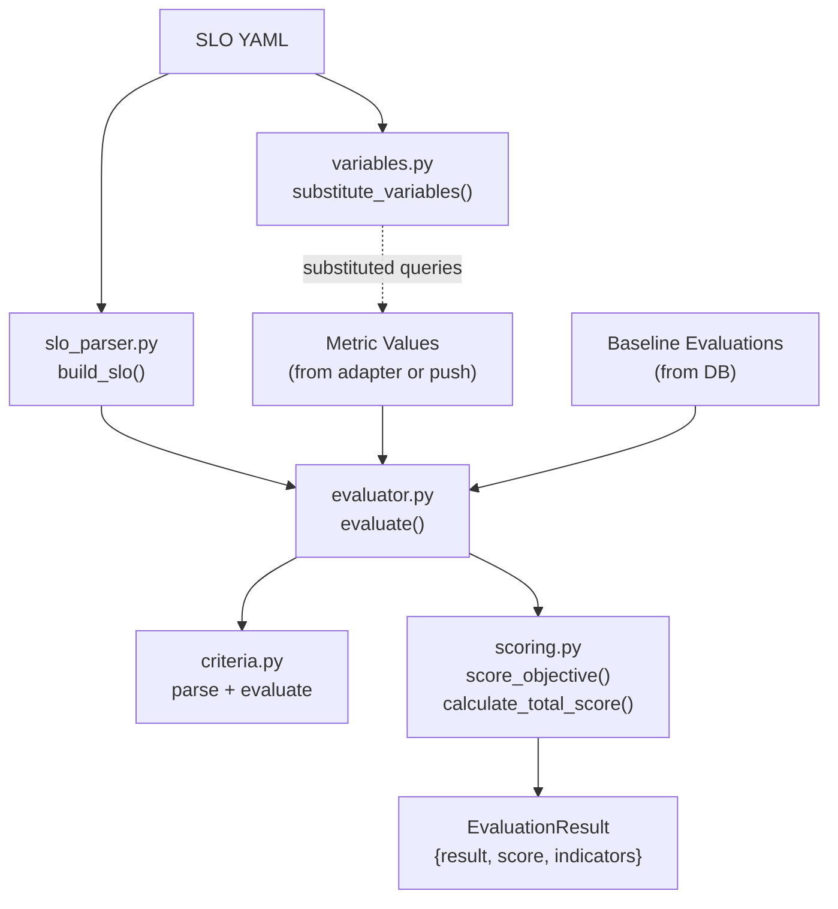

# Evaluation Engine

The core scoring logic lives in `api/app/modules/quality_gate/engine/`. It is pure
Python with zero I/O -- no database, network, or file access. Fully unit-testable.

Ported from Keptn's Go `lighthouse-service`.

## Module Map

```
engine/
  evaluator.py       -- evaluate() entry point
  slo_parser.py      -- Build SLO model from structured data
  criteria.py        -- Parse and evaluate criteria strings
  scoring.py         -- Per-objective + total score calculation
  variables.py       -- $variable substitution in SLI queries
  slo_models.py      -- SLO domain models (dataclasses)
  result_models.py   -- Evaluation result models
  constants.py       -- StrEnums (status, outcome, criteria type)
```

## Data Flow



## Entry Point: evaluate()

```python
def evaluate(
    slo: SLO,
    metrics: dict[str, float | None],
    baselines: dict[str, list[float]],
    compared_evaluation_ids: list[str],
) -> EvaluationResult
```

For each SLO objective:
1. Look up the metric value from `metrics`
2. Look up baseline values from `baselines`
3. Call `score_objective()` to get pass/warning/fail status
4. Build pass and warning target lists for the response

Then `calculate_total_score()` aggregates all objective results into a final verdict.

## Criteria System

### Syntax

| Pattern | Type | Meaning |
|---------|------|---------|
| `<600` | Fixed | value < 600 |
| `<=600` | Fixed | value <= 600 |
| `=0` | Fixed | value == 0 |
| `>=10` | Fixed | value >= 10 |
| `<=+10%` | Relative | value <= baseline * 1.10 |
| `>=-5%` | Relative | value >= baseline * 0.95 |
| `<=+50` | Relative | value <= baseline + 50 (absolute delta) |

### Evaluation Logic

- **Within a criteria block**: AND (all must pass)
- **Across blocks**: OR (any block passing = pass)
- **Relative with no baseline**: always passes (no penalty for first run)

### Parsed Representation

```python
@dataclass
class ParsedCriteria:
    raw: str                    # Original string
    operator: str               # <, <=, =, >=, >
    type: CriteriaType          # FIXED or RELATIVE
    threshold: float | None     # For fixed criteria
    relative_pct: float | None  # For relative %
    relative_direction: str     # + or -
```

## Scoring

### Per-Objective (score_objective)

| Condition | Status | Score |
|-----------|--------|-------|
| No pass_criteria defined | INFO | 0 (does not contribute) |
| Value is None | FAIL | 0 |
| All pass_criteria pass | PASS | weight |
| All warning_criteria pass | WARNING | 0.5 * weight |
| Otherwise | FAIL | 0 |

### Total Score (calculate_total_score)

1. Sum achieved scores / sum maximum scores -> percentage
2. Check for key SLI failures (any key SLI fail = overall FAIL)
3. Compare percentage against `total_score.pass` and `total_score.warning` thresholds

## Domain Models

### SLO Models (slo_models.py)

```python
@dataclass
class SLOObjective:
    sli: str
    display_name: str
    pass_criteria: list[list[str]]   # Outer = OR, inner = AND
    warning_criteria: list[list[str]]
    weight: int
    key_sli: bool

@dataclass
class SLOComparison:
    compare_with: CompareWith        # SINGLE_RESULT | SEVERAL_RESULTS
    number_of_comparison_results: int
    include_result_with_score: IncludeResultWithScore  # ALL | PASS_OR_WARN | PASS
    aggregate_function: AggregateFunction  # AVG | P50 | P90 | P95 | P99
    scope_tags: list[str]

@dataclass
class SLO:
    objectives: list[SLOObjective]
    comparison: SLOComparison
    total_score: SLOTotalScore
```

### Result Models (result_models.py)

```python
@dataclass
class ObjectiveResult:
    objective: SLOObjective
    status: IndicatorStatus    # PASS | WARNING | FAIL | INFO | ERROR
    score: float
    contributes_to_score: bool
    key_sli_failed: bool

@dataclass
class EvaluationResult:
    result: EvaluationOutcome  # PASS | WARNING | FAIL
    score: float
    indicator_results: list[ObjectiveResult]
    compared_evaluation_ids: list[str]
```

## Variable Substitution (variables.py)

SLI queries can contain `$variable` tokens replaced at evaluation time:

```python
build_variables(metadata, asset_name, test_name, start, end) -> dict[str, str]
substitute_variables(template, variables) -> str
```

Sources merged (in priority order):
1. Evaluation metadata (caller-provided key-values)
2. Asset labels
3. Built-in: `$asset_name`, `$test_name`, `$start`, `$end`

Example: `rate(http_requests_total{instance="$vm_ip"}[5m])` with `metadata={"vm_ip": "10.0.1.15"}`
