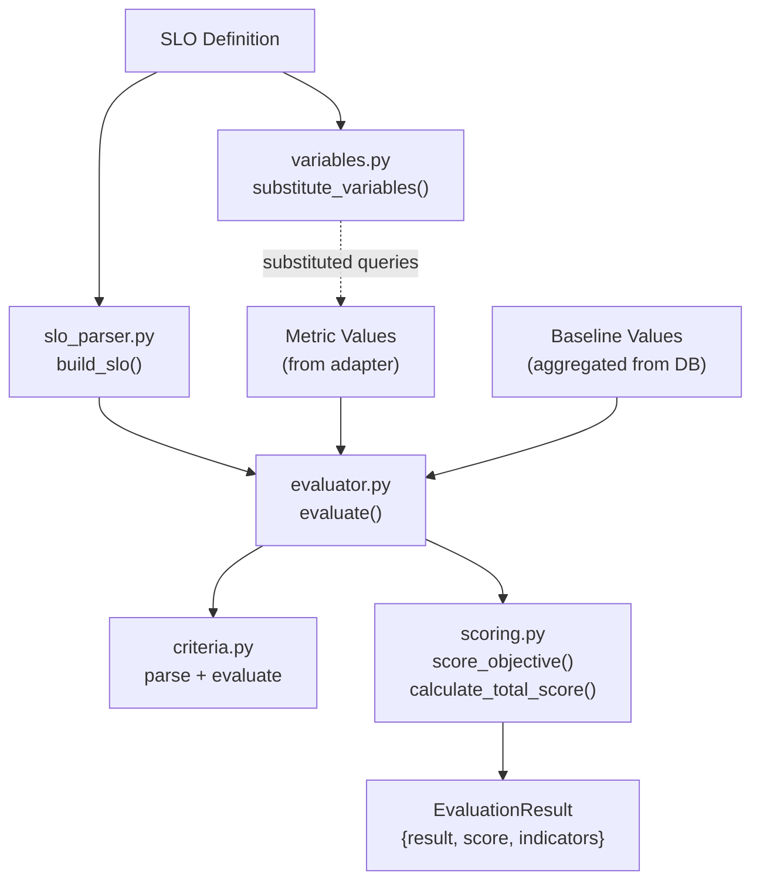

# Evaluation Engine

The core scoring logic lives in `api/tropek/modules/quality_gate/evaluation_engine/`. It is pure
Python with zero I/O -- no database, network, or file access. Fully unit-testable.

Ported from Keptn's Go `lighthouse-service`.

## Module Map

```
evaluation_engine/
  evaluator.py       -- evaluate() entry point
  slo_parser.py      -- Build SLO model from structured data
  criteria.py        -- Parse and evaluate criteria strings
  scoring.py         -- Per-objective + total score calculation
  variables.py       -- $variable substitution in SLI queries
  slo_models.py      -- SLO domain models (Pydantic BaseModel)
  result_models.py   -- Evaluation result models (Pydantic BaseModel)
  constants.py       -- StrEnums (status, outcome, criteria type)
```

## Data Flow



## Entry Point: evaluate()

```python
def evaluate(
    slo: SLO,
    metrics: dict[str, float | None],
    baselines: dict[str, float | None],
    compared_evaluation_ids: list[str] | None = None,
) -> EvaluationResult
```

For each SLO objective:
1. Look up the metric value from `metrics`
2. Look up the aggregated baseline value from `baselines`
3. Call `score_objective()` to get pass/warning/fail/error status
4. Build pass and warning target lists for the response

Then `calculate_total_score()` aggregates all objective results into a final verdict.

## Criteria System

### Syntax

| Pattern | Type | Meaning |
|---------|------|---------|
| `<600` | Fixed | value < 600 |
| `<=600` | Fixed | value <= 600 |
| `=0` | Fixed | value == 0 |
| `>=10` | Fixed | value >= 10 |
| `<=+10%` | Relative | value <= baseline * 1.10 |
| `>=-5%` | Relative | value >= baseline * 0.95 |
| `<=+50` | Relative | value <= baseline + 50 (absolute delta) |

### Evaluation Logic

- **Within a criteria list**: AND (all must pass)
- **Relative with no baseline**: always passes (no penalty for first run)

### Parsed Representation

```python
class ParsedCriteria(BaseModel):
    raw: str                    # Original string
    operator: str               # <, <=, =, >=, >
    type: CriteriaType          # FIXED or RELATIVE
    threshold: float            # For fixed criteria (default 0.0)
    relative_pct: float         # For relative % (default 0.0)
    relative_direction: str     # + or - (default '+')

    def compute_target_value(self, baseline: float | None) -> float: ...
```

## Scoring

### Per-Objective (score_objective)

| Condition | Status | Score |
|-----------|--------|-------|
| No pass_threshold defined | INFO | 0 (does not contribute) |
| Value is None | ERROR | 0 |
| All pass_threshold criteria pass | PASS | weight |
| All warning_threshold criteria pass | WARNING | 0.5 * weight |
| Otherwise | FAIL | 0 |

### Total Score (calculate_total_score)

1. Sum achieved scores / sum maximum scores -> percentage
2. Check for key SLI failures (any key SLI fail = overall FAIL)
3. Compare percentage against `total_score.pass_threshold` and `total_score.warning_threshold`

## Domain Models

All engine models are Pydantic `BaseModel` classes (not dataclasses).

### SLO Models (slo_models.py)

```python
class SLOObjective(BaseModel):
    sli: str
    display_name: str = ''
    pass_threshold: list[str]       # Flat list, AND logic
    warning_threshold: list[str]    # Flat list, AND logic
    weight: int = 1
    key_sli: bool = False

class SLOComparison(BaseModel):
    compare_with: CompareWith        # SINGLE_RESULT | SEVERAL_RESULTS
    number_of_comparison_results: int = 3
    include_result_with_score: IncludeResultWithScore  # ALL | PASS_OR_WARN | PASS
    aggregate_function: AggregateFunction  # AVG | P50 | P90 | P95 | P99
    scope_tags: list[str]            # default: ['os']

class SLOTotalScore(BaseModel):
    pass_threshold: float = 90.0
    warning_threshold: float = 75.0

class SLO(BaseModel):
    objectives: list[SLOObjective]
    comparison: SLOComparison
    total_score: SLOTotalScore
```

### Result Models (result_models.py)

```python
class ObjectiveResult(BaseModel):
    objective: SLOObjective
    status: IndicatorStatus    # PASS | WARNING | FAIL | INFO | ERROR
    score: float
    contributes_to_score: bool
    key_sli_failed: bool

class CriteriaTarget(BaseModel):
    criteria: str              # Raw criteria string
    target_value: float | None # Computed threshold after resolving baseline
    violated: bool             # Whether the metric value violated this criteria

class IndicatorResult(BaseModel):
    metric: str
    display_name: str
    value: float | None
    compared_value: float | None
    status: str
    score: float
    weight: float
    key_sli: bool
    pass_targets: list[CriteriaTarget]
    warning_targets: list[CriteriaTarget] | None
    change_absolute: float | None
    change_relative_pct: float | None

class EvaluationResult(BaseModel):
    result: EvaluationOutcome  # PASS | WARNING | FAIL
    score: float
    indicator_results: list[IndicatorResult]
    compared_evaluation_ids: list[str]
```

## Variable Substitution (variables.py)

SLI queries can contain `$variable` tokens replaced at evaluation time:

```python
build_variables(metadata, asset_name, evaluation_name, start, end) -> dict[str, str]
substitute_variables(template, variables) -> str
```

Sources merged (metadata has lowest priority — built-ins are not overridden):
1. `metadata` dict from the evaluation request
2. Built-in: `$asset_name`, `$evaluation_name`, `$test_name` (alias), `$start`, `$end`

Example: `rate(http_requests_total{instance="$vm_ip"}[5m])` with `metadata={"vm_ip": "10.0.1.15"}`

## Known Limitations

### No validation of pass vs warning criteria ordering

The engine does **not** validate that pass criteria are stricter than warning criteria.
`score_objective()` checks pass first, then warning (see Scoring above). If warning is
stricter than pass, the warning band becomes unreachable — any value satisfying warning
also satisfies pass, so the engine never reaches the warning branch.

**Example — warning stricter than pass (wrong):**

```json
{
  "pass_threshold": ["<=+20%"],
  "warning_threshold": ["<=+5%"]
}
```

Here `<=+20%` (pass) is more permissive than `<=+5%` (warning). A value within 5% of
baseline satisfies both — but pass is checked first, so it passes. A value between 5–20%
fails warning but passes pass. Warning is never reached.

**Correct — pass is stricter, warning is more permissive:**

```json
{
  "pass_threshold": ["<=+5%"],
  "warning_threshold": ["<=+20%"]
}
```

Pass is the high-quality gate (strict). Warning catches degraded-but-acceptable values
that don't meet the pass threshold.

**Why no static validation?** Criteria can mix fixed and relative thresholds, use different
operators, or depend on a runtime baseline — making general static analysis unreliable.
This matches Keptn lighthouse-service behaviour, which also performed no such validation.

**The same concern applies to `total_score` thresholds.** If `warning_threshold` is set higher
than `pass_threshold`, the warning band disappears — everything above warning also passes.
