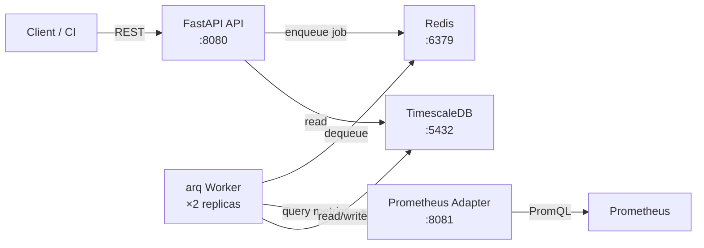
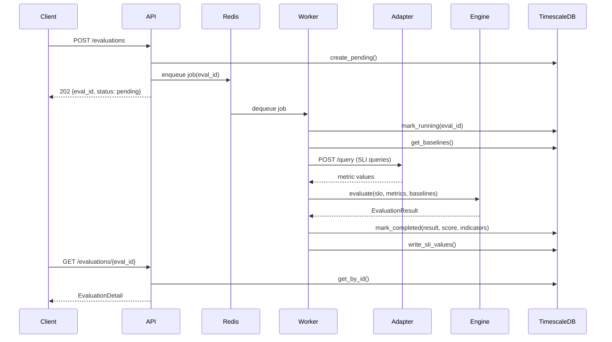
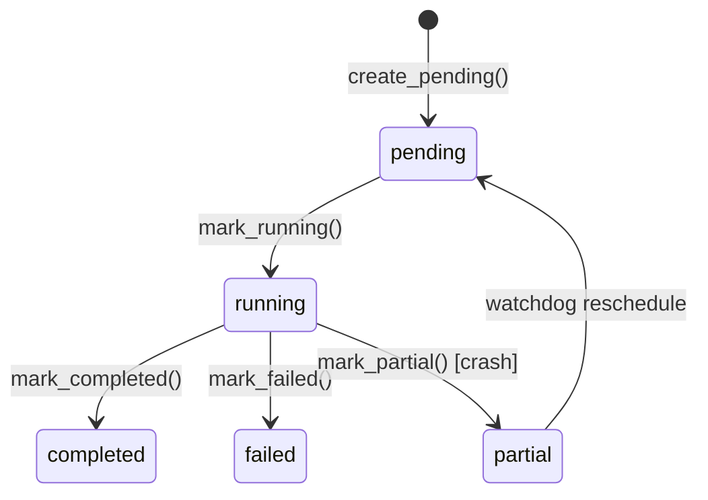
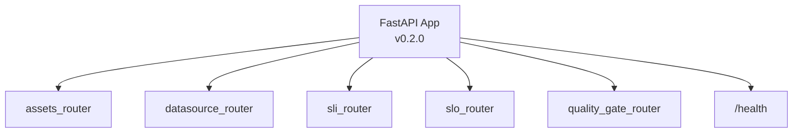
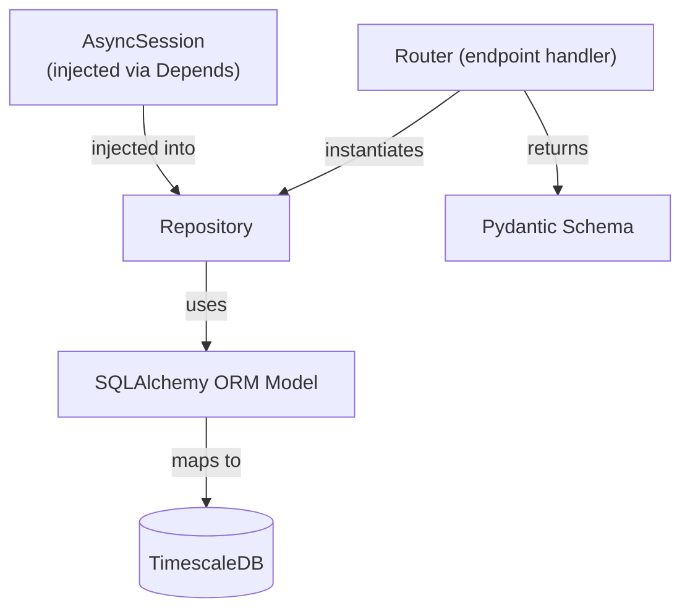
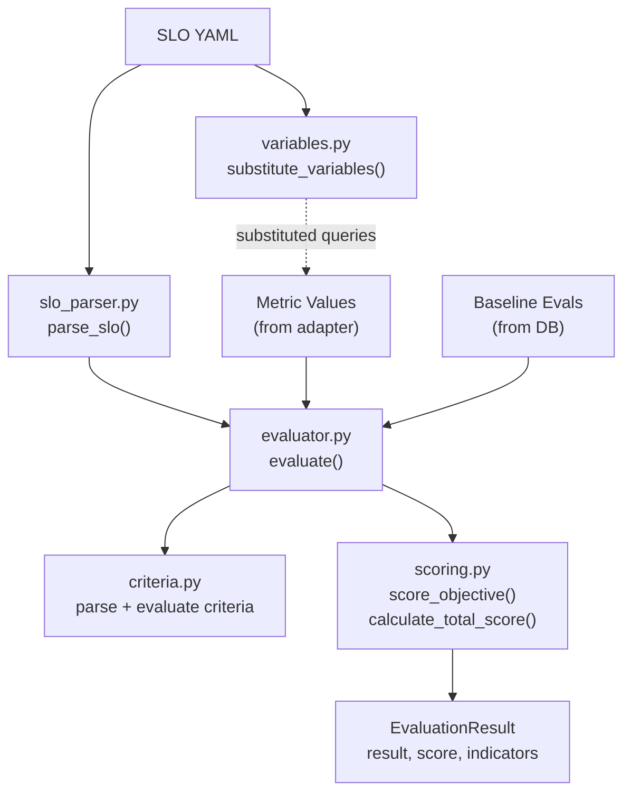
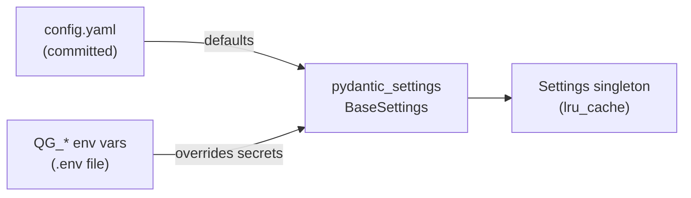

# TROPEK Architecture — API & Database Layers

## 1. System Overview

TROPEK is a quality gate and performance evaluation platform. Clients submit evaluation
requests through a FastAPI REST API. A Redis-backed job queue (arq) dispatches work to
workers that query external data sources via adapter microservices, run a pure-function
evaluation engine, and persist results to PostgreSQL + TimescaleDB.



## 2. Evaluation Flow

The core use case — triggering and completing an evaluation:



### Evaluation Status Lifecycle



## 3. API Layer

### 3.1 Application Setup

`api/app/main.py` mounts five routers with no URL prefix — each router defines absolute
paths. A single `/health` endpoint is defined at the app level.



### 3.2 Dependency Injection

All routers share the same DI pattern: `Depends(get_session)` injects an async SQLAlchemy
session. Repositories are instantiated per-request inside each handler:

```python
@router.get("/evaluations")
async def list_evaluations(
    session: AsyncSession = Depends(get_session),
) -> PagedResponse[EvaluationSummary]:
    repo = EvaluationRepository(session)
    ...
```

`get_session()` is an `@asynccontextmanager` that yields a session, auto-commits on
success, and rolls back on exception.

### 3.3 Endpoint Reference

#### Assets Module (`/asset-types`, `/assets`, `/asset-groups`)

| Method | Endpoint | Description |
|--------|----------|-------------|
| GET | `/asset-types` | List all asset types |
| POST | `/asset-types` | Create asset type |
| PATCH | `/asset-types/{name}/set-default` | Set default type |
| DELETE | `/asset-types/{name}` | Delete type (409 if in use) |
| GET | `/assets` | List assets (filter: type_name, label_key, label_val) |
| POST | `/assets` | Create asset |
| GET | `/assets/{name}` | Get asset by name |
| PATCH | `/assets/{name}` | Update asset |
| GET | `/assets/{name}/slo-links` | List SLO bindings for asset |
| POST | `/assets/{name}/slo-links` | Bind SLO+SLI+DataSource to asset |
| DELETE | `/assets/{name}/slo-links/{link_name}` | Remove binding |
| GET | `/asset-groups` | List all groups |
| GET | `/asset-groups/tree` | Full group hierarchy |
| POST | `/asset-groups` | Create group with members/subgroups |
| GET | `/asset-groups/{name}` | Get group detail |
| POST | `/asset-groups/{name}/members` | Add asset to group |
| DELETE | `/asset-groups/{name}/members/{asset_id}` | Remove asset from group |
| POST | `/asset-groups/{name}/subgroups` | Add child group |
| DELETE | `/asset-groups/{name}/subgroups/{child_id}` | Remove child group |
| GET | `/asset-groups/{name}/slo-links` | List SLO bindings for group |
| POST | `/asset-groups/{name}/slo-links` | Bind SLO to group |
| DELETE | `/asset-groups/{name}/slo-links/{link_name}` | Remove binding |

#### DataSource Module (`/datasources`)

| Method | Endpoint | Description |
|--------|----------|-------------|
| GET | `/datasources` | List datasources (filter: adapter_type) |
| POST | `/datasources` | Register datasource |
| GET | `/datasources/{name}` | Get by name |
| PATCH | `/datasources/{name}` | Update URL/labels |

#### SLO Registry (`/slo-definitions`)

| Method | Endpoint | Description |
|--------|----------|-------------|
| GET | `/slo-definitions` | List latest active versions |
| POST | `/slo-definitions` | Create or bump version |
| GET | `/slo-definitions/{name}` | Get latest active |
| GET | `/slo-definitions/{name}/versions` | All versions |
| DELETE | `/slo-definitions/{name}` | Deactivate all versions |

#### SLI Registry (`/sli-definitions`)

| Method | Endpoint | Description |
|--------|----------|-------------|
| GET | `/sli-definitions` | List latest active versions |
| POST | `/sli-definitions` | Create or bump version |
| GET | `/sli-definitions/{name}` | Get latest active |
| GET | `/sli-definitions/{name}/versions` | All versions |
| DELETE | `/sli-definitions/{name}` | Deactivate all versions |

#### Quality Gate (`/evaluations`, `/trend`)

| Method | Endpoint | Description |
|--------|----------|-------------|
| GET | `/evaluations` | List evaluations (filter: asset_name, slo_name, result, date, group_name) |
| GET | `/evaluations/{id}` | Full detail with annotations + indicator results |
| PATCH | `/evaluations/{id}/invalidate` | Mark invalidated with note |
| PATCH | `/evaluations/{id}/restore` | Clear invalidation |
| GET | `/evaluations/{id}/annotations` | List annotations |
| POST | `/evaluations/{id}/annotations` | Add annotation |
| PATCH | `/evaluations/{id}/annotations/{ann_id}` | Update annotation |
| DELETE | `/evaluations/{id}/annotations/{ann_id}` | Delete annotation |
| GET | `/trend` | Time-series data (params: asset_name, slo_name, metric) |

### 3.4 Common Patterns

- **Pagination**: List endpoints return `PagedResponse[T]` with `items` and `total`
- **Error handling**: `raise_not_found(entity, name)` → 404, `raise_conflict(entity, name)` → 409
- **Schema validation**: Pydantic v2 models with `model_validate()` for ORM → response conversion
- **Naming**: All lookups by human-readable `name`, not UUID (UUIDs are internal PKs)

## 4. Database Layer

### 4.1 Entity Relationship Diagram

```mermaid
erDiagram
    asset_types ||--o{ assets : "type_name"
    assets ||--o{ evaluations : "asset_id"
    assets ||--o{ asset_group_members : "asset_id"
    assets ||--o{ asset_slo_links : "asset_id"

    asset_groups ||--o{ asset_group_members : "group_id"
    asset_groups ||--o{ asset_group_links : "parent"
    asset_groups ||--o{ asset_group_links : "child"
    asset_groups ||--o{ asset_group_slo_links : "group_id"

    evaluations ||--o{ evaluation_annotations : "evaluation_id"
    evaluations ||--o{ sli_values : "eval_id"

    evaluation_batches ||--|| evaluations : "evaluation_ids (JSONB)"

    asset_slo_links }o..o{ slo_definitions : "slo_name"
    asset_slo_links }o..o{ sli_definitions : "sli_name"
    asset_slo_links }o..o{ data_sources : "data_source_name"

    asset_group_slo_links }o..o{ slo_definitions : "slo_name"
    asset_group_slo_links }o..o{ sli_definitions : "sli_name"
    asset_group_slo_links }o..o{ data_sources : "data_source_name"

    asset_types {
        uuid id PK
        text name UK
        bool is_default
    }

    assets {
        uuid id PK
        text name UK
        text display_name
        text type_name FK
        jsonb labels
        timestamptz created_at
        timestamptz updated_at
    }

    asset_groups {
        uuid id PK
        text name UK
        text display_name
        text description
        timestamptz created_at
        timestamptz updated_at
    }

    asset_group_members {
        uuid group_id PK_FK
        uuid asset_id PK_FK
        float weight
    }

    asset_group_links {
        uuid parent_group_id PK_FK
        uuid child_group_id PK_FK
        float weight
    }

    data_sources {
        uuid id PK
        text name UK
        text display_name
        text adapter_type
        text adapter_url
        jsonb labels
        timestamptz created_at
        timestamptz updated_at
    }

    slo_definitions {
        uuid id PK
        text name
        text display_name
        int version
        text slo_yaml
        text notes
        text author
        jsonb meta
        bool active
        timestamptz created_at
    }

    sli_definitions {
        uuid id PK
        text name
        text display_name
        int version
        jsonb indicators
        text notes
        text author
        jsonb meta
        bool active
        timestamptz created_at
    }

    evaluations {
        uuid id PK
        text name
        uuid asset_id FK
        jsonb asset_snapshot
        timestamptz period_start
        timestamptz period_end
        text status
        text result
        float score
        text slo_yaml
        text slo_name
        int slo_version
        text sli_name
        int sli_version
        text data_source_name
        jsonb indicator_results
        jsonb evaluation_metadata
        text ingestion_mode
        text adapter_used
        bool invalidated
        text invalidation_note
        timestamptz started_at
        jsonb job_stats
        timestamptz created_at
    }

    evaluation_annotations {
        uuid id PK
        uuid evaluation_id FK
        text content
        text author
        text category
        jsonb meta
        timestamptz created_at
        timestamptz updated_at
    }

    sli_values {
        uuid eval_id PK_FK
        timestamptz eval_start PK
        text metric_name PK
        text aggregation PK
        float value
        text asset_name
        text test_name
        text os_tag
    }

    evaluation_batches {
        uuid id PK
        text status
        jsonb trigger_params
        jsonb evaluation_ids
        timestamptz created_at
    }

    asset_slo_links {
        uuid id PK
        text link_name
        uuid asset_id FK
        text slo_name
        text sli_name
        text data_source_name
        timestamptz created_at
    }

    asset_group_slo_links {
        uuid id PK
        text link_name
        uuid group_id FK
        text slo_name
        text sli_name
        text data_source_name
        timestamptz created_at
    }
```

### 4.2 Table Groups

**Asset Inventory** — entities under test and how they're organized:
- `asset_types` — Vocabulary of asset kinds (vm, service, container). One default.
- `assets` — Named entities with type, labels (JSONB), timestamps.
- `asset_groups` — Named collections. Flat (contains assets) or hierarchical (contains groups).
- `asset_group_members` — Asset ↔ Group junction with weight.
- `asset_group_links` — Group ↔ Group junction (parent/child) with weight.

**Definition Registries** — versioned, immutable-after-insert definitions:
- `slo_definitions` — SLO YAML stored as text. Versioned by (name, version). Soft-delete via `active`.
- `sli_definitions` — Indicator query maps stored as JSONB. Same versioning scheme.
- `data_sources` — Named pointers to adapter service URLs. Mutable (URL can be updated).

**Evaluation Binding** — connects assets/groups to their evaluation configuration:
- `asset_slo_links` — Binds one asset to a (SLO, SLI, DataSource) triple. Unique per (asset_id, link_name).
- `asset_group_slo_links` — Same for groups. Triggers fan out across all group members.

**Evaluation Results** — the core output:
- `evaluations` — One row per evaluation run. Tracks full lifecycle (pending → completed).
  JSONB columns: `asset_snapshot` (denormalized asset state), `indicator_results` (per-SLI breakdown),
  `evaluation_metadata` (caller key-values), `job_stats` (worker info).
- `evaluation_annotations` — Append-only notes on evaluations (content, author, category).
- `sli_values` — TimescaleDB hypertable. One metric value per evaluation per metric.
  Denormalized columns (asset_name, test_name, os_tag) avoid joins in Grafana dashboards.
- `evaluation_batches` — Groups evaluations spawned by one trigger call. Tracks batch-level status.

### 4.3 Key Design Decisions

**Versioning strategy**: SLO and SLI definitions are immutable after insert. A new POST
with an existing name auto-increments the version using `SELECT ... FOR UPDATE` to prevent
race conditions. DELETE soft-deactivates all versions.

**TimescaleDB hypertables**: `sli_values` is partitioned by `eval_start` for efficient
time-range queries. The composite PK `(eval_id, eval_start, metric_name, aggregation)` is
required because TimescaleDB needs the partition key in the PK. No ORM relationship to
`Evaluation` is defined — this prevents accidental lazy-loading of thousands of rows.

**Asset snapshot denormalization**: `evaluations.asset_snapshot` captures asset state at
trigger time. This means evaluation results remain historically accurate even if the asset
is renamed or relabeled later.

**JSONB for flexible data**: `indicator_results`, `evaluation_metadata`, `job_stats`,
`labels`, and `meta` are all JSONB columns — schema-flexible without migration overhead.

**Check constraints**: `status`, `result`, and `ingestion_mode` are enforced at the DB level
via CHECK constraints, not just at the application layer.

## 5. Repository Pattern

Each module wraps all DB access in a repository class. Repositories receive an `AsyncSession`
and expose domain-specific methods.



### Repository Index

| Repository | Module | Tables Accessed |
|---|---|---|
| `AssetTypeRepository` | assets | `asset_types` |
| `AssetRepository` | assets | `assets` |
| `AssetGroupRepository` | assets | `asset_groups`, `asset_group_members`, `asset_group_links` |
| `AssetSLOLinkRepository` | assets | `asset_slo_links` |
| `AssetGroupSLOLinkRepository` | assets | `asset_group_slo_links` |
| `DataSourceRepository` | datasource | `data_sources` |
| `SLORepository` | slo_registry | `slo_definitions` |
| `SLIRepository` | sli_registry | `sli_definitions` |
| `EvaluationRepository` | quality_gate | `evaluations`, `evaluation_annotations`, `sli_values` |

### EvaluationRepository — Key Method Groups

The largest repository, organized by concern:

- **Lifecycle**: `create_pending()`, `mark_running()`, `mark_completed()`, `mark_failed()`, `mark_partial()`
- **Queries**: `get_by_id()`, `list_evaluations()`, `list_with_counts()`, `get_baselines()`, `find_stuck()`
- **Annotations**: `add_annotation()`, `get_annotation_by_id()`, `update_annotation()`, `delete_annotation()`
- **SLI Values**: `write_sli_values()`, `delete_sli_values()`, `get_sli_values_for_eval()`
- **Trend**: `get_trend()`, `get_trend_by_domain()`
- **Invalidation**: `invalidate()`, `restore()`

## 6. Core Evaluation Engine

Pure Python, zero I/O. Located in `api/app/modules/quality_gate/engine/`.



**Criteria types**: Fixed thresholds (`<600`, `=0`) and relative comparisons (`<=+10%`, `<=+50`).
Multiple criteria within a block use AND logic; multiple blocks use OR logic.
Key SLI failure vetoes the entire evaluation regardless of score.

## 7. Configuration

Two-layer config: `config.yaml` for non-secrets, `QG_*` env vars for credentials.



| Settings Class | Env Prefix | Key Fields |
|---|---|---|
| `DatabaseSettings` | `QG_DB_` | host, port, name, pool_size, user, password |
| `CacheSettings` | `QG_REDIS_` | host, port, db, password, TTLs |
| `QueueSettings` | — | db_index, max_retries, job_timeout |
| `ReliabilitySettings` | — | adapter timeout/retry, watchdog interval |
| `AdaptersSettings` | — | per-adapter URL and timeout |
| `EvaluationSettings` | — | async_threshold_metrics |
| `FileIngestionSettings` | — | allowed_path_prefix, max_file_size |

## 8. What's Not Built Yet

- **Worker module** (`api/app/worker.py`) — arq `WorkerSettings` and job functions
- **POST /evaluations** — trigger endpoint (enqueue to Redis)
- **Adapter query endpoint** — Prometheus adapter only has `/health`
- **Batch trigger** — `evaluation_batches` table exists but no trigger API
- **UI** — React SPA placeholder at `:3000`
