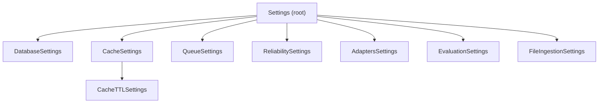

# Configuration

TROPEK uses a two-layer configuration system: `config.yaml` for non-secret settings
and `QG_*` environment variables for credentials.

## Loading Priority

```
HashiCorp Vault (highest priority)
  -> QG_* environment variables
    -> .env file
      -> config.yaml defaults (lowest priority)
```

All settings are loaded via Pydantic Settings (`pydantic-settings` library) into a
singleton cached with `@lru_cache`.

## Settings Classes



| Class | Env Prefix | Key Fields |
|-------|------------|------------|
| `DatabaseSettings` | `QG_DB_` | host, port, name, pool_size, max_overflow, user, password |
| `CacheSettings` | `QG_REDIS_` | host, port, db, password |
| `CacheTTLSettings` | -- | trend (60s), evaluation_list (30s), evaluation_detail (300s), slo_definition (600s) |
| `QueueSettings` | -- | db_index (1), max_retries (3), retry_delay (10s), job_timeout (120s) |
| `ReliabilitySettings` | -- | adapter_timeout (30s), retry_attempts (3), retry_backoff (2s), watchdog_interval (60s), stuck_threshold (180s) |
| `AdaptersSettings` | -- | prometheus URL + timeout, max_concurrent_queries (10) |
| `EvaluationSettings` | -- | async_threshold_metrics (10) |
| `FileIngestionSettings` | -- | allowed_path_prefix, max_file_size_mb (50) |

## Non-Secret Settings (config.yaml)

The `config.yaml` file is safe to commit. It contains:

- Server bind address and port
- Database connection pool tuning
- Redis cache TTLs per endpoint type
- Job queue retry and timeout policies
- Adapter URLs and concurrency limits
- Watchdog thresholds for stuck job detection
- File ingestion constraints
- Logging level and format

## Secret Settings (Environment Variables)

| Variable | Purpose |
|----------|---------|
| `QG_DB_USER` | PostgreSQL username |
| `QG_DB_PASSWORD` | PostgreSQL password |
| `QG_REDIS_PASSWORD` | Redis authentication |
| `QG_SECRET_KEY` | API secret key |
| `QG_CONFIG_PATH` | Path to config.yaml (default: `config.yaml`) |
| `QG_ADAPTER_PROMETHEUS_USERNAME` | Optional Prometheus basic auth |
| `QG_ADAPTER_PROMETHEUS_PASSWORD` | Optional Prometheus basic auth |
| `PROMETHEUS_URL` | Prometheus server URL (default: `http://prometheus:9090`) |

## Environment Files

| File | Purpose |
|------|---------|
| `.env.example` | Template for production/dev secrets |
| `.env` | Active secrets (gitignored) |
| `.env.test.example` | Template for test database secrets |
| `.env.test` | Test DB secrets, loaded automatically by pytest-dotenv |
