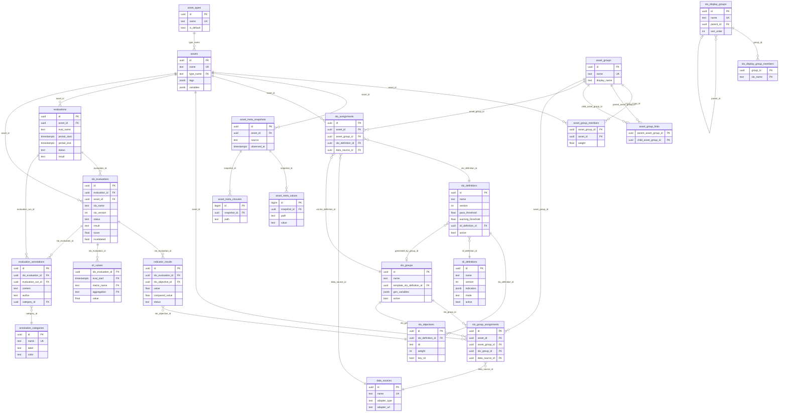

# Data Model

TROPEK uses PostgreSQL 16 with the TimescaleDB extension. 24 ORM model classes organized into
six groups.

## Entity Relationship Diagram



## Table Groups

### Asset Inventory

Entities under test and how they are organized.

| Table | Purpose |
|-------|---------|
| `asset_types` | Extensible vocabulary of asset kinds (vm, service, container, database, endpoint). One row is marked `is_default`. |
| `assets` | Named entities with a type, key-value tags (JSONB), template variables (JSONB), optional color, and timestamps. Unique by `name`. |
| `asset_groups` | Named collections. Can contain assets (flat) or other groups (hierarchical). |
| `asset_group_members` | Asset-to-group junction with a `weight` column for weighted group scoring. |
| `asset_group_links` | Group-to-group junction (parent/child) with weight. Enables nested hierarchies. |

### Asset Metadata

Point-in-time hierarchical metadata pushed from external sources (e.g. CMDB, CI pipelines).

| Table | Purpose |
|-------|---------|
| `asset_meta_snapshots` | One snapshot per (asset, source, observed_at). The envelope that groups all metadata delivered in one push. |
| `asset_meta_values` | Key-value leaves within a snapshot. `path` is a TEXT[] hierarchy (e.g. `['hw', 'cpu', 'cores']`), `value` is the leaf text. |
| `asset_meta_closures` | Closure-table entries for a snapshot — every ancestor path present, enabling efficient subtree queries. |

### Definition Registries

Versioned, immutable-after-insert definitions.

| Table | Purpose |
|-------|---------|
| `slo_definitions` | Versioned SLO definition. Stores pass/warning score thresholds, comparison config, variables, and a reference to an SLI definition. Soft-delete via `active` flag. |
| `slo_objectives` | One row per indicator objective within an SLO definition version. Stores per-SLI pass/warning criteria strings (TEXT[]), weight, `key_sli` flag, and display order. |
| `sli_definitions` | Indicator query maps (metric name → query string) stored as JSONB. Same versioning scheme as SLOs. Supports `raw` and template-based (`mode`) query generation. |
| `data_sources` | Named pointers to adapter instances (adapter_type, adapter_url, tags). Mutable — URL can be updated. |

#### SLO Groups

SLO groups generate families of related SLO definitions from a template via variable expansion.

| Table | Purpose |
|-------|---------|
| `slo_groups` | Template descriptor. References a template `slo_definition_id` and stores `gen_variables` (JSONB) that drive expansion into per-series SLO instances. |
| `slo_display_groups` | UI navigation buckets — organizes SLO concepts into a collapsible hierarchy. Self-referential via `parent_id`. |
| `slo_display_group_members` | Membership of an SLO concept (by `slo_name` string) in a display group. |

### Evaluation Binding

Connects assets and groups to their evaluation configuration. Replaces the old `asset_slo_links`/`asset_group_slo_links` tables.

| Table | Purpose |
|-------|---------|
| `slo_assignments` | Version-pinned assignment of a specific SLO definition to either an asset or an asset group (XOR enforced by CHECK constraint). References `slo_definition_id` and `data_source_id`. Unique per `(asset_id, slo_name)` or `(asset_group_id, slo_name)`. |
| `slo_group_assignments` | Always-latest assignment of an SLO group to either an asset or an asset group (XOR enforced by CHECK constraint). References `slo_group_id` and `data_source_id`. Group assignments fan out evaluations across all generated SLO instances. |

### Evaluation Results

The core output of the platform. Uses a parent-child model: one `EvaluationRun` per asset per trigger, with one `SLOEvaluation` child per bound SLO.

| Table | Purpose |
|-------|---------|
| `evaluations` | Parent evaluation run — one per `(asset_id, eval_name, period)`. Aggregates N child SLOEvaluation rows. `result` = worst-case of children; `achieved_points`/`total_points` = sum of children. |
| `slo_evaluations` | One SLO evaluation per SLO bound to the asset for a given run. Tracks full lifecycle (pending → running → completed/failed/partial). Stores `asset_snapshot` (denormalized asset state at trigger time), per-SLO score, result, invalidation state, and baseline pin metadata. |
| `indicator_results` | Normalized per-SLI result row — one per `(slo_evaluation_id, slo_objective_id)`. Stores measured value, compared baseline value, absolute/relative change, and per-indicator status and score. |
| `sli_values` | **TimescaleDB hypertable** partitioned by `eval_start`. One aggregated metric value per evaluation per metric per aggregation method. Denormalized columns (`asset_name`, `evaluation_name`) avoid joins in Grafana dashboards. |
| `annotation_categories` | Category taxonomy for evaluation annotations. System rows (`is_system=true`) are immutable and cannot be deleted. |
| `evaluation_annotations` | Append-only contextual notes. Attaches to exactly one parent: either an `slo_evaluations` row (per-SLO notes) or an `evaluations` row (column-level notes). XOR enforced by CHECK constraint. |

## Key Design Decisions

### Versioning strategy

SLO and SLI definitions are **immutable after insert**. Creating a new version with an
existing name auto-increments the version using `SELECT ... FOR UPDATE` to prevent race
conditions. `DELETE` soft-deactivates all versions (sets `active = false`). SLOEvaluation
records which definition version was used, so historical results are always reproducible.

### Evaluation parent-child model

`evaluations` (EvaluationRun) is the parent — one row per `(asset, eval_name, period)` trigger.
Each bound SLO produces one `slo_evaluations` (SLOEvaluation) child row. Each SLO evaluation
produces one `indicator_results` row per objective. This replaces the old flat `evaluations`
table with its opaque `indicator_results` JSONB column.

### TimescaleDB hypertable

`sli_values` is partitioned by `eval_start` for efficient time-range queries. The composite
PK `(slo_evaluation_id, eval_start, metric_name, aggregation)` is required because TimescaleDB
needs the partition key in the primary key. No ORM relationship to `SLOEvaluation` is defined —
this prevents accidental lazy-loading of thousands of metric rows.

### Asset snapshot denormalization

`slo_evaluations.asset_snapshot` captures the asset state at trigger time as JSONB. Evaluation
results remain historically accurate even if the asset is later renamed or relabeled.

### JSONB for flexible data

`comparison`, `variables`, `gen_variables`, `tags`, `job_stats`, and `targets` are all JSONB.
Schema-flexible without migration overhead. Avoids the need for new columns as metadata
requirements evolve.

### Check constraints

`status` (pending/running/completed/failed/partial), `result` (pass/warning/fail/error),
and `ingestion_mode` (push/pull/file) are enforced at the database level via CHECK
constraints, not just application-level validation. Assignment target exclusivity (asset
XOR asset_group) is also enforced via CHECK constraints on `slo_assignments` and
`slo_group_assignments`.

## Migrations

Managed by Alembic (async mode). Two migrations exist:

1. **001_initial_schema** — All tables, indexes, constraints, foreign keys
2. **002_timescaledb_hypertable** — Creates the `sli_values` hypertable and seeds default asset types

Migrations are autogenerated against the test database:

```bash
ENV_FILE=.env.test uv run --directory api alembic revision --autogenerate -m "description"
```
