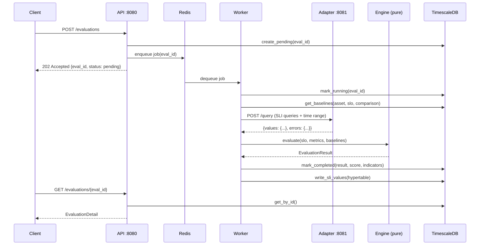
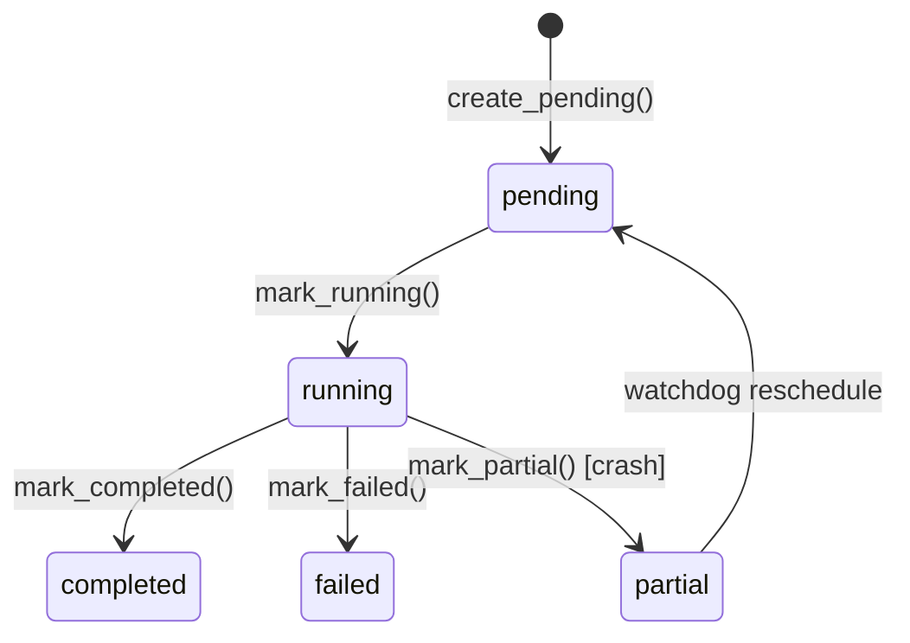
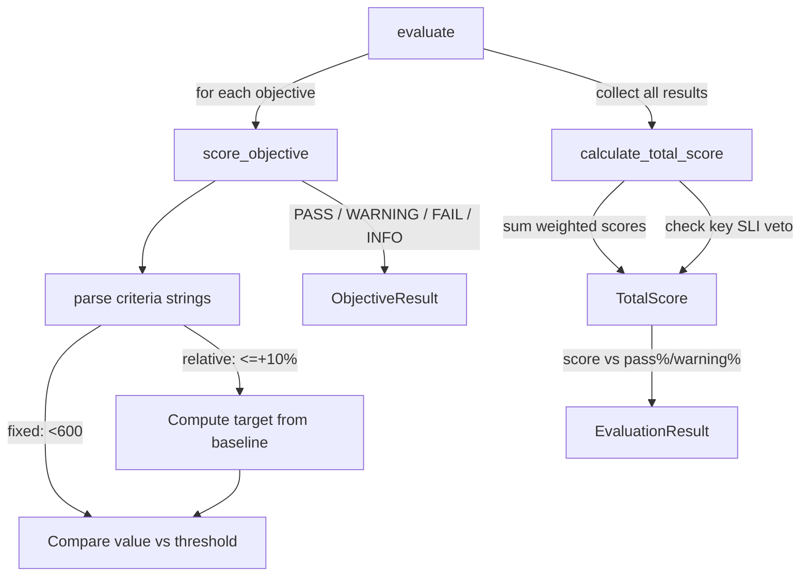

# Evaluation Flow

The core use case: a client triggers an evaluation, metrics are fetched, scored against
SLO criteria, and the result is persisted.

## Sequence



## Evaluation Lifecycle



| Status | Meaning |
|--------|---------|
| **pending** | Enqueued, waiting for a worker |
| **running** | Worker picked it up, fetching metrics or evaluating |
| **completed** | Engine ran, result + score + indicators persisted |
| **failed** | Unrecoverable error (adapter down, invalid SLO, etc.) |
| **partial** | Worker crashed mid-execution; watchdog can reschedule |

## Ingestion Modes

Three ways to supply metric values:

### Pull mode (adapter fetches from Prometheus)

```
Client -> API: POST /evaluations {slo_name, datasource, start, end, metadata}
Worker -> Adapter: POST /query {queries, start, end, step, variables}
Adapter -> Prometheus: GET /api/v1/query_range
```

### Push mode (client provides values inline)

```
Client -> API: POST /evaluations {slo_name, metrics: {metric: value, ...}}
Worker: skips adapter call, uses provided values directly
```

### File mode (CSV or JMeter upload)

```
Client -> API: POST /evaluations/file (multipart: meta JSON + results file)
Worker: parses file, extracts metric values
```

## Baseline Comparison

Relative criteria (e.g. `<=+10%`) compare the current value against a baseline
derived from previous evaluations:

1. Worker calls `get_baselines()` with the comparison config from the SLO
2. Baselines are filtered by: asset, SLO name, result score (pass/warn/all), count limit
3. Values are aggregated using the configured function (avg, p50, p90, p95, p99)
4. If `scope_tags` is set, baselines are further filtered to matching asset labels
5. If no baselines exist, relative criteria **always pass** (no penalty for first run)

## Scoring



- **Within a criteria block**: AND logic (all must pass)
- **Across blocks**: OR logic (any block passing = pass)
- **Key SLI**: if a key SLI fails, the entire evaluation fails regardless of total score
- **INFO status**: objectives with no pass criteria are informational, don't affect score

## Post-Evaluation

After completion, evaluations support:

- **Annotations**: contextual notes (e.g. "kernel updated before this test")
- **Invalidation**: mark as invalid without deleting (preserves audit trail)
- **Trend queries**: time-series data from the `sli_values` hypertable
