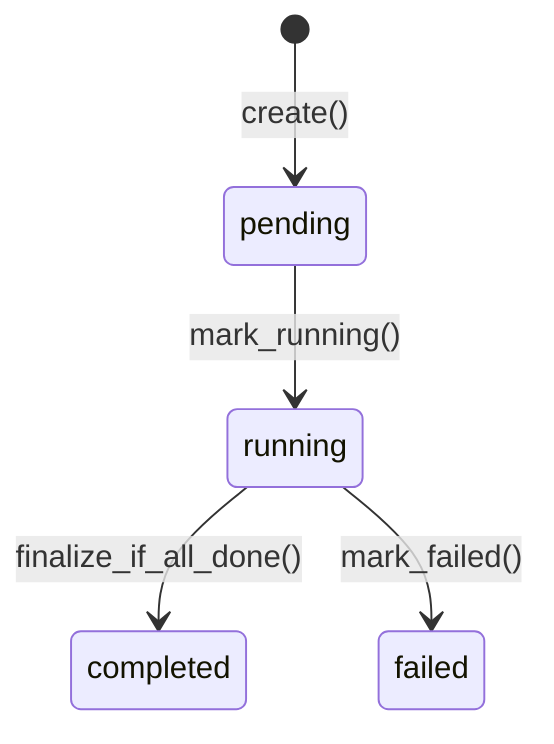
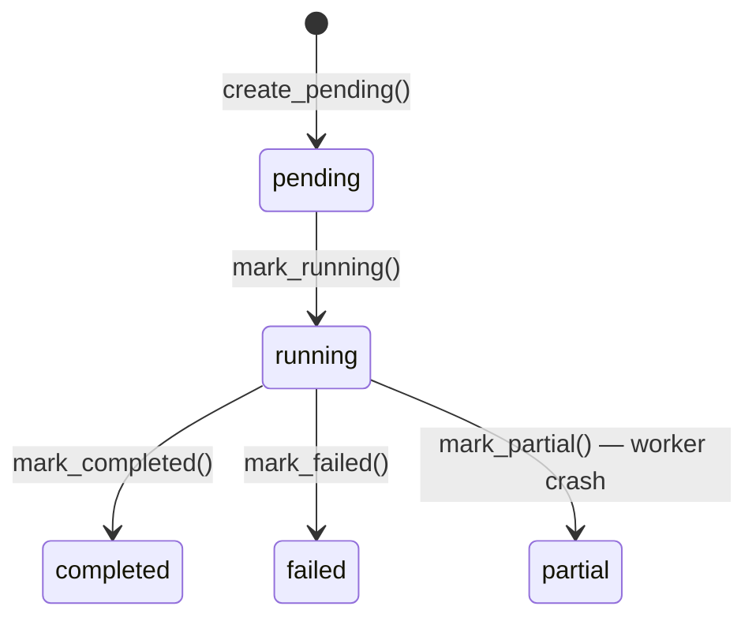
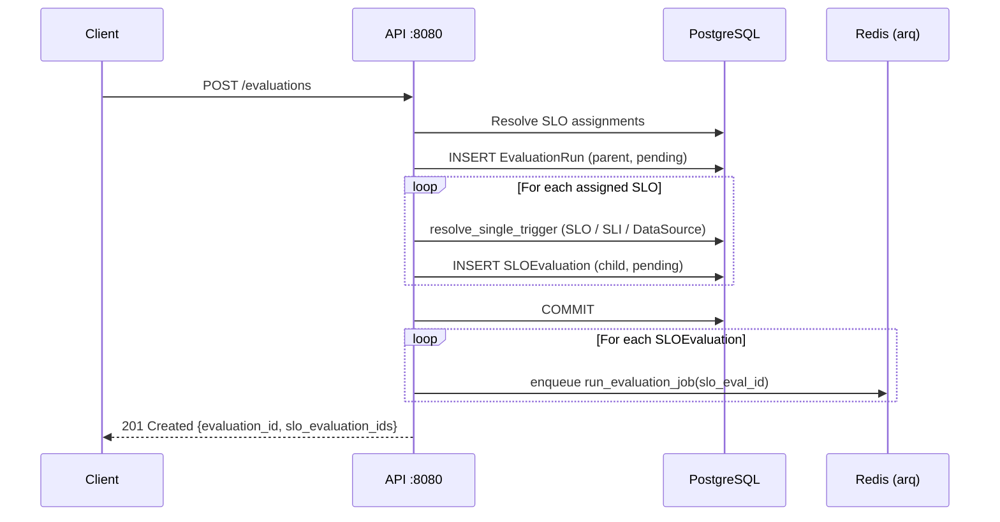
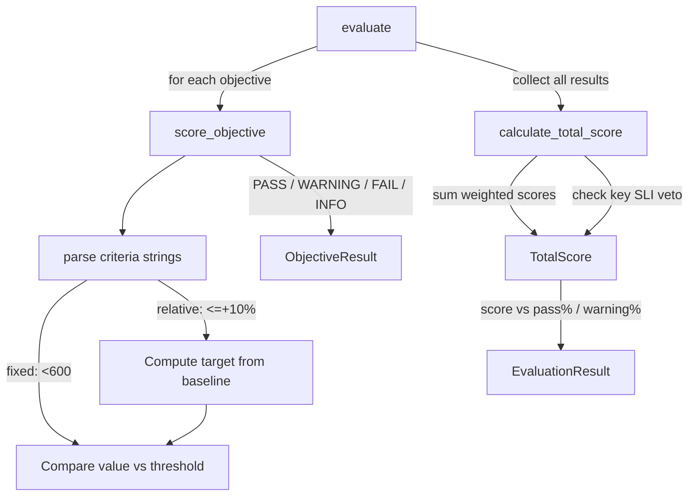
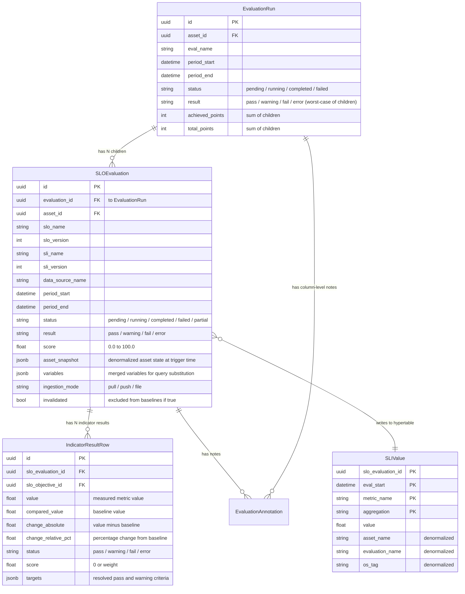
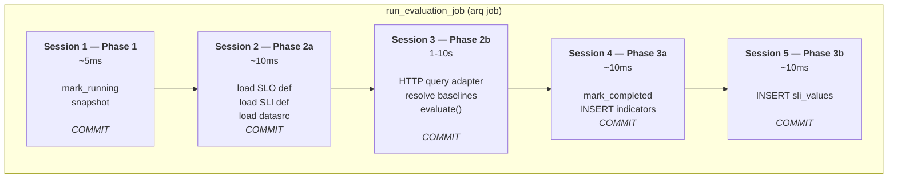
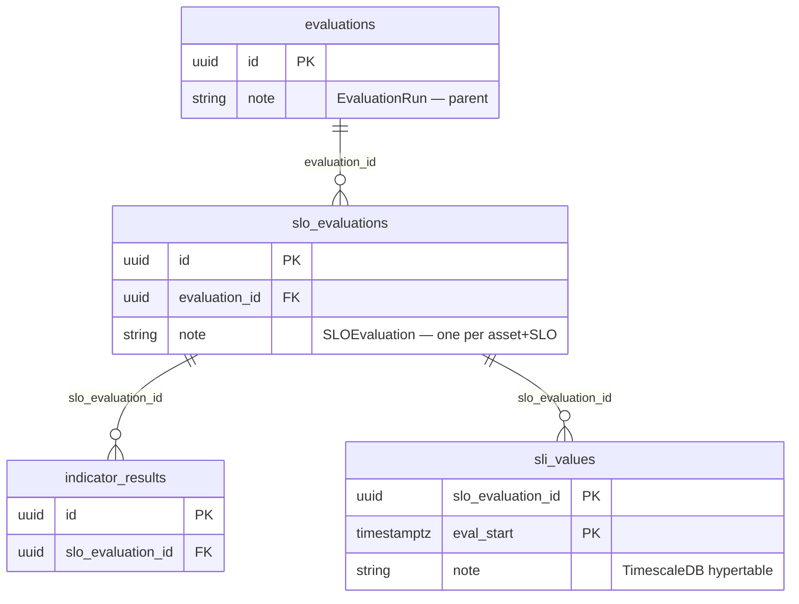

# Evaluation Lifecycle

An **evaluation** measures how well an asset (service, application) meets its Service Level
Objectives over a time window. The client triggers an evaluation via the API, the system
fetches metric values, scores them against SLO criteria, and persists structured results.
This document covers the full lifecycle from trigger to finalization.

## Lifecycle States

`EvaluationRun` (parent) and `SLOEvaluation` (child) have different allowed states.

### EvaluationRun states



| Status | Meaning |
|--------|---------|
| **pending** | Created, children enqueued |
| **running** | At least one child started |
| **completed** | All children terminal, result aggregated |
| **failed** | Unrecoverable error |

### SLOEvaluation states



| Status | Meaning |
|--------|---------|
| **pending** | Enqueued, waiting for a worker |
| **running** | Worker picked it up, fetching metrics or evaluating |
| **completed** | Engine ran, result + score + indicators persisted |
| **failed** | Unrecoverable error (adapter down, invalid SLO, etc.) |
| **partial** | Worker crashed mid-execution (DB infrastructure exists for watchdog reschedule but no watchdog job is registered yet) |

## Triggering

### Single evaluation — `POST /evaluations`

Evaluates **one asset** over **one time window**. All SLOs assigned to the asset (directly
or via asset groups) are evaluated.

```json
{
  "asset_name": "my-service",
  "eval_name": "daily",
  "period_start": "2026-04-24T00:00:00Z",
  "period_end": "2026-04-24T23:59:59Z",
  "variables": {"environment": "production"}
}
```

What happens:

1. Resolve all SLO assignments for the asset (direct + group assignments)
2. Create one `EvaluationRun` (parent, status=pending)
3. For each assigned SLO: resolve the SLO/SLI/DataSource chain via `resolve_single_trigger`,
   create one `SLOEvaluation` (child, status=pending) with pinned definition versions and
   a snapshot of the asset state
4. Commit all rows
5. Enqueue one `run_evaluation_job` per SLOEvaluation into the arq Redis queue

### Batch evaluation — `POST /evaluations/batch`

Evaluates **multiple (asset, period) pairs** in one request. Two modes:

- **`by_date`**: one asset, multiple time windows (historical backfill)
- **`by_asset`**: multiple assets, one time window (cross-asset snapshot)

Batch is a convenience wrapper. It loops over the pairs and calls `trigger_evaluate()` for
each one. Each pair produces its own `EvaluationRun`. There is no "batch run" entity.

### Trigger sequence



`resolve_single_trigger` walks the assignment chain: Asset -> SLO Assignment -> SLO
Definition -> SLI Definition -> DataSource. All of this is resolved at trigger time and
pinned into the `SLOEvaluation` row, so the evaluation is reproducible even if definitions
change later.

**Implementation**: `api/tropek/modules/quality_gate/workflows/trigger/trigger_service.py`

## Ingestion Modes

The `ingestion_mode` field on `SLOEvaluation` tracks how metric values are supplied.
Only **pull** is fully implemented today.

### Pull mode (implemented)

The worker queries an adapter (e.g., Prometheus) via HTTP to fetch metric values.

```
Client -> API: POST /evaluations {asset_name, eval_name, period_start, period_end}
Worker -> Adapter: POST /query {queries, start, end, variables}
Adapter -> Prometheus: GET /api/v1/query_range
```

### Push mode (DB-allowed, not yet implemented)

The client provides metric values inline in the request body. The worker skips the adapter
call and uses the provided values directly.

### File mode (DB-allowed, not yet implemented)

The client uploads a CSV or JMeter results file. The worker parses it to extract metric values.

## Scoring

The `evaluate()` function in `api/tropek/modules/quality_gate/evaluation_engine/evaluator.py`
is a **pure function** — no I/O, no database, no network.

**Signature**: `evaluate(slo, metrics, baselines, compared_evaluation_ids) -> EvaluationResult`



### Criteria syntax

| Pattern | Type | Meaning |
|---------|------|---------|
| `<600` | Fixed | value < 600 |
| `<=600` | Fixed | value <= 600 |
| `=0` | Fixed | value == 0 |
| `>=10` | Fixed | value >= 10 |
| `<=+10%` | Relative | value <= baseline * 1.10 |
| `>=-5%` | Relative | value >= baseline * 0.95 |
| `<=+50` | Relative absolute | value <= baseline + 50 |

Parsed into a `ParsedCriteria` model with operator, type (FIXED/RELATIVE), threshold,
relative percentage, and a `compute_target_value(baseline)` method that resolves the
comparison target at evaluation time.

### Scoring rules

Each objective has a flat `pass_threshold` list and a flat `warning_threshold` list.
Evaluation checks them in priority order — pass first, then warning:

| Condition | Status | Score |
|-----------|--------|-------|
| No `pass_threshold` defined | INFO | 0 (does not contribute) |
| Value is None (not retrieved) | ERROR | 0 |
| All `pass_threshold` criteria pass (AND) | PASS | weight |
| All `warning_threshold` criteria pass (AND) | WARNING | 0.5 × weight |
| Otherwise | FAIL | 0 |

- **Key SLI**: if a key SLI fails, the entire evaluation fails regardless of total score
- **Total score**: `sum(achieved) / sum(max_weights) × 100`, compared against
  `total_score.pass_threshold` (default 90%) and `total_score.warning_threshold` (default 75%)

### Known limitations

The engine does **not** validate that pass criteria are stricter than warning criteria.
`score_objective()` checks pass first, then warning. If warning is stricter than pass,
the warning band becomes unreachable — any value satisfying warning also satisfies pass.

**Example (wrong):** `pass: <=+20%`, `warning: <=+5%` — warning is never reached.
**Correct:** `pass: <=+5%`, `warning: <=+20%` — pass is the strict gate, warning catches
degraded-but-acceptable values.

The same concern applies to `total_score` thresholds — if `warning_threshold` is set higher
than `pass_threshold`, the warning band disappears.

## Baseline Comparison

Relative criteria (e.g. `<=+10%`) compare the current value against a baseline derived
from previous evaluations:

1. Worker loads the last N completed, non-invalidated evaluations for the same (asset, SLO)
2. Baselines are filtered by result score: all results, pass+warning only, or pass only
   (`include_result_with_score` in `SLOComparison`)
3. If a baseline pin is active, only evaluations after the pinned evaluation are considered
4. Per-metric values are aggregated using the configured function (avg, p50, p90, p95, p99)
5. If no baselines exist, relative criteria **always pass** (no penalty for first run)

The `SLOComparison` model also carries a `scope_tags` field (default `['os']`), but it is
**not used** during normal evaluation baseline queries — only in the re-evaluation flow
via `get_reeval_baselines` with `tag_filters`.

## Entity Hierarchy



### What each entity does

**EvaluationRun** (`evaluations` table) — the parent container for one evaluation cycle.
When you POST to `/evaluations`, one EvaluationRun is created for the target asset. Once all
children finish, it is finalized: result = worst-case across children, points = sum of children.
Think of it as the **roll-up row for the heatmap column** in the UI.

**SLOEvaluation** (`slo_evaluations` table) — the individual SLO result. One is created for
every SLO assigned to the asset. This is where the actual evaluation happens. The
`asset_snapshot` preserves the asset's name, tags, and variables at trigger time so results
remain interpretable even if the asset config changes later.

**IndicatorResultRow** (`indicator_results` table) — the per-metric breakdown within one
SLOEvaluation. One row per SLO objective, containing the measured value, baseline comparison,
and which criteria targets passed or failed.

**SLIValue** (`sli_values` hypertable) — TimescaleDB hypertable for trend charts and Grafana
dashboards. Intentionally denormalized to avoid joins in time-series queries. Written in a
**separate transaction** (Phase 3b) from the main results to avoid deadlocks.

## Worker Pipeline

Each `run_evaluation_job` processes one SLOEvaluation through multiple phases with **separate
database sessions**. The core invariant: **no DB transaction may span an HTTP call or hold
locks longer than ~15ms**.



> **Snapshot (Pydantic model)** is captured in Phase 1 and carried across all subsequent
> phases as detached data — no SQLAlchemy objects cross session boundaries.

### Phase 1 — Mark running + snapshot

Opens a DB session, marks the `SLOEvaluation` as running, and copies all needed fields into
an `EvaluationSnapshot` (Pydantic model). Commits and closes the session (~5ms). No
SQLAlchemy objects are carried past this point.

### Phase 2a — Load definitions

Opens a fresh session, loads `SLODefinition`, `SLIDefinition`, and `DataSource` by the
pinned name+version from the snapshot. Read-only, ~10ms.

### Phase 2b — HTTP query + baselines + evaluate

Opens a session, then calls `fetch_and_evaluate()` which: queries the adapter via HTTP
(1-10 seconds), resolves baselines via the open session, and calls `evaluate()` (pure
function). The DB session is open during the HTTP call but no queries or locks are held
during the network wait — the session is only used for baseline reads after the adapter
responds. Uses a shared `httpx.AsyncClient` per worker process for connection pooling.
Produces a `FetchAndEvaluateResult` containing metrics, baselines, and the scored result.

### Phase 3a — Write evaluation result + indicator rows

Opens a session for writes:
1. `UPDATE slo_evaluations SET status='completed', result=..., score=...`
2. `INSERT INTO indicator_results` — one row per SLI indicator (~8 rows)

Locks held: row exclusive on this `slo_evaluations` row, shared FK lock on the parent
`evaluations` row. Duration: ~10ms.

### Phase 3b — Write SLI values to hypertable

Opens a **separate session** for `INSERT INTO sli_values` (~8 rows). This split is critical
for deadlock prevention (see Performance Design below).

**Implementation**: `api/tropek/modules/quality_gate/workflows/execution/evaluation_executor.py`

## EvaluationSnapshot

The `EvaluationSnapshot` is **not a database entity** — it is a Pydantic model that bridges
execution phases. It carries `eval_id`, `parent_run_id`, `slo_name`, `sli_name`,
`period_start/end`, `asset_snapshot`, `variables`, and everything else needed to execute
phases 2 and 3 without going back to the database for the `SLOEvaluation` row.

This pattern exists because the worker uses **separate DB sessions** for each phase. Without
the snapshot, each phase would need to re-load the evaluation row. With it, the DB session
is opened only for the specific operation each phase needs.

Similarly, `FetchAndEvaluateResult` carries the adapter response and scored result from
Phase 2b into Phase 3 without a DB session.

## Finalization

Each child `SLOEvaluation` enqueues a `finalize_run_job` for its parent `EvaluationRun`.
The job is **idempotent** — multiple children can enqueue it safely, and only the execution
that finds all children in a terminal status actually updates the parent.

Finalization aggregates the parent run:
- **result** = worst-case across all children (pass < warning < fail < error)
- **achieved_points** = sum of all children's achieved points
- **total_points** = sum of all children's total points
- Updates the parent `EvaluationRun` status to `completed`
- Warms the heatmap column cache (fire-and-forget)

A **finalize sweeper** cron job runs periodically to catch any parent runs that the
fast-path missed (e.g., if a child's finalize enqueue was lost due to a Redis hiccup).

## Predecessor Deferral

When multiple evaluations for the same (asset, SLO) are enqueued close together (e.g.,
from a batch request), they must execute **in chronological order** to ensure baselines
are computed correctly.

Before Phase 1, the job checks if an earlier evaluation (by `period_start`) for the same
asset+SLO is still `pending` or `running`. If so, the current job is **deferred** by 2
seconds and re-enqueued. Maximum 60 retries (2 minutes) before giving up.

This ensures baseline comparisons always reference fully completed prior evaluations.

## Performance Design

### Scale reference

| Dimension | Count |
|-----------|-------|
| Assets per batch | 12 |
| SLOs per asset | 20 |
| SLIs (indicators) per SLO | 8 |
| SLOEvaluation jobs per batch | 240 |
| Indicator result rows per batch | 1,920 |
| SLI value rows per batch | 1,920 |
| arq worker replicas | 4 |
| `max_jobs` per worker | 10 |
| Effective concurrency | 40 |

### FK relationships and lock interactions



Key lock interactions:
- `UPDATE slo_evaluations` takes a **row exclusive lock** on that row
- `INSERT INTO indicator_results` takes a **shared FK lock** on the parent `slo_evaluations` row
- `INSERT INTO sli_values` takes a **shared FK lock** on `slo_evaluations` AND a
  **ShareUpdateExclusiveLock** on the TimescaleDB time chunk (self-conflicting)

### Why Phase 3 is split into 3a and 3b

The deadlock that required the split:

```
Worker A (Phase 3, combined):
  UPDATE slo_evaluations SET status='completed'   -> row exclusive lock on eval row A
  INSERT INTO sli_values (slo_evaluation_id=A)     -> needs chunk lock, WAITS

Worker B (Phase 3, combined):
  UPDATE slo_evaluations SET status='completed'   -> row exclusive lock on eval row B
  INSERT INTO sli_values (slo_evaluation_id=B)     -> holds chunk lock (same time chunk),
                                                      needs FK shared lock on eval row B (OK),
                                                      but chunk lock conflicts -> DEADLOCK CYCLE
```

The problem: `UPDATE slo_evaluations` (row exclusive) + `INSERT sli_values` (chunk lock +
FK shared lock) in the **same transaction** creates a lock ordering conflict when multiple
workers target the same TimescaleDB time chunk.

The fix: separate them into two transactions so **row exclusive locks and chunk locks are
never held simultaneously**. In Phase 3a, `mark_completed` holds a row exclusive lock but
no chunk lock. In Phase 3b, `INSERT sli_values` holds a chunk lock and a shared FK lock
(not exclusive). Shared FK locks don't conflict with each other, so concurrent Phase 3b
transactions can queue for the chunk lock without deadlocking.

### Consistency guarantee

Phase 3a commits before Phase 3b starts. If Phase 3b fails (process crash, timeout),
the evaluation is marked `completed` with indicator results but missing `sli_values` rows.
This is acceptable because `sli_values` is a denormalized analytics table — the
authoritative result lives in `slo_evaluations.result` + `indicator_results`.

### Error handling

All failure paths use `_mark_failed()` — a helper that opens its own session, marks the
evaluation as failed with error details in `job_stats`, and commits independently.

Failure points:
- **Phase 1**: eval not found or already processed -> early return, no mark_failed
- **Phase 2a**: definition not found -> `_mark_failed` + return
- **HTTP adapter**: connect/timeout/status error -> `fetch_and_evaluate` returns `None` -> `_mark_failed`
- **Phase 3a/3b**: expected to succeed (data already validated); arq retry handles unexpected DB errors

## Post-Evaluation Operations

After completion, evaluations support:

- **Annotations**: contextual notes (e.g., "kernel updated before this test")
- **Invalidation**: mark as invalid without deleting — excluded from baselines, preserves audit trail
- **Baseline pinning**: declare a specific evaluation as the known-good baseline
- **Result override**: manually change the result with an audit trail (original result preserved)
- **Re-evaluation**: re-run from a specific date or from baseline, with delta annotations
- **Trend queries**: time-series data from the `sli_values` hypertable

## Evaluation Engine Reference

The core scoring logic lives in `api/tropek/modules/quality_gate/evaluation_engine/`. It is
pure Python with zero I/O — no database, network, or file access. Ported from Keptn's Go
`lighthouse-service`.

### Module map

```
evaluation_engine/
  evaluator.py       — evaluate() entry point
  slo_parser.py      — Build SLO model from structured data
  criteria.py        — Parse and evaluate criteria strings
  scoring.py         — Per-objective + total score calculation
  variables.py       — $variable substitution in SLI queries
  slo_models.py      — SLO domain models (Pydantic BaseModel)
  result_models.py   — Evaluation result models (Pydantic BaseModel)
  constants.py       — StrEnums (status, outcome, criteria type)
```

### Domain models

**SLO models** (`slo_models.py`):

- `SLOObjective` — one metric with `pass_threshold` / `warning_threshold` (flat `list[str]`,
  AND logic), `weight`, `key_sli` flag
- `SLOComparison` — baseline config: `compare_with`, `number_of_comparison_results`,
  `include_result_with_score`, `aggregate_function` (avg/p50/p90/p95/p99), `scope_tags`
- `SLOTotalScore` — `pass_threshold` (default 90.0), `warning_threshold` (default 75.0)
- `SLO` — combines `objectives`, `comparison`, `total_score`

**Result models** (`result_models.py`):

- `ObjectiveResult` — per-objective status, score, `contributes_to_score`, `key_sli_failed`
- `CriteriaTarget` — raw criteria string, resolved `target_value`, `violated` flag
- `IndicatorResult` — metric name, value, baseline, status, score, weight, pass/warning targets,
  absolute/relative change
- `EvaluationResult` — overall `result` (PASS/WARNING/FAIL), `score`, `indicator_results`,
  `compared_evaluation_ids`

### Variable substitution

SLI queries can contain `$variable` tokens replaced at evaluation time.

Priority (highest wins):
1. `eval.variables` — per-evaluation overrides (direct assignment)
2. `slo.variables` — SLO-level defaults (direct assignment)
3. Reserved built-ins (`$asset_name`, `$evaluation_name`, `$test_name`, `$start`, `$end`,
   `$TROPEK_ASSET`, `$TROPEK_EVALUATION`)
4. `asset.variables` (via `setdefault` — won't overwrite reserved)
5. `asset.tags` (via `setdefault` — won't overwrite reserved or asset.variables)

Example: `rate(http_requests_total{instance="$vm_ip"}[5m])` with `variables={"vm_ip": "10.0.1.15"}`

**Implementation**: `api/tropek/modules/quality_gate/workflows/execution/evaluation_helpers.py`

## Key Files

| File | Role |
|------|------|
| `api/tropek/modules/quality_gate/workflows/trigger/trigger_service.py` | `TriggerService` — single and batch trigger orchestration |
| `api/tropek/modules/quality_gate/workflows/trigger/trigger_resolver.py` | `resolve_single_trigger` — SLO/SLI/DataSource chain resolution |
| `api/tropek/modules/quality_gate/workflows/execution/evaluation_executor.py` | Phase functions: `load_evaluation_snapshot`, `fetch_and_evaluate`, `write_results`, `write_sli_values_phase` |
| `api/tropek/modules/quality_gate/evaluation_engine/evaluator.py` | Pure `evaluate()` function — scoring logic |
| `api/tropek/modules/quality_gate/evaluation_engine/criteria.py` | `parse_criteria_string`, `evaluate_criteria` — criteria parsing and comparison |
| `api/tropek/modules/quality_gate/evaluation_engine/scoring.py` | `score_objective`, `calculate_total_score` — per-objective and total scoring |
| `api/tropek/modules/quality_gate/evaluation_engine/variables.py` | `substitute_variables` — $variable token replacement in SLI queries |
| `api/tropek/modules/quality_gate/evaluation_engine/slo_models.py` | `SLO`, `SLOObjective`, `SLOComparison` — engine domain models |
| `api/tropek/modules/quality_gate/evaluation_engine/result_models.py` | `EvaluationResult`, `IndicatorResult`, `CriteriaTarget` — result types |
| `api/tropek/modules/quality_gate/workflows/execution/evaluation_helpers.py` | `build_eval_variables`, `build_slo_model`, `compute_baselines` — shared helpers |
| `api/tropek/modules/quality_gate/repositories/evaluation.py` | `EvaluationRepository` — `mark_running`, `mark_completed`, `create_pending` |
| `api/tropek/modules/quality_gate/repositories/baseline.py` | `BaselineRepository` — historical baseline queries |
| `api/tropek/db/models.py` | ORM: `SLOEvaluation`, `EvaluationRun`, `SLIValue`, `IndicatorResultRow` |
| `api/tropek/queue.py` | `run_evaluation_job`, `finalize_run_job`, `finalize_sweeper_job` — arq worker jobs |
| `config.yaml` | `queue.max_jobs`, `reliability.adapter_timeout_seconds` |
