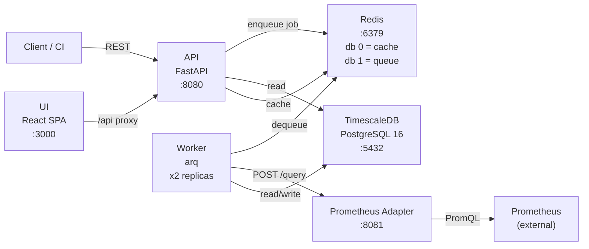

# System Overview

TROPEK is a quality gate and performance evaluation platform composed of six services
orchestrated via Docker Compose. No Kubernetes required.

## Service Topology



## Services

| Service | Port | Technology | Role |
|---------|------|------------|------|
| **api** | 8080 | FastAPI (Python 3.13) | REST API, evaluation trigger, registries, trend queries |
| **worker** | -- | arq (same image as api) | Async evaluation: fetch metrics, run engine, persist results |
| **adapter-prometheus** | 8081 | FastAPI | Translates SLI queries into PromQL, returns aggregated values |
| **timescaledb** | 5432 | PostgreSQL 16 + TimescaleDB | Evaluations, SLO/SLI registries, SLI time-series hypertable |
| **redis** | 6379 | Redis 7 | Job queue (db 1) and response cache (db 0) |
| **ui** | 3000 | React 19 + Vite | SPA with mock-first development (MSW) |

## Communication Patterns

- **API <-> Worker**: Decoupled via Redis job queue (arq). API enqueues, worker dequeues.
- **Worker <-> Adapter**: Synchronous HTTP POST `/query` with retry + timeout (tenacity).
- **API <-> DB**: Async SQLAlchemy ORM (asyncpg driver). Repository pattern.
- **API <-> Redis**: Response caching with per-endpoint TTLs.
- **UI <-> API**: REST over HTTP. In dev, Vite proxies `/api` to `:8080`. MSW intercepts in mock mode.

## Deployment Profiles

```bash
# Full stack
docker compose up --build

# Dev (infra only, run API/worker on host)
docker compose up timescaledb redis -d

# Test (adds isolated test DB on :5433)
docker compose --profile test up timescaledb-test -d
```

## Configuration Layers

```
Vault (highest priority)
  -> QG_* environment variables
    -> .env file
      -> config.yaml (lowest priority, non-secrets)
```

See [configuration.md](configuration.md) for details.
