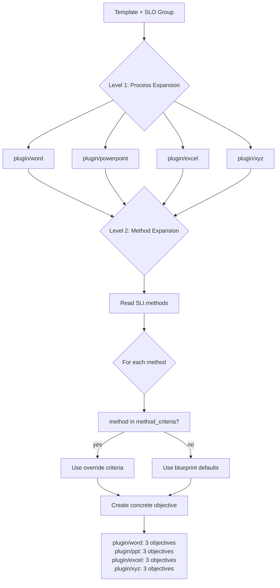
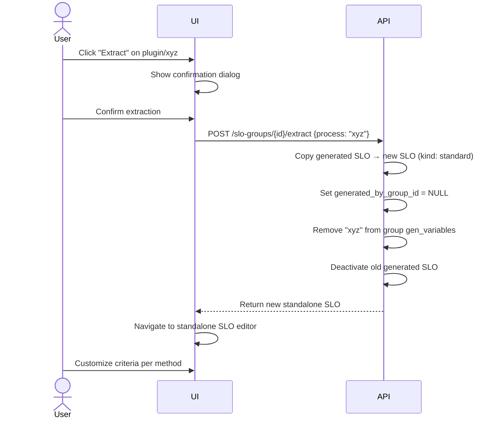
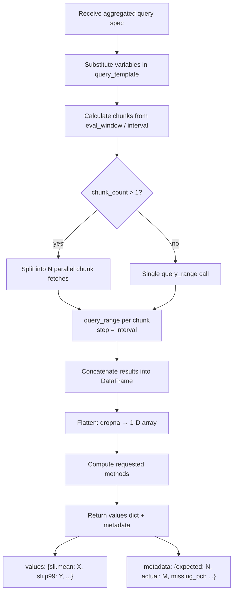
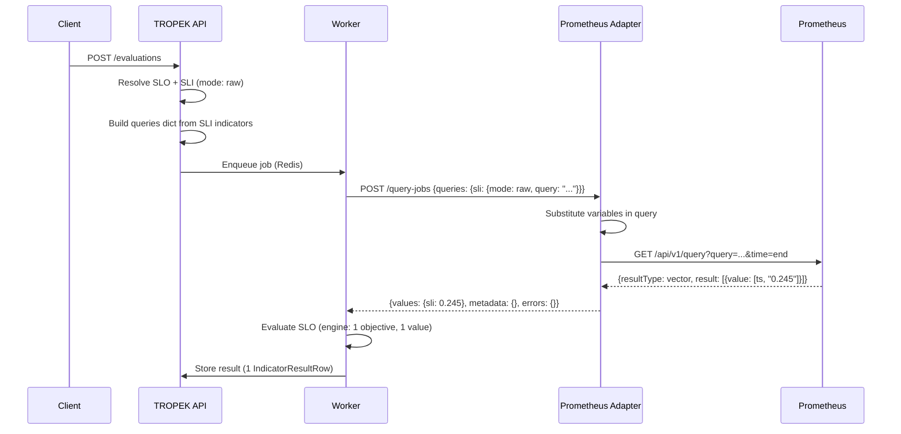
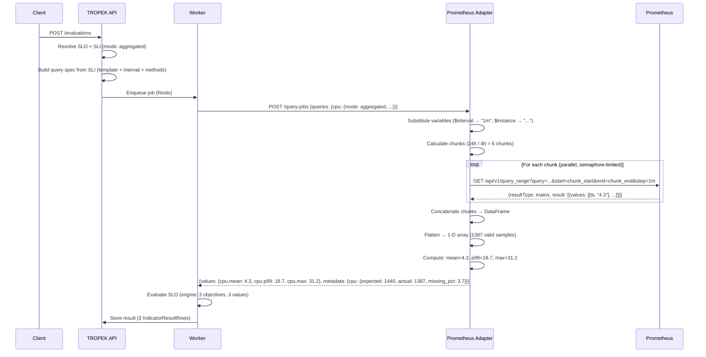
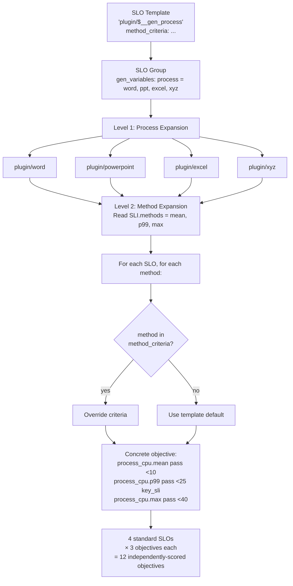

# Prometheus SLI Adapter — Full Design Specification

**Date:** 2026-03-29
**Status:** Draft
**Scope:** Adapter service, SLI registry changes, SLO template method expansion, reference docs, UI

---

## 1. Problem Statement

TROPEK's current adapter protocol supports a single query mode: the user provides a complete query
string, the adapter executes it, and returns one scalar value per SLI. This is sufficient for
pre-aggregated PromQL (instant queries) but cannot support use cases where:

- Multiple statistical views (mean, p99, max) are needed from the same underlying time-series
- The user wants the adapter to fetch raw data and compute aggregations server-side
- One SLI configuration should produce N independently-scored SLO objectives

The original Keptn `prometheus-service` had zero throttling, zero concurrency control, and zero
timeouts. The new adapter must handle bursts of ~400 queries without overwhelming Prometheus, support
both raw and aggregated query modes, and integrate with TROPEK's SLO template system for automatic
objective expansion.

---

## 2. Query Modes

### 2.1 Mode Taxonomy

| Mode | Meaning | Methods selectable? | Adapter behavior |
|------|---------|---------------------|-----------------|
| `raw` | User provides complete query, adapter returns 1 scalar | No | Instant query at `end` timestamp |
| `aggregated` | Adapter fetches time-series, computes selected stats | Yes — user picks from available methods | `query_range` fetch, compute N statistics |

Future extension examples (not in scope, showing extensibility):

| Mode | Meaning |
|------|---------|
| `aggregated:p99` | Preset aggregation, always p99, no user method selection |
| `aggregated:latency-profile` | Fixed set: p50, p90, p95, p99 |

### 2.2 Strategy Pattern (SOLID)

Each mode is implemented as a strategy with a common interface:

```
mode: "raw"           → RawQueryStrategy
mode: "aggregated"    → AggregatedQueryStrategy
mode: "aggregated:*"  → (future) preset sub-strategies
```

Each strategy implements:

- `build_adapter_request(sli_definition, variables) → QuerySpec`
- `parse_adapter_response(response) → dict[str, float | None]`
- `get_objective_names(sli_definition) → list[str]` (for template expansion)

Adding a new mode means adding a new strategy class — no changes to existing mode implementations.

### 2.3 Raw Mode

The user provides a complete PromQL expression that already encodes the aggregation. The adapter
executes it as an instant query at the end of the evaluation window. One query → one scalar → one
SLO objective.

**When to use:**

- Time-fraction SLOs ("X% of minutes below threshold")
- Request-based / ratio SLOs (error rate, success rate)
- Reusing an existing PromQL expression from Grafana or alerting rules
- Full control over gap handling, label aggregation, counter resets

**Prometheus load:** Single instant query, minimal data transfer. Subqueries (`[24h:1m]`) force
Prometheus to evaluate the inner expression server-side (e.g., 1,440 times for 24h at 1m
resolution), consuming Prometheus RAM.

### 2.4 Aggregated Mode

The user provides a PromQL template and selects which aggregation methods the adapter should compute.
The adapter fetches a full time-series via `query_range`, flattens all series into a 1-D array, and
computes selected statistics in-process. One query → N SLI values → N SLO objectives.

**When to use:**

- Multiple SLOs from a single metric (mean + p99 + max in one configuration)
- Straightforward PromQL (`rate()`, `sum by ()`) where you want guardrails
- Adding or changing aggregation methods without touching PromQL
- Comparable SLIs across different test runs with controlled resolution

**Prometheus load:** One `query_range` fetch transfers the full time-series. A 24h evaluation at 1m
interval transfers 1,440 data points per series. Adding more methods has zero additional Prometheus
load — all statistics are computed from the same fetched dataset.

### 2.5 Available Aggregation Methods

| Method | Formula | Use case |
|--------|---------|----------|
| `min` | `array.min()` | Lowest observed value |
| `mean` | `array.mean()` | Arithmetic mean — general central tendency |
| `max` | `array.max()` | Peak observed value — capacity planning |
| `std` | `array.std(ddof=0)` | Population standard deviation — variance detection |
| `sum` | `array.sum()` | Useful for counters expressed as rates |
| `median` | `percentile(50)` | Robust central tendency, ignores outliers |
| `p75` | `percentile(75)` | Upper quartile |
| `p90` | `percentile(90)` | Tail behavior |
| `p95` | `percentile(95)` | Common SLO threshold |
| `p99` | `percentile(99)` | Tail latency / resource spike detection |

All methods operate on the same fetched dataset. The adapter computes only the methods requested in
the SLI definition.

### 2.6 Mode Comparison

| Dimension | Raw | Aggregated |
|-----------|-----|-----------|
| Who writes the aggregation | User (in PromQL) | Adapter (from time-series) |
| SLI values per config | 1 | N (one per selected method) |
| Prometheus round-trips | 1 instant query | 1 `query_range` (chunked internally) |
| Data transferred | Single scalar | Full time-series (e.g., 1,440 rows for 24h @ 1m) |
| Prometheus RAM | Higher for subqueries (materializes full range) | Low (chunked queries) |
| Time-fraction SLO | Yes | No |
| Request-based / ratio SLO | Yes | No |
| Percentiles (p99) | Via `quantile_over_time` subquery | Computed in-process from raw samples |
| Config complexity | High — user must understand PromQL subquery syntax | Low — pick methods from list |
| Debuggability | PromQL is self-contained, reproducible in Prometheus UI | PromQL is simple; stats are opaque without raw data export |

---

## 3. Adapter Protocol

### 3.1 Request Schema

```json
{
  "queries": {
    "response_time_p99": {
      "mode": "raw",
      "query": "histogram_quantile(0.99, sum(rate(http_duration_bucket{job=\"$SERVICE\"}[5m])))"
    },
    "agent_cpu": {
      "mode": "aggregated",
      "query_template": "sum(rate(app_cpu{instance=~\"$instance\"}[$interval]))",
      "interval": "1m",
      "methods": ["mean", "p99", "max"]
    }
  },
  "variables": {
    "SERVICE": "carts",
    "instance": "10.0.0.1:9090"
  },
  "start": "2026-01-15T10:00:00Z",
  "end": "2026-01-15T10:05:00Z"
}
```

- `queries` — dict of SLI name → query specification. Values are polymorphic on `mode`.
- `variables` — shared variable dict. The adapter substitutes `$KEY` placeholders in both
  `query` (raw mode) and `query_template` (aggregated mode).
- `start` / `end` — evaluation window. Required, ISO 8601.

**Raw mode query spec:**

| Field | Required | Description |
|-------|----------|-------------|
| `mode` | Yes | `"raw"` |
| `query` | Yes | Complete PromQL expression |

**Aggregated mode query spec:**

| Field | Required | Description |
|-------|----------|-------------|
| `mode` | Yes | `"aggregated"` |
| `query_template` | Yes | PromQL with `$variable` placeholders |
| `interval` | Yes | Resolution for both `rate()` window and `query_range` step |
| `methods` | Yes | List of aggregation methods to compute |

### 3.2 Variable Substitution (Adapter-Side)

The adapter performs all variable substitution. The API/worker layer passes templates and variables
through without modification — the adapter understands backend-specific semantics.

Substitution rules:

1. Replace `$KEY` with value from `variables` dict for all matching placeholders
2. For aggregated mode, the adapter resolves `$interval` from the request's `interval` field — this
   is a reserved placeholder that cannot be overridden via the `variables` dict. If `variables`
   contains an `interval` key, the adapter ignores it for `$interval` substitution
3. Auto-compute `DURATION_SECONDS` as `ceil(end - start)` with `s` suffix if not in variables
4. After substitution, reject if any `$[a-zA-Z_][a-zA-Z0-9_.]*` patterns remain (unresolved
   variables)

### 3.3 Response Schema

```json
{
  "values": {
    "response_time_p99": 0.245,
    "agent_cpu.mean": 4.3,
    "agent_cpu.p99": 18.7,
    "agent_cpu.max": 31.2
  },
  "metadata": {
    "agent_cpu": {
      "mode": "aggregated",
      "expected_samples": 1440,
      "actual_samples": 1387,
      "missing_pct": 3.7,
      "chunks_failed": 0
    }
  },
  "errors": {
    "agent_cpu.std": "insufficient data points for std (need >= 2)"
  }
}
```

- `values` — flat dict of metric name → float value. Raw-mode queries use the SLI name as key.
  Aggregated-mode queries expand to `{sli_name}.{method}` keys.
- `metadata` — per-SLI metadata for aggregated-mode queries. Raw-mode queries have no entry.
  Contains sample count information for confidence assessment.
- `errors` — per-metric error messages. Individual method failures in aggregated mode don't fail
  the entire SLI — other methods still return values.

### 3.4 Result Validation

**Raw mode** (matching original Go behavior):

- `vector` with exactly 1 element → extract float from `result[0].value[1]`
- `scalar` → extract float from `result.value[1]`
- 0 results → fail: `"query returned 0 results"`
- N > 1 results → fail: `"query returned N results, expected exactly 1"`
- NaN/Inf → fail

**Aggregated mode:**

- `query_range` returns `matrix` result type
- Multiple series are flattened into a single 1-D array (all values concatenated)
- NaN values are dropped before statistics computation
- Empty array after NaN removal → all methods fail: `"no valid data points"`
- Sample count tracked: `expected = eval_window / interval`, `actual = len(array)`

### 3.5 Prometheus Execution

**Raw mode:** `GET /api/v1/query?query=<promql>&time=<end_rfc3339>`

**Aggregated mode:** `GET /api/v1/query_range?query=<promql>&start=<start>&end=<end>&step=<interval>`

The adapter chunks long `query_range` calls for efficiency and to control Prometheus memory
footprint. Two independent knobs control chunking behavior, both adapter-level env vars:

| Env var | Default | Controls |
|---------|---------|----------|
| `DEFAULT_CHUNK_SIZE` | `4h` | Max time range per `query_range` call. Smaller = less Prometheus RAM per call. |
| `DEFAULT_PARALLEL_CHUNKS` | `3` | Max concurrent chunk fetches. More = faster but more simultaneous Prometheus load. |

These are operational knobs tuned per deployment — they do not affect the output (same data
points regardless of chunking strategy). They are not exposed in the SLI definition because they
are properties of the Prometheus instance, not of the metric being measured. If different SLIs
need dramatically different chunking, deploy a second adapter instance with its own config.

**How they interact (24h eval, interval=1m, 1,440 total data points):**

```
chunk_size=4h, parallel_chunks=6:
  6 calls × 240 pts each, ALL parallel
  Prometheus RAM: 6 × 240 = 1,440 pts simultaneously
  Speed: ~1 round

chunk_size=1h, parallel_chunks=3:
  24 calls × 60 pts each, 3 at a time
  Prometheus RAM: 3 × 60 = 180 pts simultaneously
  Speed: ~8 rounds

chunk_size=4h, parallel_chunks=2:
  6 calls × 240 pts each, 2 at a time
  Prometheus RAM: 2 × 240 = 480 pts simultaneously
  Speed: ~3 rounds
```

A powerful Prometheus instance can handle `chunk_size=24h, parallel_chunks=10`. A constrained
one might need `chunk_size=30m, parallel_chunks=2`. The defaults are conservative — safe for
typical Prometheus deployments.

Chunk failures are isolated — a failed chunk is logged, excluded from aggregation, and reflected
in `chunks_failed` metadata.

---

## 4. SLI Registry Changes

### 4.1 Schema

```python
class SLIDefinitionCreate(BaseModel):
    name: str
    adapter_type: str
    mode: str = "raw"                          # "raw" | "aggregated"
    display_name: str | None = None

    # Raw mode fields
    indicators: dict[str, str] = {}            # metric_name → query string

    # Aggregated mode fields
    query_template: str | None = None          # PromQL with $variable placeholders
    interval: str | None = None                # Resolution: "1m", "5m", "15m"
    methods: list[str] | None = None           # ["mean", "p99", "max", ...]

    # Common fields (unchanged)
    notes: str | None = None
    author: str | None = None
    tags: dict[str, Any] = {}
    comparable_from_version: int | None = None
```

### 4.2 Validation Rules

| Rule | Applies to |
|------|-----------|
| `indicators` must be non-empty | `mode: raw` |
| `query_template` must be non-empty | `mode: aggregated` |
| `interval` must be a valid Prometheus duration | `mode: aggregated` |
| `methods` must be non-empty, all values from allowed set | `mode: aggregated` |
| `indicators` must be empty / absent | `mode: aggregated` |
| `query_template`, `interval`, `methods` must be absent | `mode: raw` |

### 4.3 Database Columns

New columns on `sli_definitions` table:

| Column | Type | Default | Notes |
|--------|------|---------|-------|
| `mode` | `TEXT` | `'raw'` | `"raw"` or `"aggregated"` |
| `query_template` | `TEXT` | `NULL` | Aggregated mode only |
| `interval` | `TEXT` | `NULL` | Aggregated mode only |
| `methods` | `JSONB` | `NULL` | Aggregated mode only, e.g., `["mean", "p99"]` |

### 4.4 Derived Metric Names

For `mode: aggregated`, the SLI produces metrics named `{sli_name}.{method}`. These names are used
in SLO objectives and stored in `IndicatorResultRow` and `SLIValue` tables.

Example: SLI `agent_cpu` with `methods: [mean, p99, max]` produces:

- `agent_cpu.mean`
- `agent_cpu.p99`
- `agent_cpu.max`

---

## 5. SLO Template Method Expansion

### 5.1 Two-Level Expansion Model

TROPEK's SLO template system already supports Level 1 expansion (generating N SLOs from
`gen_variables`). Aggregated-mode SLIs introduce Level 2: expanding M objectives within each SLO
from the SLI's methods list.

```
Level 1 (process expansion)         Level 2 (method expansion)
──────────────────────────          ──────────────────────────
gen_variables:                      SLI.methods: [mean, p99, max]
  process: [word, ppt, excel, xyz]
         │                                    │
         ▼                                    ▼
    4 SLOs generated                   3 objectives per SLO
                                       = 12 total objectives
```

### 5.2 Template Definition

```yaml
name: "plugin/$__gen_process"
kind: template
sli_name: process_cpu                    # Aggregated-mode SLI

objectives:
  - sli: "process_cpu"                   # No .method suffix — framework expands
    pass_threshold: ["<25"]               # Default for methods without override
    weight: 1

method_criteria:                          # Per-method overrides (optional)
  mean:
    pass_threshold: ["<10"]
  p99:
    pass_threshold: ["<25"]
    weight: 2
    key_sli: true
  max:
    pass_threshold: ["<40"]
```

### 5.3 Generation Pipeline



Steps:

1. For each value in `gen_variables.process`, create an SLO shell (Level 1 — existing system)
2. For the SLI referenced by `sli_name`, read `methods` from the SLI registry
3. For each method, create a concrete objective:
   - SLI name: `{sli_name}.{method}` (e.g., `process_cpu.mean`)
   - Criteria: from `method_criteria[method]` if present, else from the blueprint objective
   - Weight, key_sli: from override if present, else from blueprint
4. All generated SLOs have `kind: standard` — fully concrete, Option A objectives

### 5.4 method_criteria Storage

New JSON column on `SLODefinition` table:

| Column | Type | Default | Notes |
|--------|------|---------|-------|
| `method_criteria` | `JSONB` | `NULL` | Only meaningful for templates referencing aggregated-mode SLIs |

Schema of the JSON value:

```json
{
  "mean": {"pass_threshold": ["<10"]},
  "p99": {"pass_threshold": ["<25"], "weight": 2, "key_sli": true},
  "max": {"pass_threshold": ["<40"]}
}
```

Each key is a method name. Each value is a partial objective override — only specified fields
override the blueprint; unspecified fields inherit from the template's objective definition.

### 5.5 Regeneration Behavior

When the SLO group is regenerated (template changed, SLI methods changed, gen_variables changed):

| Change | Effect |
|--------|--------|
| New method added to SLI | New objective added to all generated SLOs |
| Method removed from SLI | Corresponding objective removed from generated SLOs |
| Template criteria changed | All generated SLOs updated (unless extracted) |
| `method_criteria` changed | Affected method objectives updated |
| Process added to gen_variables | New SLO generated with full method expansion |
| Process removed from gen_variables | Generated SLO deactivated, history preserved |

### 5.6 Generated SLO Example (Concrete Output)

After generation, `plugin/word` looks like a standard SLO:

```yaml
name: "plugin/word"
kind: standard
sli_name: process_cpu
sli_version: 3
generated_by_group_id: "group-uuid-..."
variables:
  process: "word"

objectives:
  - sli: "process_cpu.mean"
    pass_threshold: ["<10"]
    weight: 1
  - sli: "process_cpu.p99"
    pass_threshold: ["<25"]
    weight: 2
    key_sli: true
  - sli: "process_cpu.max"
    pass_threshold: ["<40"]
    weight: 1

total_score:
  pass_threshold: 90.0
  warning_threshold: 75.0
```

The evaluation engine sees this as a normal SLO with 3 objectives. No special handling needed.

---

## 6. Evaluation Engine

**Zero changes required.**

The engine receives concrete objectives with dot-suffixed metric names (`process_cpu.mean`,
`process_cpu.p99`). It scores each independently using existing criteria parsing, baseline
comparison, and weighted scoring logic.

The worker maps adapter response keys to SLO objective SLI names by string match — no new logic
beyond the existing value lookup.

### 6.1 Sample Count Metadata

The adapter returns `metadata` per aggregated-mode SLI with sample count information. This is stored
in `Evaluation.job_stats` (existing JSON blob):

```json
{
  "compared_evaluation_ids": ["..."],
  "sli_metadata": {
    "agent_cpu": {
      "mode": "aggregated",
      "expected_samples": 1440,
      "actual_samples": 1387,
      "missing_pct": 3.7,
      "chunks_failed": 0
    }
  }
}
```

The UI displays a confidence badge on aggregated-mode SLI groups. SLIs with `missing_pct > 20` are
flagged as low-confidence (configurable threshold in `config.yaml`).

---

## 7. SLO Extraction from Groups

### 7.1 Concept

When a process needs dedicated criteria that differ from the template, the user "extracts" its
generated SLO into a standalone SLO. This is a convenience operation — the same result is achievable
via API/YAML by removing the process from `gen_variables`, creating a standalone SLO, and
regenerating the group.

### 7.2 Extraction Flow



### 7.3 Post-Extraction State

- The extracted SLO is fully independent — template/group regeneration doesn't affect it
- The group no longer includes the extracted process
- Evaluation history from the generated SLO is preserved (the old SLO is deactivated, not deleted)
- The extracted SLO starts at version 1 with its own version history

---

## 8. Adapter Service Architecture

### 8.1 Project Layout

```
prometheus-sli-adapter/
  app/
    __init__.py
    main.py                    # FastAPI app, lifespan, middleware
    config.py                  # Pydantic Settings from env vars
    api/
      routes.py                # POST/GET/DELETE endpoints
      schemas.py               # Pydantic request/response models
    core/
      job_manager.py           # Job creation, status reads, cancellation
      coordinator.py           # Background task: picks jobs, fans out via semaphore
      worker.py                # Single query execution (delegates to strategy)
      strategies/
        __init__.py
        base.py                # Strategy interface
        raw.py                 # RawQueryStrategy — instant query
        aggregated.py          # AggregatedQueryStrategy — query_range + stats
      prometheus_client.py     # httpx async Prometheus API wrapper
      variable_substitutor.py  # $VARIABLE replacement logic
      stats.py                 # Statistical computation (mean, percentiles, etc.)
    redis/
      client.py                # Connection pool management
      repository.py            # Job/result CRUD on Redis keys
    health/
      routes.py                # /health/* endpoints
      checks.py                # Health check functions
  tests/
    test_api/
    test_core/
    test_strategies/           # Per-strategy unit tests
    test_redis/
  Dockerfile
  pyproject.toml
```

### 8.2 Concurrency Controls

From the original adapter spec, unchanged:

| Control | Default | Description |
|---------|---------|-------------|
| `MAX_CONCURRENT_QUERIES` | `10` | Global `asyncio.Semaphore` for Prometheus calls |
| `MAX_CONCURRENT_JOBS` | `3` | Concurrent jobs per instance |
| `MAX_QUEUE_DEPTH` | `100` | Pending jobs before 503 back-pressure |
| `MAX_QUERIES_PER_JOB` | `400` | Max queries per submission |
| `QUERY_TIMEOUT_SECONDS` | `30` | Per-query HTTP timeout |

For aggregated mode, each `query_range` call (including chunks) counts as one query against the
semaphore. A single aggregated-mode SLI with 6 chunks occupies 6 semaphore slots over its lifetime,
but only one at a time per chunk (sequential within SLI, parallel across SLIs).

### 8.3 Job Lifecycle

Unchanged from original spec:

```
queued → running → completed
  |         |
  |         +→ timed_out
  |         |
  |         +→ cancelled
  |
  +→ cancelled
```

No `failed` state. Even if every query errors, job is `completed`. Caller checks per-indicator
`success` flags / error messages.

### 8.4 Redis Data Model

Unchanged from original spec:

| Key | Type | Contents |
|-----|------|----------|
| `prom-sli:job:{id}` | Hash | status, timestamps, prometheus_url, timeout, counts |
| `prom-sli:job:{id}:queries` | List | JSON array of query specs (write-once) |
| `prom-sli:job:{id}:results` | Hash | indicator_name → JSON result |
| `prom-sli:queue:pending` | List | FIFO of job IDs |

### 8.5 Aggregated Mode Fetch Pipeline



If the eval window is shorter than or equal to `chunk_size`, no chunking occurs — a single
`query_range` call covers the entire range.

**Chunking examples (DEFAULT_CHUNK_SIZE=4h, DEFAULT_PARALLEL_CHUNKS=3):**

```
13 min eval, interval=15s:
  eval_window (13m) ≤ chunk_size (4h) → no chunking
  1 query_range call → 52 data points
  Chunking irrelevant — range is too short to split.

45 min eval, interval=1m:
  eval_window (45m) ≤ chunk_size (4h) → no chunking
  1 query_range call → 45 data points
  Same: no splitting needed.

8h eval, interval=1m:
  eval_window (8h) > chunk_size (4h) → 2 chunks
  2 query_range calls × 240 points each, both parallel (2 ≤ parallel_chunks)
  Total: ~1 round, 480 data points

24h eval, interval=1m:
  eval_window (24h) > chunk_size (4h) → 6 chunks
  6 query_range calls × 240 points each, 3 at a time (parallel_chunks=3)
  Total: ~2 rounds, 1,440 data points

48h eval, interval=5m, chunk_size=8h (per-SLI override):
  6 chunks × 96 points each, 3 at a time
  Total: ~2 rounds, 576 data points
```

Chunk size only matters for long eval windows (hours+). For anything under `chunk_size`,
chunking never kicks in and the settings are irrelevant.

Chunk failures are isolated: a failed chunk is logged and excluded from aggregation. The remaining
chunks still produce valid statistics with a reduced sample count recorded in metadata.

---

## 9. Data Flow — End to End

### 9.1 Raw Mode Flow



### 9.2 Aggregated Mode Flow



### 9.3 Template Expansion Flow



---

## 10. Interval Alignment

### 10.1 The Problem

In Prometheus, `rate()` computes per-second rates over a sliding window. If the `rate()` window and
the `query_range` step differ, each sample overlaps with adjacent samples:

```
rate[5m] with step=1m:

  t=0   t=1   t=2   t=3   t=4   t=5   t=6
  |─────────────|                              rate window at t=0
        |─────────────|                        rate window at t=1
              |─────────────|                  rate window at t=2

  → 4 out of 5 minutes overlap between adjacent samples
  → samples are correlated, not independent
  → percentile calculations have inflated confidence
```

### 10.2 Examples of Broken Queries

**Broken: rate window wider than step (overlapping samples)**

```promql
# SLI: interval=1m, but query uses rate[5m]
# query_range step=1m (from interval), rate window=5m (hardcoded)
sum(rate(http_request_duration_seconds_total{service="api"}[5m]))
```

```
step=1m, rate[5m]:

  t=0         t=5
  |───────────|           rate at t=0: average over t=-5..t=0
    |───────────|         rate at t=1: average over t=-4..t=1
      |───────────|       rate at t=2: average over t=-3..t=2

  Each consecutive sample shares 4 out of 5 minutes of data.
  Over 24h this produces 1,440 "samples" but only ~288 independent observations.
  p99 appears stable (low variance) because adjacent values are nearly identical.
  The confidence in the p99 is inflated — it looks precise but is actually smoothed.
```

**Broken: step wider than rate window (gaps between samples)**

```promql
# SLI: interval=5m, but query uses rate[1m]
# query_range step=5m (from interval), rate window=1m (hardcoded)
sum(rate(http_request_duration_seconds_total{service="api"}[1m]))
```

```
step=5m, rate[1m]:

  t=0 t=1         t=5 t=6         t=10
  |──|             |──|             |──|
       (4 min gap)      (4 min gap)

  Each sample only looks at 1 minute of data, but samples are 5 minutes apart.
  4 out of every 5 minutes are invisible — spikes in those gaps are missed entirely.
  p99 underestimates tail behavior because most data is never observed.
```

**Broken: multi-level rate smoothing (double aggregation)**

```promql
# SLI: interval=1m, query applies rate then avg_over_time
# This is a raw-mode pattern accidentally used in aggregated mode
avg_over_time(sum(rate(http_request_duration_seconds_total{service="api"}[5m]))[10m:1m])
```

```
The inner rate[5m] smooths over 5 minutes.
The outer avg_over_time[10m:1m] averages 10 of these already-smoothed values.
The result is double-smoothed — variance is artificially suppressed.
p99 of this series is meaningless because extreme values were averaged away twice.
```

**Broken: histogram quantile with mismatched rate window**

```promql
# SLI: interval=1m, but histogram uses rate[15m]
histogram_quantile(0.99, sum(rate(http_request_duration_seconds_bucket{service="api"}[15m])) by (le))
```

```
step=1m, rate[15m]:

  Each bucket rate is computed over 15 minutes, but sampled every 1 minute.
  Adjacent histogram snapshots overlap by 14 minutes.
  The histogram_quantile output barely changes between consecutive samples.
  Computing p99 of these 1,440 near-identical values gives false precision.

  With interval=15m and rate[15m]: 96 independent observations over 24h.
  With interval=1m and rate[15m]: 1,440 samples but only ~96 are independent.
  The extra samples add no information — they just inflate the count.
```

### 10.3 Grafana Verification Panels

These queries can be pasted directly into Grafana to visualize the alignment problem. Create a
dashboard with side-by-side panels to compare correct vs broken behavior on the same metric.

**Panel 1 — Aligned vs overlapping rate (time-series graph)**

```promql
# Panel A: Aligned — rate[1m] with $__interval = 1m (set Min step = 1m in Grafana)
# Shows natural variance, spikes are visible, each point is independent
sum(rate(http_request_duration_seconds_total{service="api"}[1m]))

# Panel B: Overlapping — rate[5m] with $__interval = 1m (set Min step = 1m)
# Shows artificially smooth curve, spikes are blurred across 5 minutes
sum(rate(http_request_duration_seconds_total{service="api"}[5m]))
```

Visual difference: Panel A has sharp peaks and valleys. Panel B looks like a moving average —
because it IS one. When TROPEK computes p99 from Panel B's data, the extreme values are averaged
away before the percentile is even calculated.

**Panel 2 — Effect on percentile (stat panel or table)**

```promql
# Subquery: correct alignment — rate and resolution both 1m
# Shows true p99 of independent 1-minute rate observations
quantile_over_time(0.99,
  sum(rate(http_request_duration_seconds_total{service="api"}[1m]))[1h:1m]
)

# Subquery: broken alignment — rate[5m] but resolution 1m
# Shows p99 of overlapping observations — artificially low because smoothed
quantile_over_time(0.99,
  sum(rate(http_request_duration_seconds_total{service="api"}[5m]))[1h:1m]
)

# Subquery: correct but coarser — rate and resolution both 5m
# Shows true p99 of independent 5-minute rate observations (fewer samples)
quantile_over_time(0.99,
  sum(rate(http_request_duration_seconds_total{service="api"}[5m]))[1h:5m]
)
```

Expected result: the broken query (rate[5m], resolution 1m) returns a LOWER p99 than either
correct query. This is the core danger — it looks like better performance but it's just
smoothing away the tail.

**Panel 3 — Sample independence test (heatmap or histogram)**

```promql
# Aligned: distribution of 1-minute rates over 1 hour
# Expect wide spread — real variance in request rates
sum(rate(http_request_duration_seconds_total{service="api"}[1m]))

# Overlapping: distribution of 5-minute smoothed rates sampled every 1 minute
# Expect narrow cluster — adjacent values are nearly identical
sum(rate(http_request_duration_seconds_total{service="api"}[5m]))
```

In Grafana's histogram visualization (or Explore → histogram mode), the aligned query shows the
true distribution shape. The overlapping query shows a falsely narrow distribution — the standard
deviation appears small because consecutive samples share 80% of their data.

**Panel 4 — Gap detection (time-series graph with missing data)**

```promql
# Rate[1m] with step=5m — only samples every 5 minutes, 4 minutes invisible
# Set Min step = 5m in Grafana to simulate
sum(rate(http_request_duration_seconds_total{service="api"}[1m]))

# Rate[1m] with step=1m — every minute visible
# Set Min step = 1m in Grafana
sum(rate(http_request_duration_seconds_total{service="api"}[1m]))
```

Visual difference: the 5m-step panel misses short spikes that appear clearly in the 1m-step
panel. Any spike lasting less than 5 minutes may be entirely invisible.

**Panel 5 — Double smoothing (time-series graph)**

```promql
# Single smoothing: rate[1m] — shows real variance
sum(rate(http_request_duration_seconds_total{service="api"}[1m]))

# Double smoothing: rate[5m] then avg_over_time[10m:1m] — almost flat line
avg_over_time(
  sum(rate(http_request_duration_seconds_total{service="api"}[5m]))[10m:1m]
)
```

Visual difference: the double-smoothed query produces an almost flat line even during load
spikes. Computing any percentile from this data is meaningless — the signal was destroyed.

**Grafana dashboard setup notes:**

- Use a metric with natural variance (HTTP request rates, CPU usage) — flat metrics won't
  show the difference
- Set the time range to 1–4 hours for clear visual comparison
- Use "Min step" in Grafana's query options to control the effective step parameter
- Enable "exemplars" if available — they show individual request traces that the smoothed
  queries miss

### 10.4 The Solution

In aggregated mode, `interval` is a single value that controls **both**:

- `$interval` substitution in the query template (the `rate()` window)
- The `query_range` step parameter

Since both come from the same source, misalignment is impossible by construction. The adapter
resolves `$interval` to the `interval` value and uses the same value as the step.

```
interval: "1m"

  rate[1m] with step=1m:

  t=0 t=1 t=2 t=3 t=4 t=5
  |──|                        rate window at t=0
      |──|                    rate window at t=1
          |──|                rate window at t=2

  → zero overlap, no gaps
  → each sample is independent
  → percentiles are statistically valid
```

**Correct aggregated-mode queries:**

```promql
# CPU rate — $interval controls both rate window and step
sum(rate(app_process_cpu_time_seconds_total{instance=~"$instance"}[$interval]))

# Histogram quantile — $interval aligns bucket rates with step
histogram_quantile(0.99, sum(rate(http_request_duration_seconds_bucket{service="$service"}[$interval])) by (le))

# Memory gauge — no rate() needed, $interval only controls step resolution
avg(process_resident_memory_bytes{instance=~"$instance"})
# (For gauges, interval misalignment is harmless — no overlapping windows)
```

### 10.5 Raw Mode Caveat

In raw mode, the user writes the full PromQL including any subquery resolution. Alignment is the
user's responsibility. The reference documentation (Phase 2) will cover these pitfalls with the
examples above and guidance on how to write correct subqueries:

```promql
# Correct raw-mode p99 — inner rate and subquery resolution both 1m
quantile_over_time(0.99,
  sum(rate(http_request_duration_seconds_total{service="api"}[1m]))[24h:1m]
)

# Incorrect — rate[5m] with resolution :1m causes overlap
quantile_over_time(0.99,
  sum(rate(http_request_duration_seconds_total{service="api"}[5m]))[24h:1m]
)
```

---

## 11. UI Changes

### 11.1 SLI Registry Editor

**Mode toggle:** Radio or segmented control: `Raw` | `Aggregated`

**Raw mode form (existing, unchanged):**

- Indicators table: metric name → query string pairs

**Aggregated mode form (new):**

- Query template text field (with `$variable` syntax highlighting)
- Interval selector (1m, 5m, 15m — or free text input for custom values)
- Methods multi-select (checkboxes for available aggregation methods)
- Info icon (ℹ️) next to interval: links to GitHub reference docs explaining query_range step
  and data point count implications

### 11.2 SLO Template Editor

**Method criteria table (new, visible when template references an aggregated-mode SLI):**

The table auto-populates rows from the referenced SLI's `methods` list. Each row shows:

- Method name (read-only, from SLI)
- Pass criteria (editable, defaults to template's blueprint value)
- Warning criteria (editable, optional)
- Weight (editable, defaults to blueprint)
- Key SLI toggle (editable)

Rows without explicit overrides show inherited values in a visually distinct style (e.g.,
muted/italic) to distinguish "using default" from "explicitly set to same value."

### 11.3 Evaluation Detail View

**SLI Breakdown Table:**

Aggregated-mode objectives that share the same SLI prefix are visually grouped:

```
┌─────────────────────────────────────────────────────────────┐
│ ▼ process_cpu                    1387/1440 samples (3.7% ↓) │
│   ├─ process_cpu.mean   4.3    <10   ✓ pass    1.0         │
│   ├─ process_cpu.p99    18.7   <25   ✓ pass    2.0   🔑    │
│   └─ process_cpu.max    31.2   <40   ✓ pass    1.0         │
├─────────────────────────────────────────────────────────────┤
│   error_rate             0.02   <0.05  ✓ pass   3.0        │
└─────────────────────────────────────────────────────────────┘
```

- Group header shows SLI name + sample count metadata badge
- Low-confidence warning (missing_pct > threshold) shown as amber indicator on group header
- Individual method rows show value, criteria, status, score as today
- Raw-mode objectives appear as ungrouped rows (existing behavior)

### 11.4 Info Icons

Small ℹ️ icons in the SLI editor (next to mode toggle, interval field, methods picker) linking to
the reference documentation on GitHub. No in-app guide pages.

### 11.5 UI Mockups

UI changes must be validated via mockups before implementation. The planning phase will include
mockup creation and review for:

- SLI editor mode toggle and aggregated-mode form
- SLO template method criteria table
- Evaluation detail grouped SLI breakdown
- SLO group editor with extract action

---

## 12. Mock Adapter & Dev Environment

### 12.1 Mock Adapter Extension

`adapters/mock/` extended to support aggregated-mode responses:

- Accept `mode: aggregated` query specs
- Return pre-configured multi-value results with realistic sample count metadata
- Support configurable methods and data gaps for testing edge cases

### 12.2 Dev Scenario (dev-start.sh)

The dev environment demo data includes:

- A raw-mode SLI with instant query (existing behavior)
- An aggregated-mode SLI with 3 methods (mean, p99, max)
- An SLO template expanding across 3 processes × 3 methods = 9 objectives
- Evaluation results showing grouped method objectives with sample metadata
- One process with custom per-method criteria (demonstrating method_criteria overrides)

---

## 13. Reference Documentation

### 13.1 Location

Markdown files under `docs/reference/` in the TROPEK repository. These are the canonical reference
materials — readable on GitHub, potentially publishable as static site pages later.

### 13.2 Documents

| Document | Contents |
|----------|----------|
| `query-modes.md` | Decision guide (flowchart): when to use raw vs aggregated. Tradeoffs table. |
| `aggregation-methods.md` | Method reference: what each measures, when to use, example PromQL, gotchas |
| `data-flow.md` | Mermaid sequence diagrams: raw flow, aggregated flow, template expansion flow |
| `interval-alignment.md` | The alignment problem, why it matters for percentiles, how TROPEK prevents it |
| `prometheus-load.md` | What happens under the hood: data point counts, chunking, Prometheus RAM implications |
| `gap-handling.md` | How missing data is handled, sample count metadata, confidence thresholds |

### 13.3 UI Integration

SLI and SLO editors include small info icons (ℹ️) that link to the relevant GitHub documentation
page. No in-app rendering of reference materials.

---

## 14. Phasing

### Phase 0 — Raw-Mode Adapter (Foundation)

Build the Prometheus adapter service with raw-mode query execution. The protocol schemas, SLI
registry, and data structures are designed from day one to accommodate aggregated mode — the `mode`
field exists, request/response schemas have the full shape — but only `raw` is implemented.

**Deliverables:**

- Adapter service skeleton (FastAPI, Redis job queue, health endpoints)
- Raw-mode query strategy (instant query execution)
- Adapter protocol v2 schemas (supporting both modes, only raw implemented)
- SLI registry schema updated with `mode` field (default: `raw`)
- Variable substitution engine
- Concurrency controls (semaphore, queue depth, job limits)
- Unit tests (respx-mocked Prometheus HTTP responses)
- Integration test with real Prometheus
- Mock adapter extended for raw-mode protocol v2

### Phase 1a — Aggregated-Mode Backend

Implement `mode: aggregated` in the adapter and wire it through the TROPEK backend.

**Deliverables:**

- AggregatedQueryStrategy (query_range fetch, chunking, stats computation)
- SLI registry schema: `query_template`, `interval`, `methods` columns
- SLO template `method_criteria` column + Level 2 expansion in generation pipeline
- Worker: build aggregated-mode adapter requests, map expanded results to objectives
- Mock adapter extended for aggregated-mode responses
- Unit tests: strategy, stats computation, template expansion
- API-level integration tests: full pipeline with mock adapter

### Phase 1b — UI + E2E

Implement UI changes and validate end-to-end.

**Prerequisite:** UI mockups reviewed and approved during planning phase.

**Deliverables:**

- SLI editor: mode toggle, query template field, interval selector, method multi-select
- SLO template editor: method criteria table
- Evaluation detail: grouped display for aggregated-mode objectives, sample count badge
- `dev-start.sh` expanded with aggregated-mode demo scenario
- E2E tests: create aggregated SLI → create template SLO → trigger evaluation → verify grouped results

### Phase 2 — Reference Documentation

Comprehensive markdown reference docs with Mermaid diagrams.

**Deliverables:**

- `docs/reference/query-modes.md`
- `docs/reference/aggregation-methods.md`
- `docs/reference/data-flow.md`
- `docs/reference/interval-alignment.md`
- `docs/reference/prometheus-load.md`
- `docs/reference/gap-handling.md`
- Info icons in UI editors linking to GitHub docs

### Phase 3 — SLO Extraction UI

Convenience UI for extracting a generated SLO from its group into a standalone SLO.

**Deliverables:**

- Extract API endpoint: `POST /slo-groups/{id}/extract`
- Confirmation dialog in group editor UI
- Tree view shows extracted SLOs separately from group-managed SLOs
- Tests: extraction preserves evaluation history, group regeneration ignores extracted SLOs

---

## 15. Phase 4 — Data Quality Gate (Future, Needs Brainstorming)

### 15.1 Problem

Sample count metadata (`expected_samples`, `actual_samples`, `chunks_failed`) is collected from
Phase 1a onward and stored in `Evaluation.job_stats`. However, in Phases 0–3 it is purely
informational — displayed in the UI but not acted upon.

This is insufficient. A p99 computed from 5 samples is statistically meaningless compared to one
from 1,440 samples. Two evaluation runs with the same SLO but vastly different sample counts
cannot be meaningfully compared. Chunk failures compound this — if 10 out of 20 chunks fail, half
the data is missing and the computed statistics are unreliable.

### 15.2 Requirements (Confirmed)

- Sample count metadata MUST be persisted in the database (not just in `job_stats` JSON) for
  future querying, trending, and alerting
- The UI MUST surface sample count prominently — not buried in a tooltip
- Low-confidence results MUST be visually distinct from high-confidence ones

### 15.3 Open Design Questions (Need Brainstorming)

**Where should quality thresholds live?**

| Option | Location | Pros | Cons |
|--------|----------|------|------|
| A — Adapter rejection | Adapter env var | Simple, fail-fast | Inflexible, same threshold for all SLIs |
| B — Implicit SLO objective | Auto-generated `__samples` objective | Uses existing engine, configurable per SLO | Mixes data quality with business thresholds |
| C — SLI-level quality gate | `min_samples_pct`, `fail_samples_pct` on SLI | Quality is a measurement concern, not business | New evaluation logic outside the engine |

**What should the thresholds control?**

- `min_samples_pct` — below this, flag as low-confidence (warning badge in UI)
- `fail_samples_pct` — below this, fail all methods for this SLI (data too unreliable)
- `max_failed_chunks_pct` — above this, fail the SLI (too much data missing)
- Should these produce `warning` or `fail` status? Or a new `low_confidence` status?

**Should sample count be comparable across runs?**

If test run A had 1,440 samples and test run B had 100 samples, should the baseline comparison
engine detect this and flag it? This would require storing `actual_samples` per indicator in a
queryable column, not just in `job_stats` JSON.

**Interaction with Prometheus scrape interval:**

The user knows their Prometheus scrape interval (e.g., 15s). With `interval=5m` over a 24h eval,
they expect `24*60/5 = 288` data points. But if the scrape interval is 15s and they use
`interval=15s`, they expect `24*3600/15 = 5,760` data points. If they only get 100, the data
source was likely down. The expected count depends on both `interval` and `eval_window` — the
adapter already computes this as `expected_samples`.

### 15.4 Database Implications

The `sli_metadata` stored in `job_stats` JSON is not queryable. For Phase 4, sample count data
should be promoted to proper columns — likely on `IndicatorResultRow` or a new
`SLIFetchMetadata` table:

```
evaluation_id   sli_name     expected_samples  actual_samples  missing_pct  chunks_failed  chunks_total
uuid-...        agent_cpu    1440              1387            3.7          0              6
```

This enables:
- Querying evaluations by data quality (`WHERE missing_pct > 20`)
- Trending sample counts over time (detecting degrading data pipelines)
- Baseline comparison that accounts for sample count differences
- SLO-like thresholds on data quality metrics

### 15.5 Phasing

Phase 1a stores metadata in `job_stats` JSON (available from day one, queryable via JSON operators).
Phase 4 promotes it to proper columns and adds quality gate logic. The JSON storage ensures no data
is lost between phases — migration can backfill from existing `job_stats` values.

---

## 16. InfluxDB Considerations (Future Reference, Not In Scope)

This section is not in scope for implementation. It documents architectural implications if an
InfluxDB adapter is added later.

### 15.1 No Architecture Impact

The adapter protocol is backend-agnostic. An InfluxDB adapter would implement the same `/query-jobs`
endpoint, accept the same request schema, return the same response schema. The SLI's
`adapter_type: influxdb` field routes to the correct adapter. No engine, SLO, or UI changes needed.

### 15.2 Key Differences

| Concern | Prometheus | InfluxDB |
|---------|-----------|---------|
| Counter reset handling | `rate()` adjusts surrounding window — accurate | `derivative(nonNegative: true)` drops reset point — less accurate |
| Interval alignment | Two knobs: `rate[]` window + step (enforced by TROPEK) | One knob: `aggregateWindow(every:)` — simpler for gauges |
| Query language stability | PromQL stable since 2016 | Flux deprecated in InfluxDB 3.x |
| Gap semantics | Gap = scrape target unreachable (pull model) | Gap = client stopped sending (push model) |

### 15.3 Risk

Flux (InfluxDB 2.x query language) is deprecated in InfluxDB 3.x. Building a Flux-based adapter
means rewriting when 3.x adoption grows. The strategy pattern in the adapter architecture
(`RawQueryStrategy`, `AggregatedQueryStrategy`) would extend to backend-specific strategies, keeping
the protocol stable.

---

## 17. Testing Strategy

### 17.1 Adapter Unit Tests

- Variable substitution: placeholder replacement, `$interval` enforcement, unresolved variable
  rejection
- Raw strategy: instant query parsing, result validation (0 results, N > 1, NaN, scalar)
- Aggregated strategy: `query_range` response parsing, DataFrame construction, stats computation,
  chunk failure isolation
- Stats computation: edge cases (empty array, single element, all NaN)
- Mocking: `respx` for Prometheus HTTP responses with canned JSON fixtures

### 17.2 API Integration Tests (Mock Adapter)

- Submit raw-mode job → poll → verify single scalar result
- Submit aggregated-mode job → poll → verify expanded `{sli}.{method}` results + metadata
- Queue pressure: fill to `MAX_QUEUE_DEPTH`, verify 503 with Retry-After
- Timeout: mock slow Prometheus, verify `timed_out` with partial results
- Cancellation: submit job, cancel, verify state transition

### 17.3 Template Expansion Tests

- Level 2 expansion: aggregated SLI methods → N objectives
- method_criteria merge: override present, override absent (falls back to default)
- Regeneration: method added to SLI → new objective in generated SLOs
- Regeneration: method removed from SLI → objective removed

### 17.4 E2E Tests

- Full flow: create aggregated SLI → create template → create group → trigger evaluation → verify
  results with grouped objectives and sample metadata
- Dev scenario: `dev-start.sh` produces expected demo data

### 17.5 TDD Applicability

| Component | TDD fit | Reason |
|-----------|---------|--------|
| Variable substitutor | Excellent | Pure function, well-defined inputs/outputs |
| Stats computation | Excellent | Pure math, easy to verify |
| Result validation | Excellent | Known input → expected output |
| Template expansion | Excellent | Deterministic transformation |
| Prometheus HTTP interaction | Good | `respx` mocks HTTP cleanly |
| Redis job lifecycle | Good | `fakeredis` provides in-memory Redis |
| Full adapter E2E | Moderate | Needs real Prometheus for final validation |
| UI components | Good | Vitest + React Testing Library |
