# TROPEK UI Overview

## Contents

1. [Navigator — the main page](#navigator--the-main-page)
2. [Evaluation actions](#evaluation-actions)
3. [Heatmap](#heatmap)
4. [Change point markers — diamonds](#change-point-markers--diamonds)
5. [Asset meta timeline](#asset-meta-timeline)
6. [SLI Breakdown table](#sli-breakdown-table)
7. [Trend charts](#trend-charts)
8. [Change Points page](#change-points-page)
9. [SLOs page — registries for SLOs, SLIs, and datasources](#slos-page--registries-for-slos-slis-and-datasources)
10. [Assets page](#assets-page)

---

## Navigator — the main page

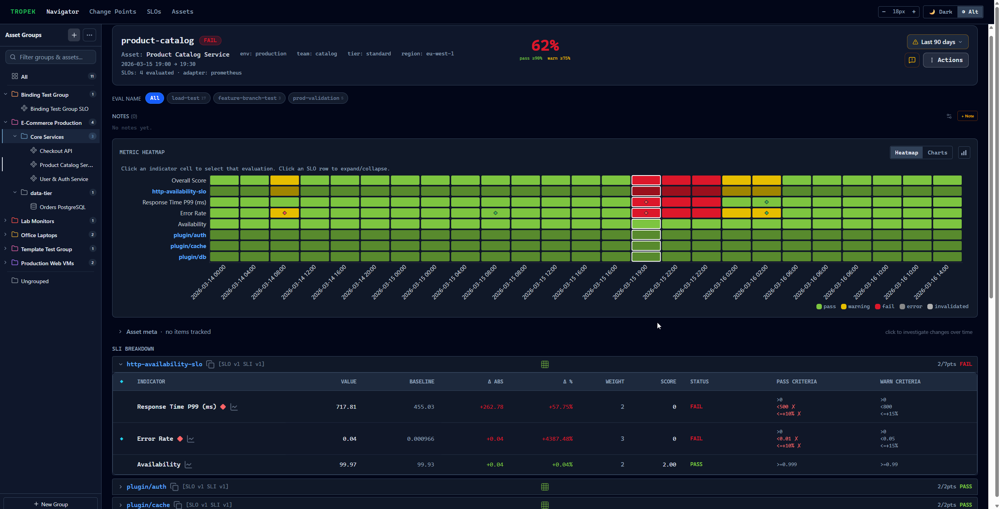

The **Navigator** is the main page you land on. On the left is a tree of asset groups. Click a group to expand it; click an asset to open it on the right.

The right panel shows everything about the selected asset:

1. **Header** — the score for the currently selected evaluation, which SLOs ran, asset tags, the time period, and a time-range picker. On first load the most recent non-invalidated evaluation is selected automatically. Clicking a heatmap cell switches to that evaluation and updates the header. In the top-right corner there is a note button (add/view annotations) and an **Actions** dropdown for modifying the evaluation.

2. **Notes** — annotation notes attached to the selected evaluation column, shown directly below the header.

3. **Heatmap** — see [Heatmap](#heatmap). There is a toggle button (top-right of the heatmap section) to switch between heatmap view and chart view.

4. **Asset meta timeline** — a Gantt-style strip showing tracked changes to the asset, placed between the heatmap and the breakdown table. See [Asset meta timeline](#asset-meta-timeline).

5. **SLI Breakdown** — a table with per-metric detail for the selected evaluation. See [SLI Breakdown table](#sli-breakdown-table).

6. **Trend charts** — history charts for every metric, grouped by SLO, shown below the breakdown table. See [Trend charts](#trend-charts).

---

## Evaluation actions

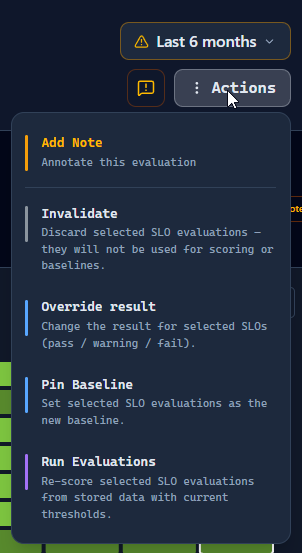

The **Actions** button in the top-right of the asset panel opens a dropdown. Each action applies to the currently selected evaluation. You can narrow the scope — apply only to specific SLOs rather than all of them — using the scope picker inside each action form.

| Action | What it does |
|---|---|
| **Invalidate** | Marks the selected SLO evaluations as invalid. Invalid evaluations are hidden from scoring and never used as baselines. The data is kept and can be restored later. |
| **Override result** | Manually sets the verdict (pass / warning / fail) for the selected SLOs, replacing what the scoring engine calculated. Use this when a result was a false positive or caused by a temporary environment issue. |
| **Pin Baseline** | Makes the selected SLO evaluations the new comparison baseline. Future evaluations using relative criteria (e.g. `<=+10%`) will compare against this pinned value instead of the rolling average. |
| **Run Evaluations** | Re-scores the selected SLO evaluations using the data already stored, with the *current* SLO thresholds. No new data is fetched from the adapter. Useful after updating pass or warning thresholds. |
| **Restore** | Undoes an invalidation — brings the evaluations back into scoring and baselines. Only shown when at least one SLO in the current column is invalidated. |

The note button (speech-bubble icon, next to the Actions button) opens the annotation form directly without going through the dropdown.

---

## Heatmap

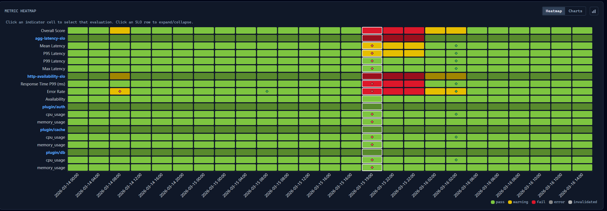

The heatmap is the main way to navigate evaluations. Each **column** is one evaluation run. Each **row** is either a named SLO group header or an individual metric.

The **Overall Score** row at the top summarises every SLO in that run.

**Colours:**

| Colour | Meaning |
|---|---|
| Green | Pass — the SLO or group met its pass threshold |
| Yellow / amber | Warning — the warning threshold was breached but the pass threshold was not |
| Red | Fail — the pass threshold was breached |
| Dark grey | Error — no data could be retrieved for this metric |
| Light grey | Invalidated — the evaluation was manually marked invalid |

SLO group rows (shown in blue text) are **collapsible**: clicking one folds its metric rows out of view, and the heatmap column shrinks to show only the group-level colour. This keeps the view manageable when there are many metrics.

Clicking any cell selects that evaluation. The header updates with the new score and the breakdown table below updates with that evaluation's detail. The currently selected column is highlighted.

Hovering over a cell shows a tooltip with the evaluation name (when multiple evaluation names are in use), the period start time, the score, and the result.

The **view toggle** (top-right of the heatmap section) switches the entire right panel between heatmap view and chart view.

---

## Change point markers — diamonds

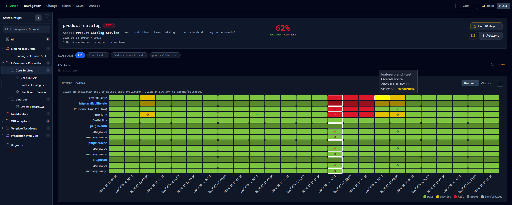

Diamond markers (◆) appear on heatmap cells and in the SLI breakdown table when a statistically significant shift in a metric's history is detected, using the [Apache OTAVA E-Divisive algorithm](https://github.com/apache/otava).

- **Red diamond** — a *regression*. For metrics where lower is better (e.g. latency) this means the value went up; for metrics where higher is better (e.g. throughput) it means the value dropped.
- **Green diamond** — an *improvement*. The metric shifted in the good direction.

The diamond appears on the first evaluation in the new behaviour regime. Because E-Divisive re-analyses the full history on every run, TROPEK deduplicates markers so the same shift never appears more than once.

New change points start in `unprocessed` status and can be reviewed on the [Change Points page](#change-points-page).

---

## Asset meta timeline

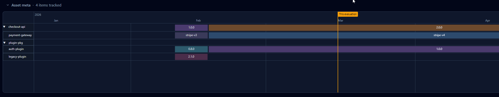

The **Asset meta timeline** sits between the heatmap and the SLI breakdown table. It is a scrollable, zoomable Gantt strip. Each row tracks one piece of asset history (a software version, a hardware config, a dependency, a feature flag, etc.). Coloured bars show the time period during which each value was active.

A vertical line with a label marks the currently selected evaluation — it moves when you click a different heatmap column.

The purpose is to make it easy to correlate a metric change with something that changed in the environment. For example: *the red diamond on 2026-03-15 lines up with checkout-api upgrading from 1.0.0 to 2.0.0.*

Any number of items can be tracked per asset. Typical things to track: software versions, OS patches, hardware specs, configuration flags, or test-environment changes.

---

## SLI Breakdown table

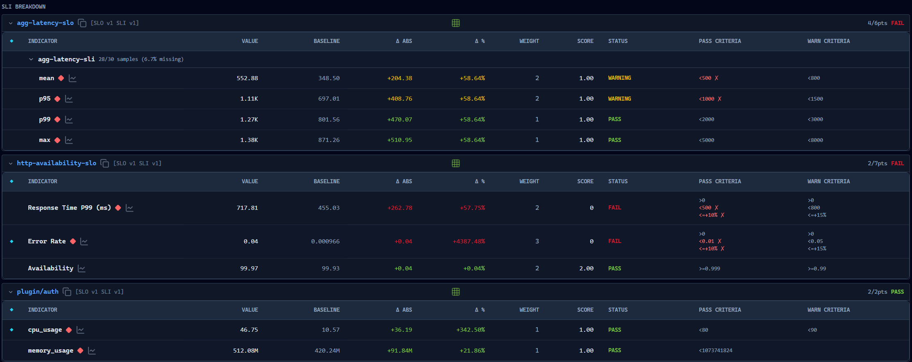

The SLI Breakdown table shows the full detail for the selected evaluation. Rows are grouped by SLO. Each SLO group can be collapsed independently (their collapsed/expanded state matches the heatmap).

Columns:

| Column | Description |
|---|---|
| ◆ | A filled diamond if this metric is marked as a **key SLI** |
| **Indicator** | Metric name. A change-point diamond appears here if one was detected. Clicking the chart icon scrolls to the metric's trend chart below |
| **Value** | The raw metric value collected during this evaluation |
| **Baseline** | The comparison value (average of recent passing evaluations, or a pinned baseline) |
| **Δ abs** | Absolute difference from the baseline |
| **Δ %** | Percentage difference from the baseline. Highlighted red when it contributed to a failure |
| **Weight** | How much this metric contributes to the total score |
| **Score** | Points earned (0 if the objective failed) |
| **Status** | PASS / WARNING / FAIL for this metric |
| **Pass criteria** | The threshold expressions that must pass. Failed criteria are shown with a red ✕ |
| **Warn criteria** | Warning threshold expressions |

The SLO group header row shows the group's total points and its overall pass / fail / warning verdict.

---

## Trend charts

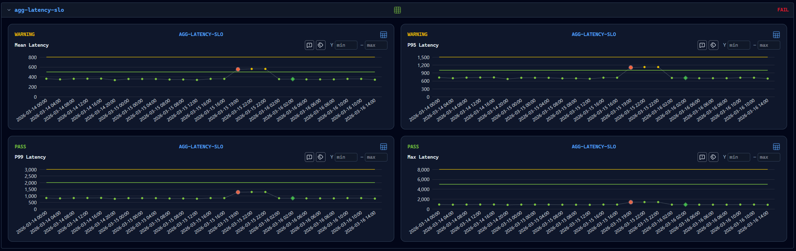
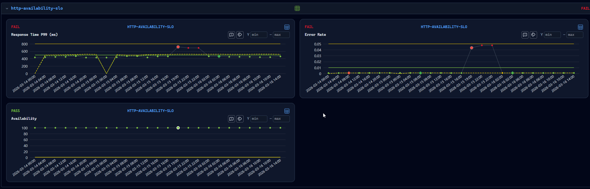

Trend charts appear **below the SLI Breakdown table** on the same page, one section per SLO. Each SLO section is collapsible — click the section header to expand or collapse it.

Clicking the chart icon (📈) next to any metric name in the breakdown table scrolls directly to that metric's chart.

Each chart shows:

- **Dots** — one dot per evaluation, coloured green (pass), yellow (warning), or red (fail)
- **Threshold lines** — dashed horizontal lines for the pass threshold (green) and warning threshold (yellow)
- **Change point markers** — the same red/green diamonds appear at the detected shift point. Hovering over a dot shows its value
- A **Y min / Y max** input pair in the top-right corner lets you fix the axis range to zoom in

Charts are grouped by their SLO so you can compare all metrics for one SLO side-by-side.

Clicking a dot in a trend chart selects that evaluation in the heatmap and updates the breakdown table.

---

## Change Points page

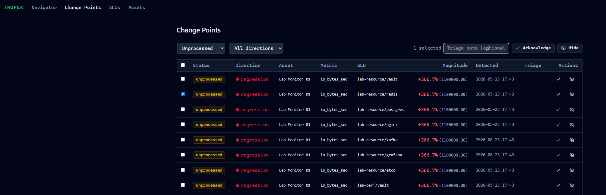

The **Change Points** page (top-level nav item) shows all detected shifts across every asset and SLO in one list.

Each row is one detected change point:

| Column | Description |
|---|---|
| **Status** | `unprocessed`, `acknowledged`, or `hidden` |
| **Direction** | `regression` (red diamond) or `improvement` (green diamond) |
| **Asset** | The asset the metric belongs to |
| **Metric** | The SLI indicator name |
| **SLO** | The SLO the indicator belongs to |
| **Magnitude** | Percentage change (e.g. `+23.4%`) with the absolute post-shift value in parentheses |
| **Detected** | Date and time of the evaluation that first surfaced this change point |
| **Triage** | The author and note, if the change point has already been triaged |
| **Actions** | ✓ (*Acknowledge*) and eye-off (*Hide*) buttons — only shown for `unprocessed` entries |

**Filters:** Status defaults to *Unprocessed*; direction defaults to *All directions*. Both can be changed independently.

**Bulk triage:** Tick the checkboxes on multiple rows to reveal a bulk-action bar. Type an optional note, then click **Acknowledge** or **Hide** to apply the action to all selected rows at once. Useful when the same metric spiked across many SLOs after a single deployment.

The list is paginated at 50 items per page.

---

## SLOs page — registries for SLOs, SLIs, and datasources

The **SLOs** page (top-level nav item) manages all SLO definitions, SLI definitions, and datasource connections in one place. The sidebar on the left switches between three views using the mode buttons at the top:

### SLO mode (default)

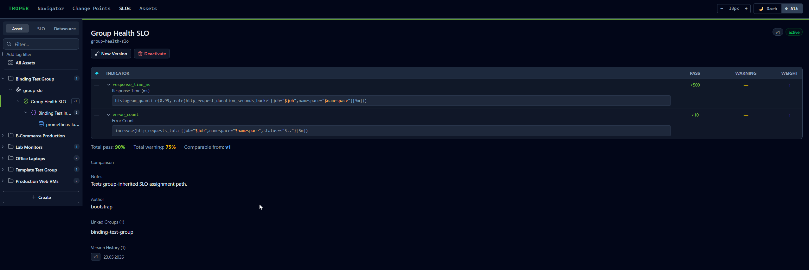

Lists all SLOs, SLI definitions, datasources, and SLO groups in a tree. Clicking an item shows its detail on the right.

**SLO detail** shows:
- Display name, technical name, and version number
- The list of objectives (which SLI provides each metric, pass/warning thresholds, weight)
- Score thresholds: the minimum total score percentage needed to pass or warn
- Comparison settings (how many historical results to average for the baseline)
- Which asset groups this SLO is linked to
- Version history — every change to an SLO creates a new version; evaluations record which version they used, so old results stay stable as criteria change

Buttons: **New Version**, **Delete**.

**SLI detail** shows:

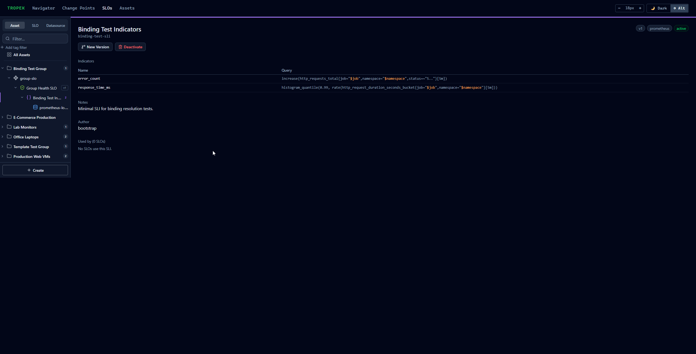

- Display name, adapter type
- The indicator definitions (name and PromQL query)
- Which SLOs currently reference this SLI

Buttons: **New Version**, **Delete**.

**Datasource detail** shows:

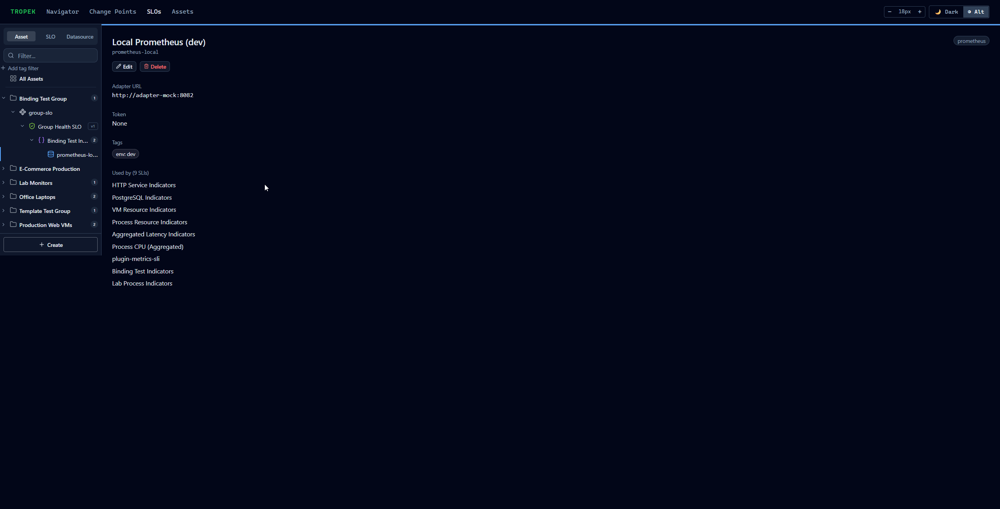

- Adapter URL — the endpoint TROPEK queries when running evaluations (e.g. `http://adapter-mock:8082`)
- Token — optional bearer token, shown masked
- Which SLI definitions use this datasource

Buttons: **Edit**, **Delete**.

### Asset mode

Shows the full group-and-asset hierarchy on the left. Selecting an asset or group shows which SLOs are linked to it.

### Datasource mode

Filters the sidebar to show only datasources. Selecting one shows the same datasource detail described above.

---

## Assets page

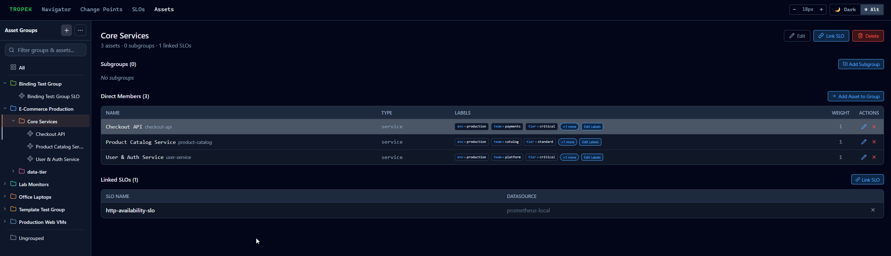

The **Assets** page (top-level nav item) is where you manage which services, VMs, or other things are being measured.

The left sidebar shows the full group hierarchy. Two special entries sit above the group tree: **All** (every registered asset) and **Ungrouped** (assets not assigned to any group). A name filter at the top of the sidebar narrows the tree.

**Group detail** (shown when you select a group) has three sections:

- **Subgroups** — nested child groups, with an *Add Subgroup* button. Groups can be nested as deep as you need to match your org structure.
- **Direct Members** — the assets in this group. Each row shows the display name, technical identifier in monospace (e.g. `checkout-api`), type (e.g. `service`), and label tags (e.g. `env:production`, `team:payments`). Each row has edit and remove buttons.
- **Linked SLOs** — the SLOs assigned to this group. Linking an SLO to a group covers every asset in that group — you don't have to assign the same SLO to each asset individually.
