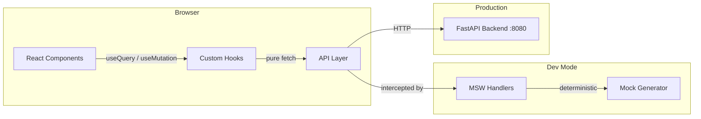
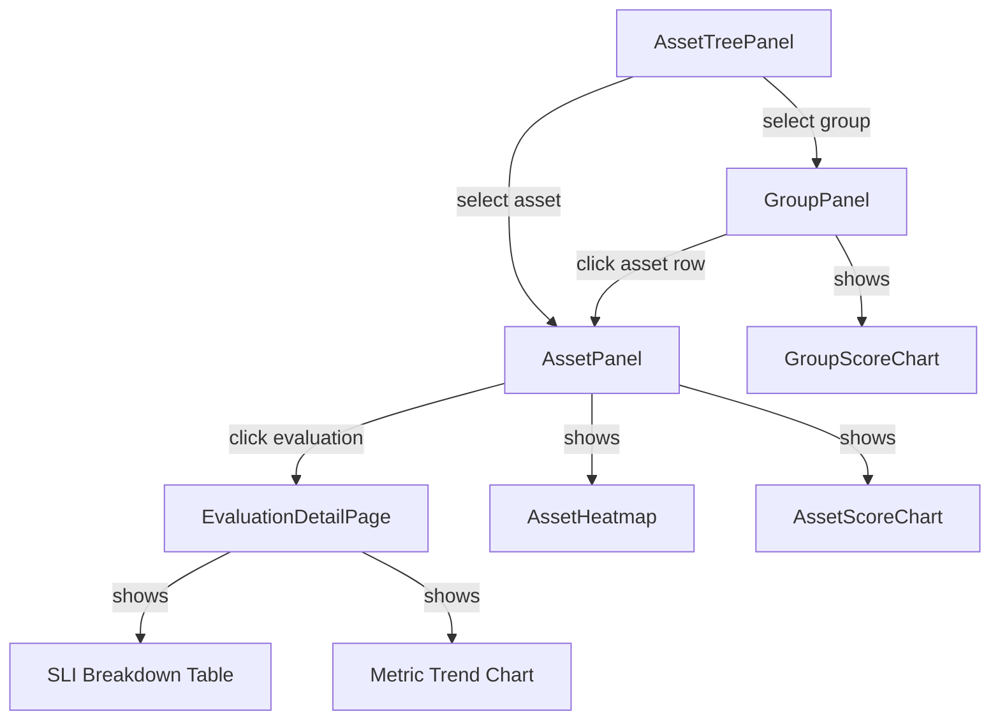
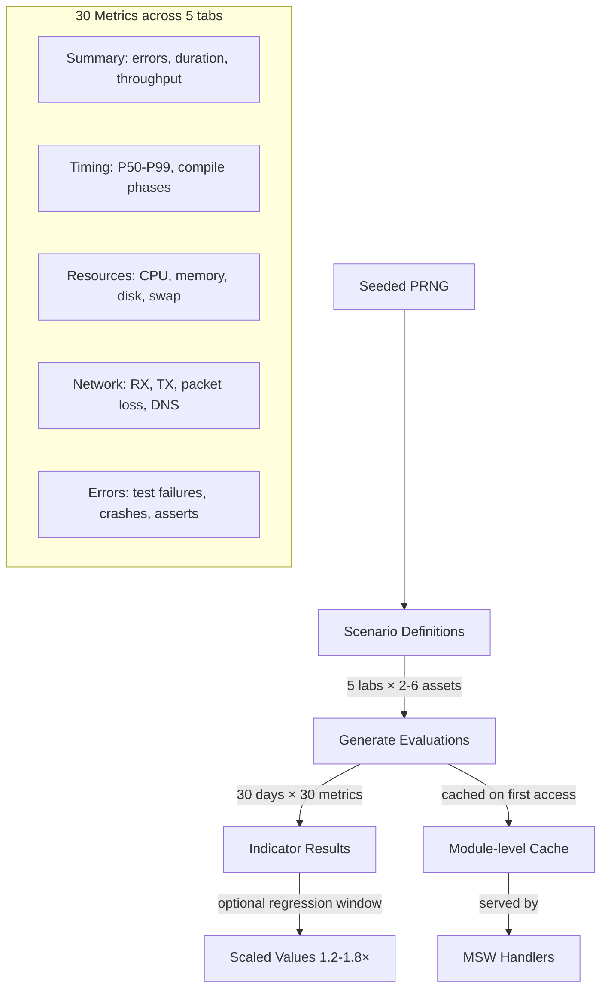

# TROPEK UI

React SPA for the TROPEK quality gate platform — asset navigation, evaluation drill-down, SLO registry, and metric exploration.

## Stack

| Layer | Technology |
|---|---|
| Framework | React 19 + TypeScript 5.9 (strict) |
| Build | Vite 8 |
| Styling | Tailwind CSS 4 + shadcn/ui (Base Nova) + OKLch color space |
| Charts | Apache ECharts 6 (via echarts-for-react) |
| Data fetching | TanStack React Query 5 |
| Routing | React Router 7 (URL-driven state) |
| Forms | React Hook Form + Zod 4 |
| Icons | Lucide React |
| Font | Geist (variable) |
| API mocking | MSW 2 (Mock Service Worker) |
| Testing | Vitest 4 |

## Quick Start

```bash
cd ui
pnpm install
pnpm dev             # starts on http://localhost:5173 with mock data
```

By default the dev server runs with **MSW mocks enabled** — no backend needed. The browser console will show `[MSW] Mocking enabled` on startup.

To run against the real API:

```bash
pnpm dev
```

MSW intercepts all `/api/*` requests in the browser. Mock data is deterministic (seeded PRNG) — same data on every reload. Covers 30 days of history across 40 asset/lab scenarios with 30 metrics each.

Unhandled requests (fonts, static assets) are passed through (`onUnhandledRequest: 'bypass'`).

### Against the real API

```bash
VITE_API_BASE=http://localhost:8080 pnpm build
pnpm preview
```

Or for dev with HMR against a running backend:

```bash
VITE_USE_MOCKS=false pnpm dev
```

The API base URL defaults to `http://localhost:8080` (set in `.env.development`). Override with `VITE_API_BASE`.

## Scripts

| Command | Purpose |
|---|---|
| `pnpm dev` | Vite dev server with HMR + MSW mocks |
| `pnpm build` | TypeScript check + production build |
| `pnpm preview` | Serve production build locally |
| `pnpm lint` | ESLint |
| `pnpm test` | Vitest (unit tests) |

Or from the repo root:

```bash
just test-ui                    # all UI tests
just test-ui src/features/...   # specific file
just lint-ui                    # ESLint
```

## Directory Structure

```
src/
├── main.tsx                     # Entry point — MSW init, React root
├── App.tsx                      # Router, nav bar, theme/query providers
├── index.css                    # Tailwind base, theme CSS variables (OKLch)
├── components/
│   ├── charts/                  # HeatmapChart, MultiSeriesChart, MetricLabelPanel
│   └── ui/                      # shadcn/ui primitives (button, dialog, tabs, etc.)
├── features/
│   ├── assets/                  # Asset list, groups, colour legend
│   ├── datasources/             # Datasource management
│   ├── evaluations/             # Evaluation list, detail, SLI breakdown, annotations
│   ├── meta_timeline/           # Asset metadata timeline
│   ├── navigator/               # Asset tree → group → asset drill-down navigation
│   ├── note-categories/         # Annotation category management
│   ├── registry/                # 3-mode SLO registry (tree, detail, sidebar)
│   ├── slis/                    # SLI definition registry
│   ├── slo-groups/              # SLO group and template binding management
│   └── slos/                    # SLO CRUD, SLO link dialogs
├── pages/
│   ├── AssetNavigatorPage.tsx   # Main view (default route)
│   ├── EvaluationDetailPage.tsx # Single evaluation deep-dive
│   ├── SloRegistryPage.tsx      # SLO list + create/edit
│   ├── AssetsPage.tsx           # Asset list
│   └── MetricExplorerPage.tsx   # Metric analysis (WIP)
├── lib/
│   ├── queryKeys.ts             # React Query key factory
│   ├── theme-context.tsx        # Theme + font size React Context
│   ├── theme.ts                 # Theme constants, status colours, chart palette
│   ├── format.ts                # Date/number formatting
│   └── utils.ts                 # cn() helper
├── utils/
│   └── metrics.ts               # computeChangePct, relative threshold series
└── mocks/
    ├── browser.ts               # MSW worker setup
    ├── generate.ts              # Deterministic data generator (seeded PRNG)
    └── handlers/                # MSW request handlers
        ├── evaluations.ts
        ├── assets.ts
        ├── slos.ts
        └── slis.ts
```

## Routes

| Path | Page | URL State |
|---|---|---|
| `/` | Redirects to `/navigator` | — |
| `/navigator` | Asset navigator (tree + panels) | `?group=&asset=&eval=` |
| `/evaluations/:id` | Evaluation detail | — |
| `/slos` | SLO registry (3-mode) | `?mode=&selected=&type=&group=` |
| `/assets` | Asset management | `?group=&asset=` |
| `/explorer` | Metric explorer | `?group=&asset=` |
| `/settings/note-categories` | Note category management | — |

## Themes

Three themes via `data-theme` attribute on `<html>`:

| Theme | Style | Toggle |
|---|---|---|
| `current` | Dark, teal/green accent | Navbar "Dark" button |
| `dark` | Dark, Radix UI colour scales | Navbar "Alt" button |
| `light` | Light | Stub — not yet exposed |

Theme and font size persist in localStorage.

## Architecture

For detailed architecture documentation, see:
- [docs/architecture.md](docs/architecture.md) — Tech stack, directory structure, theming, state management
- [docs/mocking.md](docs/mocking.md) — MSW mock system and deterministic data generator
- [`docs/modules/`](../docs/modules/) — Per-module domain narratives and API usage

### Data flow



### Feature module anatomy

Each feature under `src/features/` follows the same structure:

```
feature/
├── types.ts        # TypeScript interfaces
├── api.ts          # Pure fetch functions (no caching)
├── hooks.ts        # React Query wrappers (useQuery, useMutation)
├── constants.ts    # Column definitions, config
└── components/     # Domain-specific React components
```

### Navigator drill-down flow



### Mock data pipeline



## Environment Variables

| Variable | Default | Purpose |
|---|---|---|
| `VITE_USE_MOCKS` | `true` (dev) | Enable MSW browser mocking |
| `VITE_API_BASE` | `http://localhost:8080` | Backend API base URL |

## Documentation

### Architecture & Contributor Guides (`ui/docs/`)

| Document | Scope |
|---|---|
| [architecture.md](docs/architecture.md) | Tech stack, directory structure, feature inventory, key decisions |
| [patterns.md](docs/patterns.md) | Data flow, state management, module structure, conventions |
| [components.md](docs/components.md) | Component catalogue by feature area |
| [charts.md](docs/charts.md) | HeatmapChart, stacked mini-heatmaps, MultiSeriesChart, colours |
| [theming.md](docs/theming.md) | Theme system, CSS tokens, colour scales |
| [forms.md](docs/forms.md) | Action forms, SLO wizard, entity CRUD dialogs |
| [testing.md](docs/testing.md) | Test stack, MSW setup, QueryClient cleanup, coverage gaps |
| [mocking.md](docs/mocking.md) | MSW mock system and deterministic data generator |
| [known-issues.md](docs/known-issues.md) | Technical debt, accessibility gaps, test coverage |

### User-Facing Feature Docs (`docs/modules/`)

| Document | Feature |
|---|---|
| [navigator-ui.md](../docs/modules/navigator-ui.md) | Navigator page (heatmaps, panels, drill-down) |
| [evaluations-ui.md](../docs/modules/evaluations-ui.md) | Evaluations (detail, actions, SLI breakdown) |
| [registry-ui.md](../docs/modules/registry-ui.md) | SLO/SLI/Datasource registry |
| [assets-ui.md](../docs/modules/assets-ui.md) | Assets, groups, datasources |
| [meta-timeline-ui.md](../docs/modules/meta-timeline-ui.md) | Meta-timeline |
