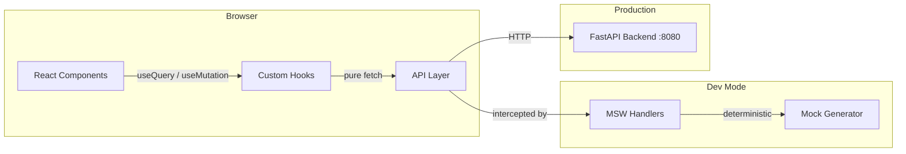
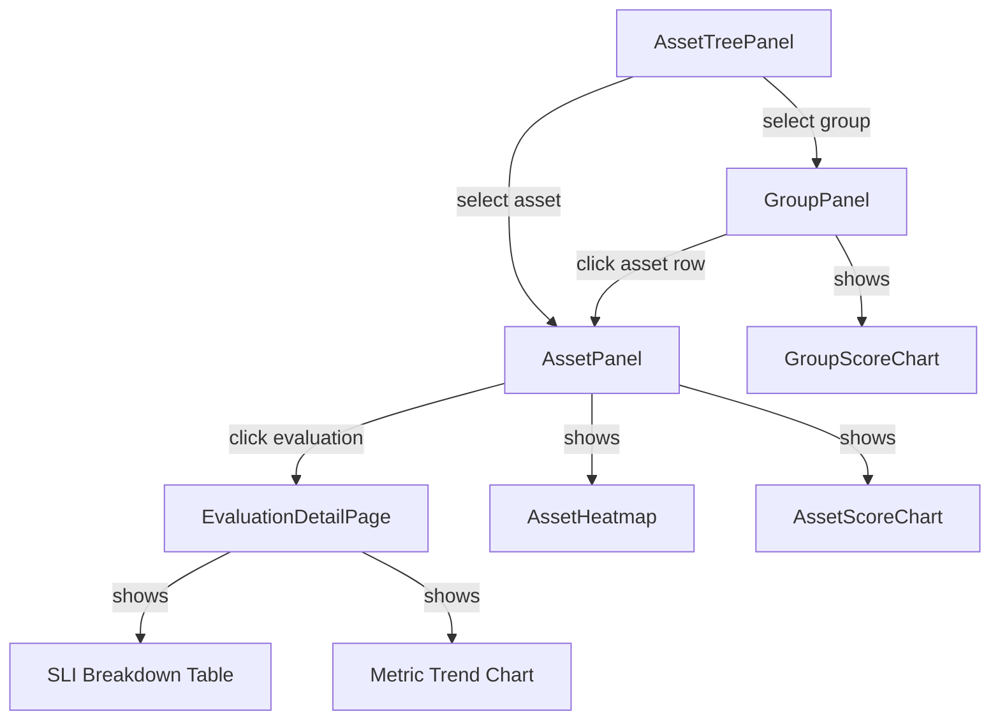
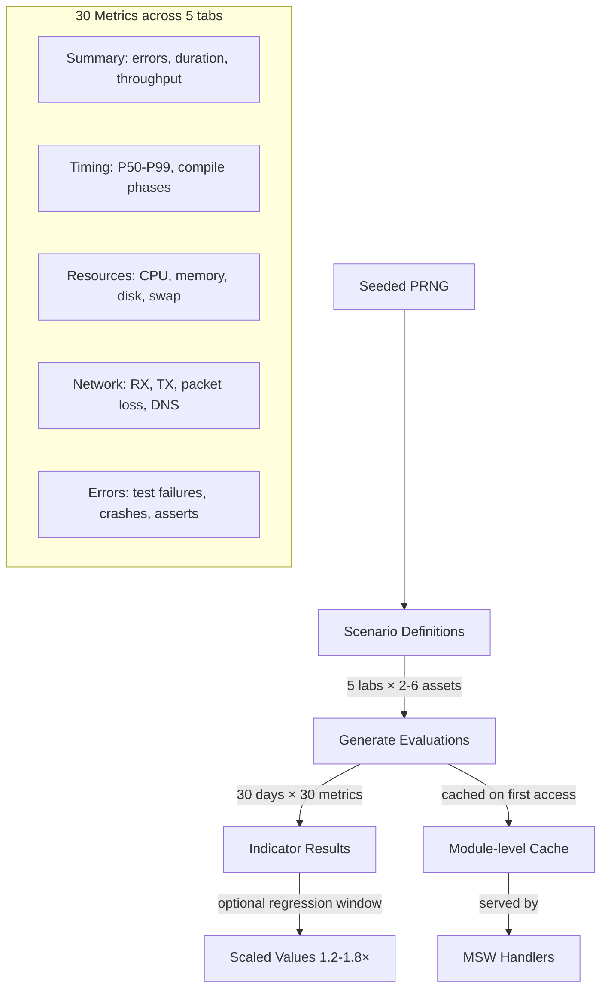

# TROPEK UI

React SPA for the TROPEK quality gate platform — asset navigation, evaluation drill-down, SLO registry, and metric exploration.

## Stack

| Layer | Technology |
|---|---|
| Framework | React 19 + TypeScript 5.9 (strict) |
| Build | Vite 8 |
| Styling | Tailwind CSS 4 + shadcn/ui (Base Nova) + OKLch color space |
| Charts | Apache ECharts 6 (via echarts-for-react) |
| Data fetching | TanStack React Query 5 |
| Routing | React Router 7 (URL-driven state) |
| Forms | React Hook Form + Zod 4 |
| Icons | Lucide React |
| Font | Geist (variable) |
| API mocking | MSW 2 (Mock Service Worker) |
| Testing | Vitest |

## Quick start

```bash
cd ui
npm install
npm run dev          # starts on http://localhost:5173 with mock data
```

By default the dev server runs with **MSW mocks enabled** — no backend needed. The browser console will show `[MSW] Mocking enabled` on startup.

## Running modes

### Mock mode (default in dev)

```bash
npm run dev
```

MSW intercepts all `/api/*` requests in the browser. Mock data is deterministic (seeded PRNG) — same data on every reload. Covers 30 days of history across 40 asset/lab scenarios with 30 metrics each.

Unhandled requests (fonts, static assets) are passed through (`onUnhandledRequest: 'bypass'`).

### Against the real API

```bash
VITE_API_BASE=http://localhost:8080 npm run build
npm run preview
```

Or for dev with HMR against a running backend:

```bash
VITE_USE_MOCKS=false npm run dev
```

The API base URL defaults to `http://localhost:8080` (set in `.env.development`). Override with `VITE_API_BASE`.

## Scripts

| Command | Purpose |
|---|---|
| `npm run dev` | Vite dev server with HMR + MSW mocks |
| `npm run build` | TypeScript check + production build |
| `npm run preview` | Serve production build locally |
| `npm run lint` | ESLint |
| `npm run test` | Vitest (unit tests) |

## Project structure

```
src/
├── main.tsx                     # Entry point — MSW init, React root
├── App.tsx                      # Router, nav bar, theme/query providers
├── index.css                    # Tailwind base, theme CSS variables (OKLch)
├── components/
│   ├── charts/                  # HeatmapChart, MultiSeriesChart, MetricLabelPanel
│   └── ui/                      # shadcn/ui primitives (button, dialog, tabs, etc.)
├── features/
│   ├── evaluations/             # Evaluation list, detail, SLI breakdown, annotations
│   ├── assets/                  # Asset list, groups, colour legend
│   ├── navigator/               # Asset tree → group → asset drill-down navigation
│   ├── slos/                    # SLO registry CRUD, versioning, history
│   └── slis/                    # SLI definition registry
├── pages/
│   ├── AssetNavigatorPage.tsx   # Main view (default route)
│   ├── EvaluationDetailPage.tsx # Single evaluation deep-dive
│   ├── SloRegistryPage.tsx      # SLO list + create/edit
│   ├── AssetsPage.tsx           # Asset list
│   └── MetricExplorerPage.tsx   # Metric analysis (WIP)
├── lib/
│   ├── queryKeys.ts             # React Query key factory
│   ├── theme-context.tsx        # Theme + font size React Context
│   ├── theme.ts                 # Theme constants, status colours, chart palette
│   ├── format.ts                # Date/number formatting
│   └── utils.ts                 # cn() helper
├── utils/
│   └── metrics.ts               # computeChangePct, relative threshold series
└── mocks/
    ├── browser.ts               # MSW worker setup
    ├── generate.ts              # Deterministic data generator (seeded PRNG)
    └── handlers/                # MSW request handlers
        ├── evaluations.ts
        ├── assets.ts
        ├── slos.ts
        └── slis.ts
```

## Routes

| Path | Page | URL state |
|---|---|---|
| `/` | Redirects to `/navigator` | — |
| `/navigator` | Asset navigator (tree + panels) | `?group=<name>&asset=<name>&eval=<id>` |
| `/evaluations/:id` | Evaluation detail | — |
| `/slos` | SLO registry | — |
| `/assets` | Asset list | — |
| `/explorer` | Metric explorer (WIP) | — |

## Themes

Three theme variants defined via CSS custom properties in `index.css`:

| Theme | Style | Activation |
|---|---|---|
| `forest` | Dark, teal/green accent | Default — navbar "Dark" button |
| `current` | Dark, neutral (original shadcn) | Navbar "Alt" button |
| `corporate` | Light, blue accent | Stub — not yet in navbar |

Theme and font size persist in localStorage (`tropek-theme`, `tropek-font-size`).

## Architecture

For detailed architecture documentation, see:
- [docs/architecture.md](docs/architecture.md) -- Tech stack, directory structure, theming, state management
- [docs/features.md](docs/features.md) -- Feature module breakdown (evaluations, assets, navigator, SLOs, SLIs)
- [docs/mocking.md](docs/mocking.md) -- MSW mock system and deterministic data generator

### Data flow



### Feature module anatomy

Each feature under `src/features/` follows the same structure:

```
feature/
├── types.ts        # TypeScript interfaces
├── api.ts          # Pure fetch functions (no caching)
├── hooks.ts        # React Query wrappers (useQuery, useMutation)
├── constants.ts    # Column definitions, config
└── components/     # Domain-specific React components
```

### Navigator drill-down flow



### Mock data pipeline



## Environment variables

| Variable | Default | Purpose |
|---|---|---|
| `VITE_USE_MOCKS` | `true` (dev) | Enable MSW browser mocking |
| `VITE_API_BASE` | `http://localhost:8080` | Backend API base URL |

## API endpoints consumed

```
GET    /api/evaluations[?group_name&asset_name&date&from&to]
GET    /api/evaluations/:id
GET    /api/evaluations/metric-heatmap?asset_name=X
GET    /api/trend?eval_id=X&metric=Y
POST   /api/evaluations
PATCH  /api/evaluations/:id/invalidate
PATCH  /api/evaluations/:id/override-status
PATCH  /api/evaluations/:id/pin-baseline
POST   /api/evaluations/:id/annotations

GET    /api/assets
GET    /api/asset-groups/tree

GET    /api/slo-definitions
GET    /api/slo-definitions/:name
GET    /api/slo-definitions/:name/versions
POST   /api/slo-definitions
POST   /api/slo-definitions/validate
DELETE /api/slo-definitions/:name

GET    /api/sli-definitions
GET    /api/sli-definitions/:name
GET    /api/sli-definitions/:name/versions
POST   /api/sli-definitions
DELETE /api/sli-definitions/:name
```
